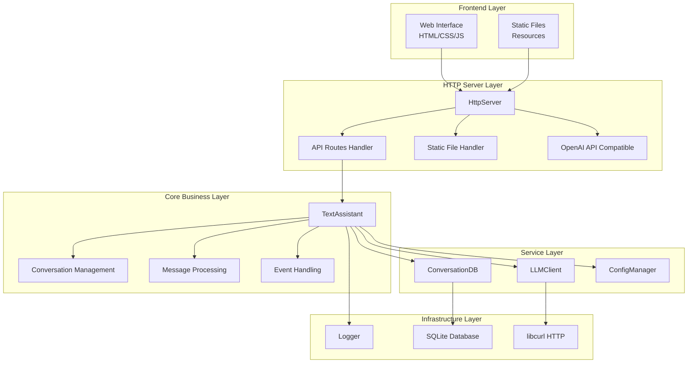
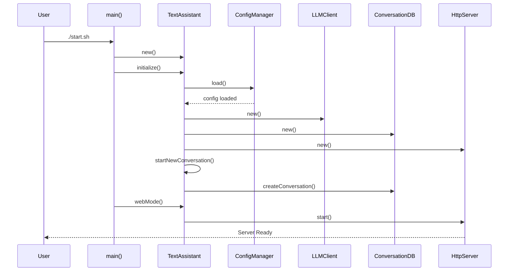
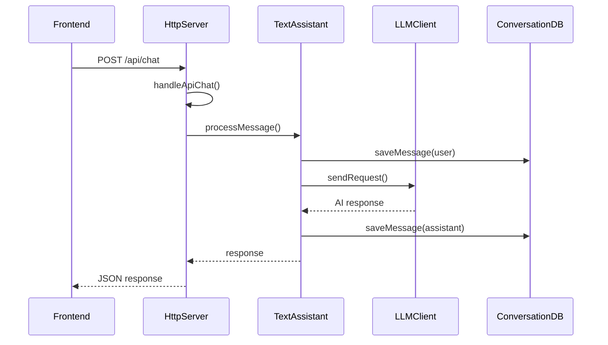
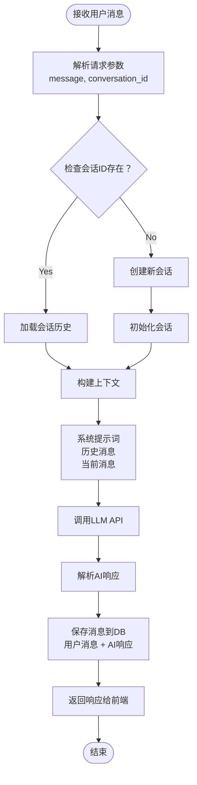
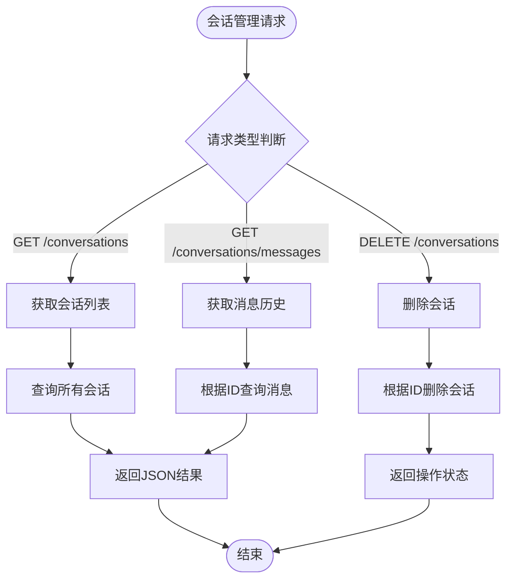
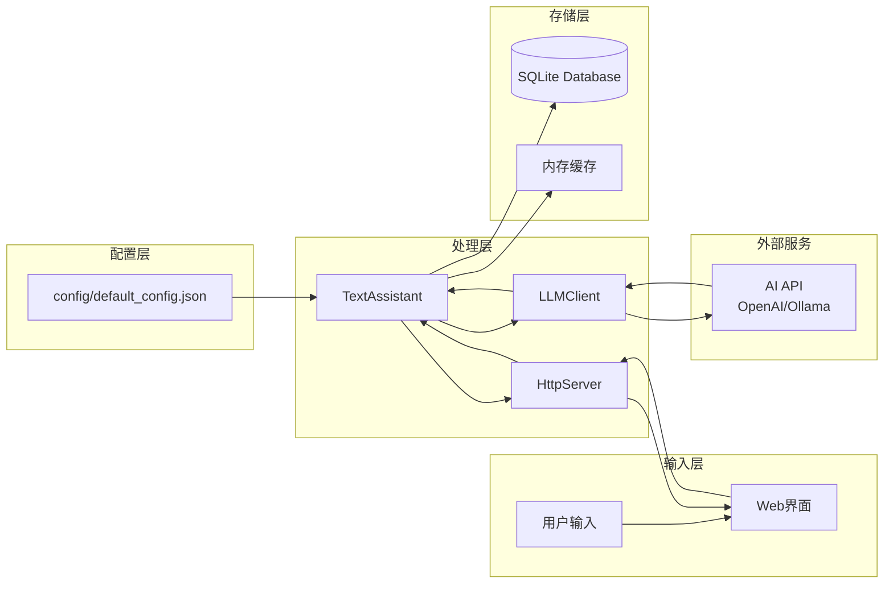
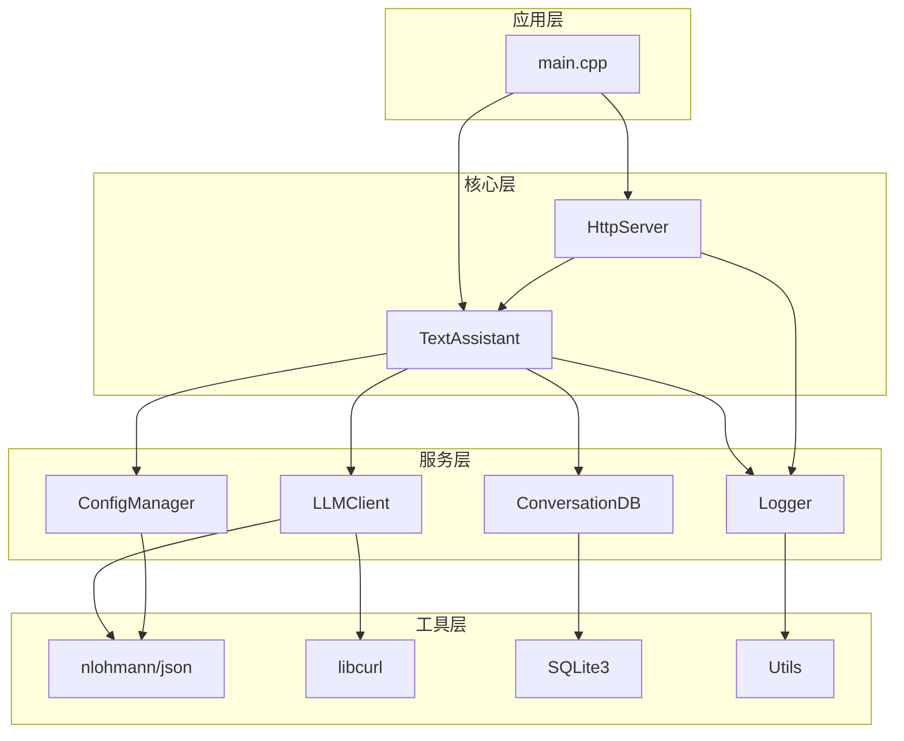
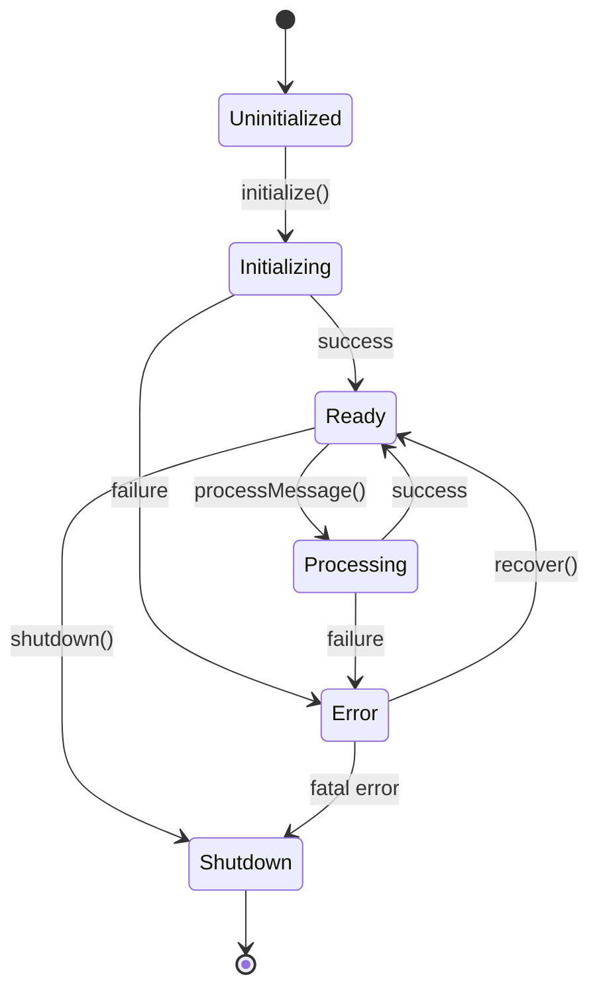

# AI Text Assistant 项目架构文档

> *github地址：[AITextAssistant-cpp](https://github.com/mo-xiaoxiu/AITextAssist-cpp)*

## 项目概述

AI Text Assistant 是一个基于C++的智能文本助手，支持历史会话管理和长久记忆功能。项目采用分层架构设计，提供现代化的Web界面和RESTful API，同时兼容OpenAI API格式。

### 核心特性
- 🤖 **智能对话**: 基于大语言模型的自然语言交互
- 💾 **历史会话**: 支持多个独立对话，可随时切换
- 🧠 **长久记忆**: AI在每个对话中保持完整的上下文记忆
- 🗑️ **会话管理**: 支持删除不需要的历史对话
- 🌐 **Web界面**: 现代化的响应式Web界面

## 整体架构设计

### 1. 系统架构图



### 2. 分层架构说明

#### Frontend Layer (前端层)
- **Web Interface**: 基于HTML/CSS/JavaScript的用户界面
- **Static Files**: 静态资源文件管理

#### HTTP Server Layer (HTTP服务层)
- **HttpServer**: 核心HTTP服务器，处理所有Web请求
- **API Routes Handler**: RESTful API路由处理
- **Static File Handler**: 静态文件服务
- **OpenAI API Compatible**: OpenAI兼容接口

#### Core Business Layer (核心业务层)
- **TextAssistant**: 主要业务逻辑控制器
- **Conversation Management**: 会话管理功能
- **Message Processing**: 消息处理逻辑
- **Event Handling**: 事件处理机制

#### Service Layer (服务层)
- **LLMClient**: 大语言模型客户端
- **ConversationDB**: 会话数据库管理
- **ConfigManager**: 配置管理服务

#### Infrastructure Layer (基础设施层)
- **Logger**: 日志记录系统
- **SQLite Database**: 数据持久化
- **libcurl HTTP**: HTTP通信库

## 核心组件分析

### TextAssistant 核心类

**核心组件职责：**
- `ConfigManager`: 配置文件加载和管理
- `LLMClient`: 与AI模型的通信接口
- `ConversationDB`: 会话数据的持久化存储
- `HttpServer`: Web服务和API接口

### 配置管理

````json path=ai-test/config/default_config.json mode=EXCERPT
{
  "llm": {
    "provider": "openai",
    "api_endpoint": "https://www.dmxapi.cn/v1/chat/completions",  //代理平台
    "api_key": "",												     //创建的令牌key
    "model_name": "o4-mini-2025-04-16"
  },
  "prompt": {
    "system_prompt": "You are a helpful AI text assistant...",
    "max_history_messages": 10
  }
}
````

## 系统流程分析

### 1. 系统启动时序图



**启动流程说明：**
1. 用户执行启动脚本
2. 主程序创建TextAssistant实例
3. 初始化配置管理器并加载配置
4. 依次创建LLM客户端、数据库和HTTP服务器
5. 启动新会话并开始Web服务

### 2. 聊天消息处理时序图



**消息处理流程：**
1. 前端发送聊天请求
2. HTTP服务器接收并路由到处理函数
3. TextAssistant处理消息逻辑
4. 保存用户消息到数据库
5. 调用LLM API获取AI响应
6. 保存AI响应到数据库
7. 返回结果给前端

## 详细处理流程

### 1. 消息处理流程图



**关键处理步骤：**
1. **参数解析**: 提取消息内容和会话ID
2. **会话检查**: 验证会话是否存在，不存在则创建新会话
3. **上下文构建**: 组合系统提示词、历史消息和当前消息
4. **AI调用**: 发送请求到LLM API
5. **响应处理**: 解析AI响应并保存到数据库
6. **结果返回**: 将处理结果返回给前端

### 2. 会话管理流程图



**会话管理功能：**
- **获取会话列表**: 返回所有历史会话的基本信息
- **获取消息历史**: 根据会话ID返回完整的消息记录
- **删除会话**: 从数据库中删除指定会话及其所有消息

## 数据流分析

### 数据流架构图



**数据流向说明：**
1. **配置数据**: 从JSON配置文件加载到各个组件
2. **用户输入**: 通过Web界面传递到HTTP服务器
3. **业务处理**: HTTP服务器将请求转发给TextAssistant处理
4. **AI交互**: TextAssistant通过LLMClient与外部AI服务通信
5. **数据持久化**: 处理结果保存到SQLite数据库
6. **响应返回**: 处理结果通过HTTP服务器返回给Web界面

## 组件依赖关系

### 组件依赖图



## 系统状态管理

### 状态转换图



**状态说明：**
- **Uninitialized**: 系统未初始化状态
- **Initializing**: 正在初始化配置和组件
- **Ready**: 系统就绪，可以处理请求
- **Processing**: 正在处理用户消息
- **Error**: 发生错误，需要恢复或关闭
- **Shutdown**: 系统关闭状态

## API接口设计

### RESTful API

| 方法   | 路径                          | 功能         | 参数                         |
| ------ | ----------------------------- | ------------ | ---------------------------- |
| POST   | `/api/chat`                   | 发送聊天消息 | `message`, `conversation_id` |
| GET    | `/api/conversations`          | 获取会话列表 | -                            |
| GET    | `/api/conversations/messages` | 获取会话消息 | `conversation_id`            |
| DELETE | `/api/conversations`          | 删除会话     | `conversation_id`            |

## 技术特点

### 1. 多线程安全
- 使用`std::mutex`保护共享数据
- 原子操作管理系统状态
- 线程安全的消息队列

### 2. 内存管理
- 智能指针自动管理资源
- RAII原则确保资源正确释放
- 避免内存泄漏和悬空指针

### 3. 错误处理
- 完整的异常处理机制
- 详细的错误日志记录
- 优雅的错误恢复策略

## 部署和运维

### 编译和启动
```bash
# 编译项目
mkdir build && cd build
cmake ..
make

# 启动服务
./start.sh
```

### 访问地址
- **AI聊天界面**: http://localhost:3001/enhanced-chat.html
- **调试页面**: http://localhost:3001/debug-conversations.html

## 总结

AI Text Assistant项目采用了现代C++的最佳实践，通过分层架构实现了高内聚、低耦合的设计。系统具有良好的可维护性、可扩展性和性能表现，是一个完整的AI对话系统解决方案。

主要优势：
- **架构清晰**: 分层设计，职责明确
- **功能完整**: 支持会话管理、历史记录、长久记忆
- **技术先进**: 使用现代C++特性和最佳实践
- **易于扩展**: 模块化设计便于添加新功能
- **用户友好**: 提供现代化的Web界面

