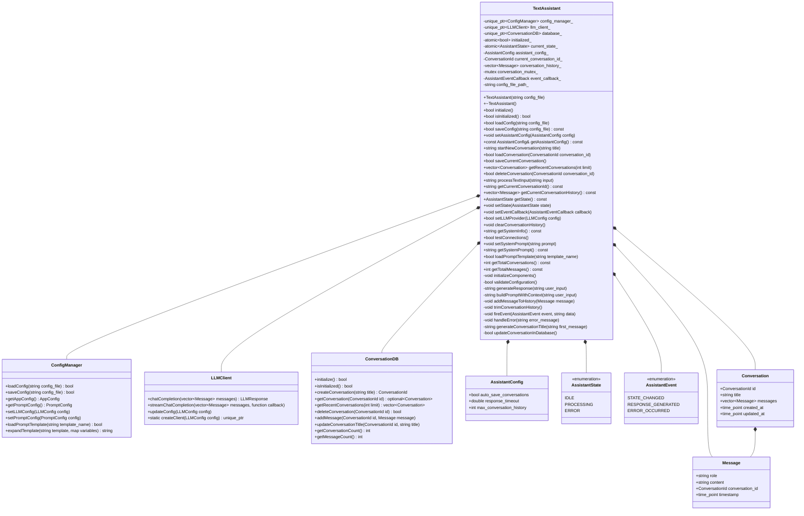
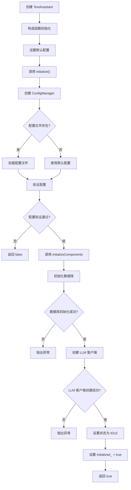
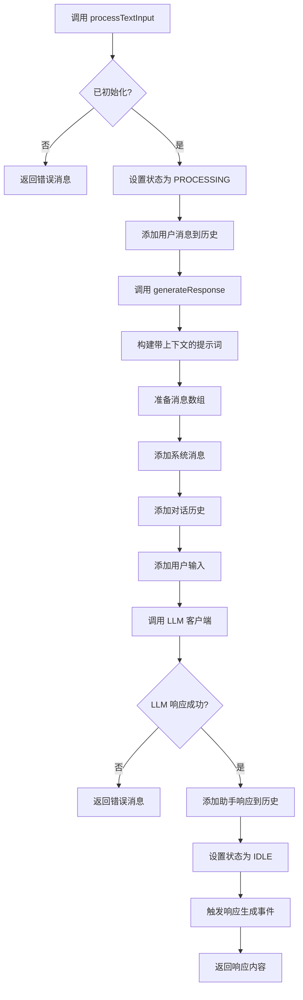
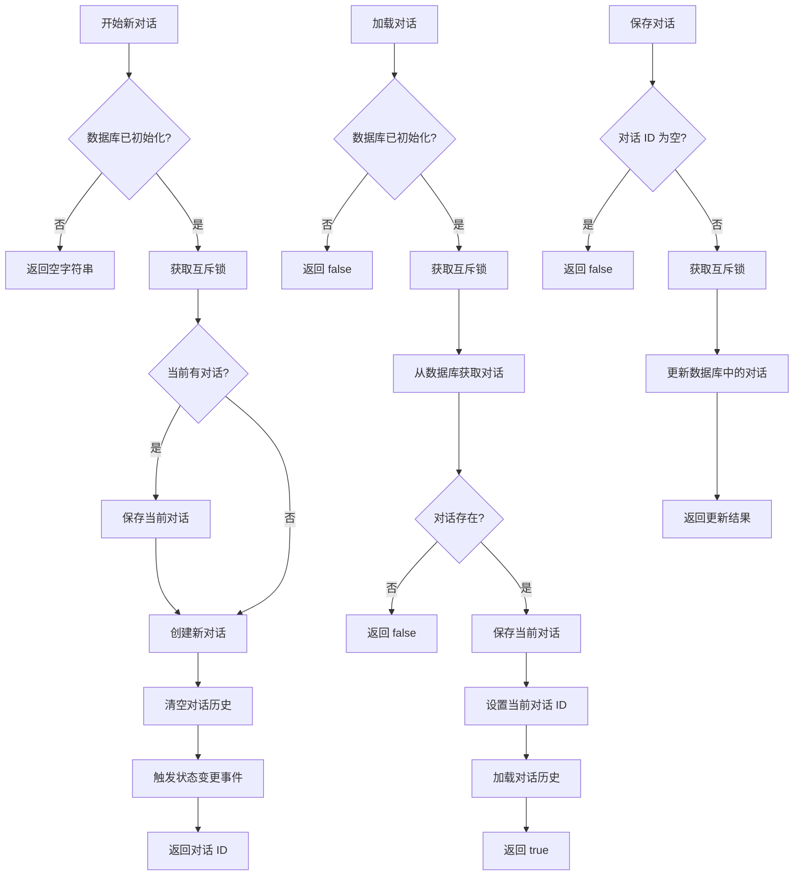
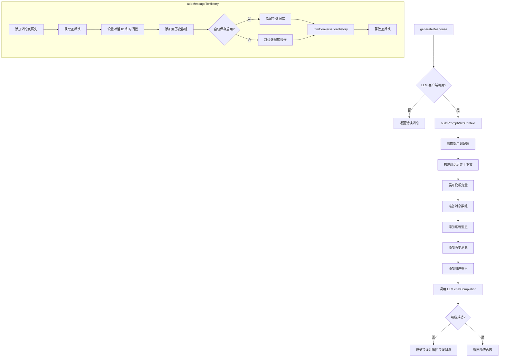
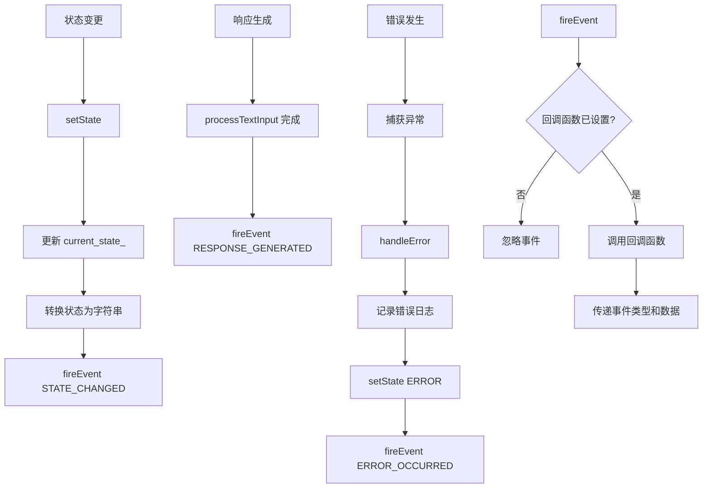
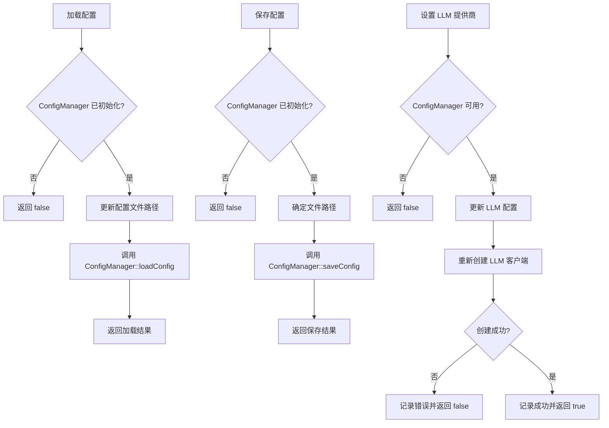
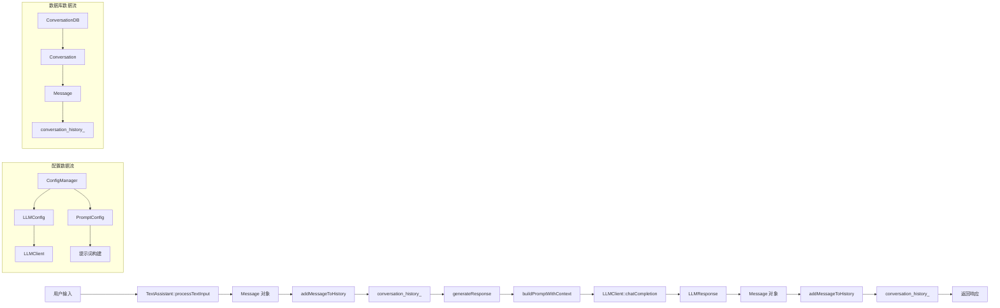

# Assistant设计

我来为您绘制 Assistant 的详细类图和处理流程图。

## 1. Assistant 类图

## 2. Assistant 初始化流程图

## 3. 文本处理流程图

## 4. 对话管理流程图

## 5. 消息处理详细流程图

## 6. 事件处理流程图

## 7. 配置管理流程图

## 8. 数据流图

## 总结

1. **核心组件**：
   - `ConfigManager`：管理配置
   - `LLMClient`：处理 LLM 请求
   - `ConversationDB`：管理对话数据

2. **状态管理**：
   - 使用原子变量管理初始化状态
   - **状态机**管理助手状态
   - 事件回调机制

3. **线程安全**：
   - 使用互斥锁保护对话历史
   - 原子变量管理状态

4. **错误处理**：
   - 完整的异常处理机制
   - 错误事件通知
   - 错误事件恢复

5. **扩展性**：
   - 事件驱动架构
   - 可配置的提示词模板
   - 支持多种 LLM 提供商

