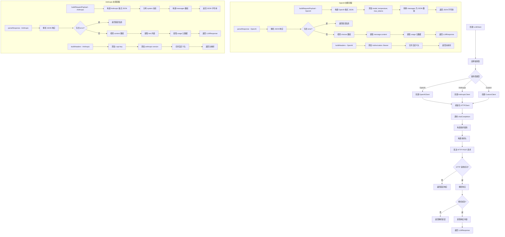
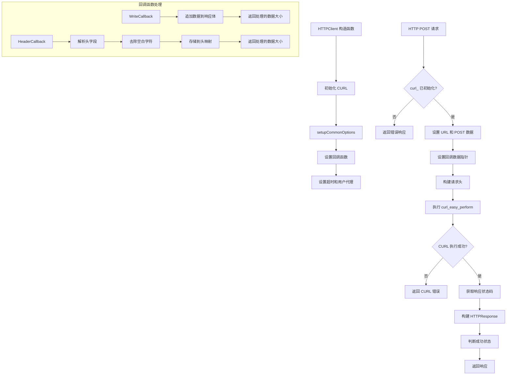
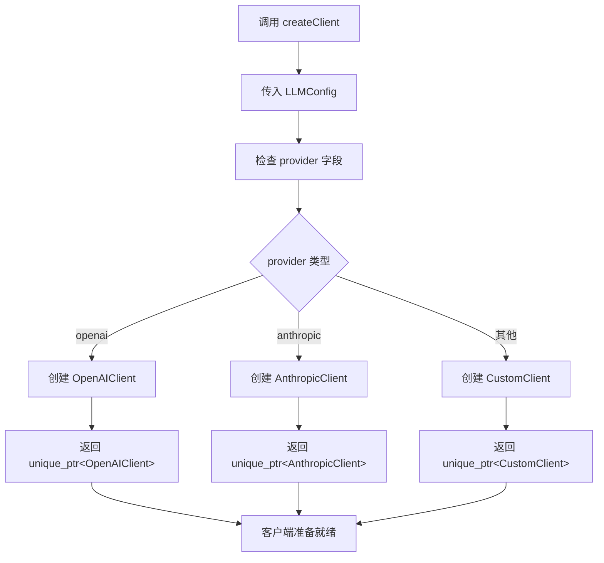
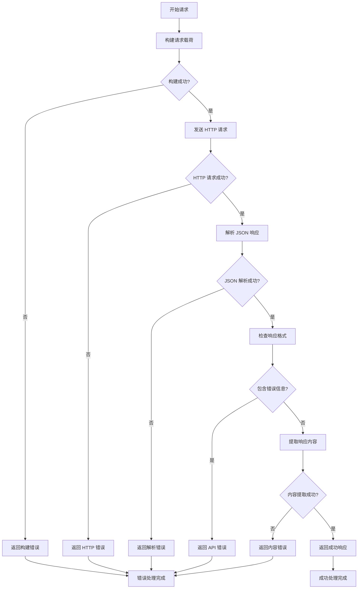
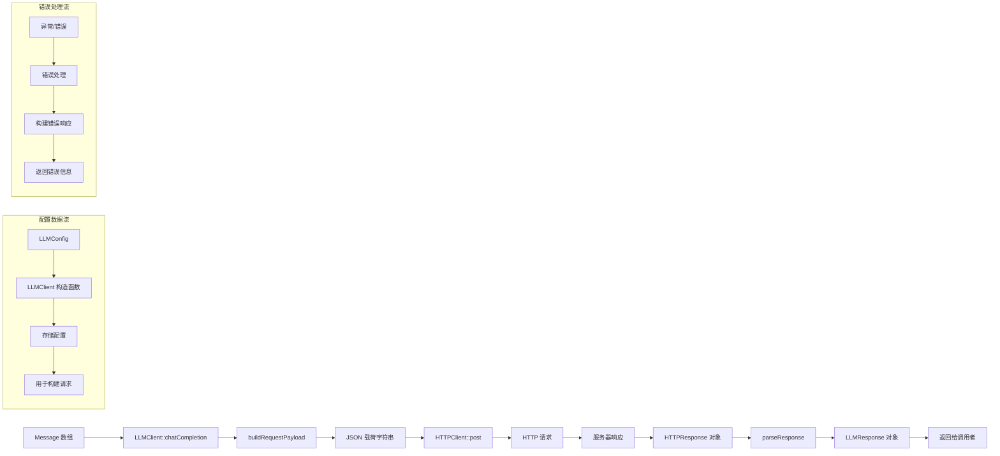

# LLM客户端设计

我来为您绘制 LLM 客户端的详细类图和处理流程图。

## 1. LLM 客户端类图

```mermaid
classDiagram
    class LLMClient {
        <<abstract>>
        #LLMConfig config_
        #unique_ptr~HTTPClient~ http_client_
        
        +LLMClient(LLMConfig config)
        +virtual ~LLMClient()
        +virtual LLMResponse chatCompletion(vector~Message~ messages)
        +virtual void streamChatCompletion(vector~Message~ messages, function~void(string)~ callback)
        +void updateConfig(LLMConfig config)
        +const LLMConfig& getConfig() const
        +static unique_ptr~LLMClient~ createClient(LLMConfig config)
        
        #virtual string buildRequestPayload(vector~Message~ messages) = 0
        #virtual LLMResponse parseResponse(HTTPResponse http_response) = 0
        #virtual map~string,string~ buildHeaders() = 0
    }

    class HTTPClient {
        -CURL* curl_
        
        +HTTPClient()
        +~HTTPClient()
        +HTTPResponse post(string url, string data, map~string,string~ headers)
        +HTTPResponse get(string url, map~string,string~ headers)
        +void setTimeout(long timeout_seconds)
        +void setUserAgent(string user_agent)
        
        -static size_t WriteCallback(void* contents, size_t size, size_t nmemb, string* userp)
        -static size_t HeaderCallback(void* contents, size_t size, size_t nmemb, map~string,string~* userp)
        -void setupCommonOptions()
        -struct curl_slist* buildHeaders(map~string,string~ headers)
    }

    class OpenAIClient {
        +explicit OpenAIClient(LLMConfig config)
        
        #string buildRequestPayload(vector~Message~ messages) override
        #LLMResponse parseResponse(HTTPResponse http_response) override
        #map~string,string~ buildHeaders() override
    }

    class AnthropicClient {
        +explicit AnthropicClient(LLMConfig config)
        
        #string buildRequestPayload(vector~Message~ messages) override
        #LLMResponse parseResponse(HTTPResponse http_response) override
        #map~string,string~ buildHeaders() override
    }

    class CustomClient {
        +explicit CustomClient(LLMConfig config)
        
        #string buildRequestPayload(vector~Message~ messages) override
        #LLMResponse parseResponse(HTTPResponse http_response) override
        #map~string,string~ buildHeaders() override
    }

    class HTTPResponse {
        +long status_code
        +string body
        +map~string,string~ headers
        +bool success
        +string error_message
    }

    class LLMResponse {
        +bool success
        +string content
        +string error_message
        +long status_code
        +map~string,string~ metadata
    }

    class LLMConfig {
        +string provider
        +string api_endpoint
        +string api_key
        +string model_name
        +float temperature
        +int max_tokens
        +map~string,string~ headers
    }

    class Message {
        +string role
        +string content
    }

    LLMClient <|-- OpenAIClient
    LLMClient <|-- AnthropicClient
    LLMClient <|-- CustomClient
    LLMClient *-- HTTPClient
    LLMClient *-- LLMConfig
    HTTPClient *-- HTTPResponse
    LLMClient ..> LLMResponse
    LLMClient ..> Message
```

## 2. LLM 客户端处理流程图

## 3. HTTP 客户端详细流程图

使用libcurl进行http的post请求：

## 4. 工厂模式创建流程图

## 5. 错误处理流程图

## 6. 数据流图

## 主要特点总结：

1. **设计模式**：
   - 使用**工厂模式**创建不同提供商的客户端
   - 使用**模板方法**模式定义 LLM 客户端接口
2. **架构特点**：
   - 抽象基类 `LLMClient` 定义通用接口
   - 具体实现类处理不同提供商的特定格式
   - `HTTPClient` 封装 HTTP 通信细节
   - 统一的错误处理和响应格式
3. **扩展性**：
   - 易于添加新的 LLM 提供商
   - 支持自定义 API 端点
   - 灵活的配置管理
4. **错误处理**：
   - 多层错误检查和处理
   - 详细的错误信息返回
   - 异常安全的资源管理

