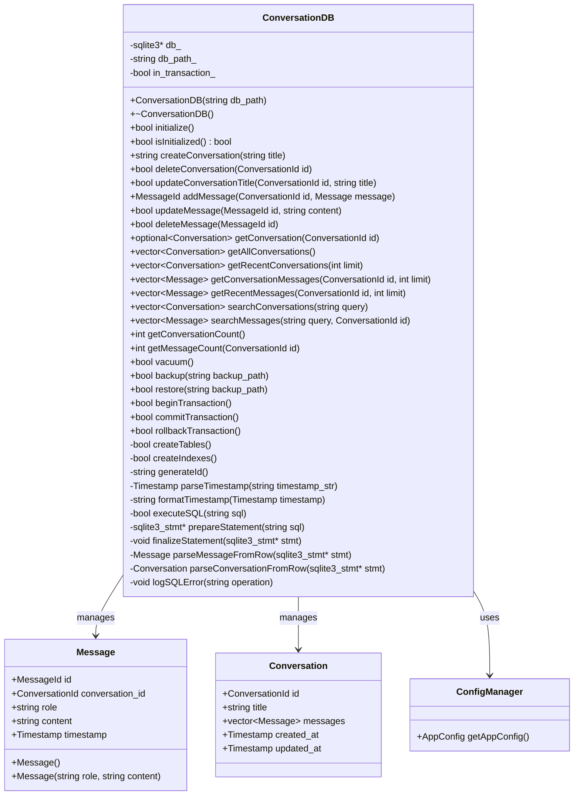
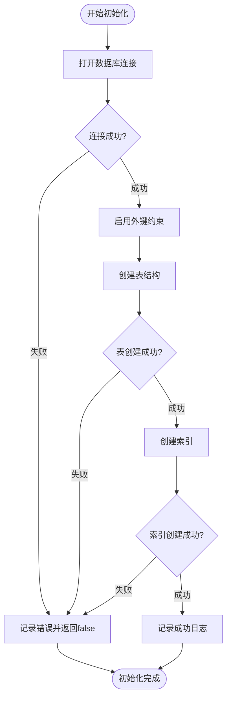
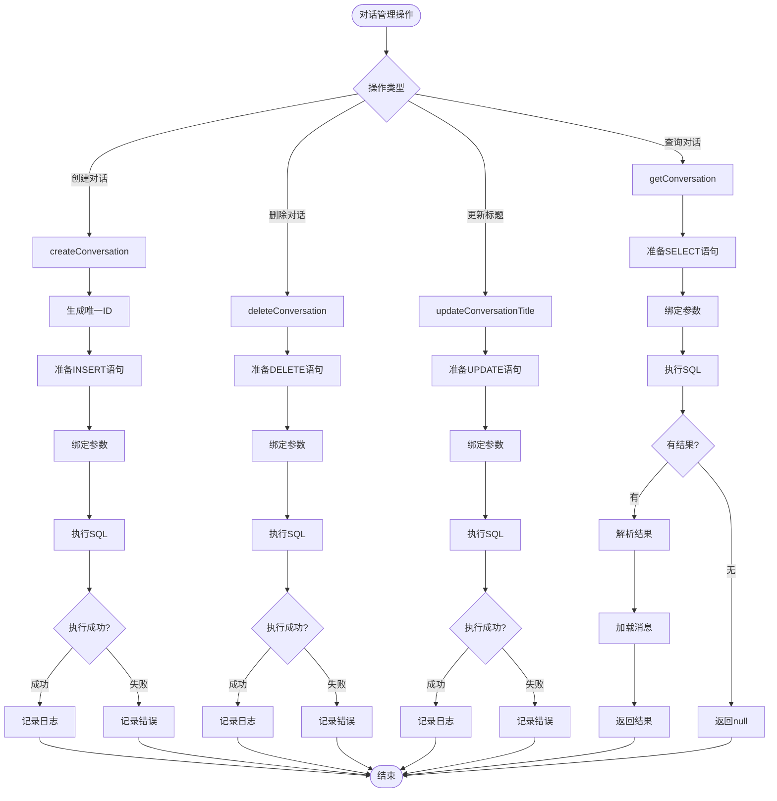
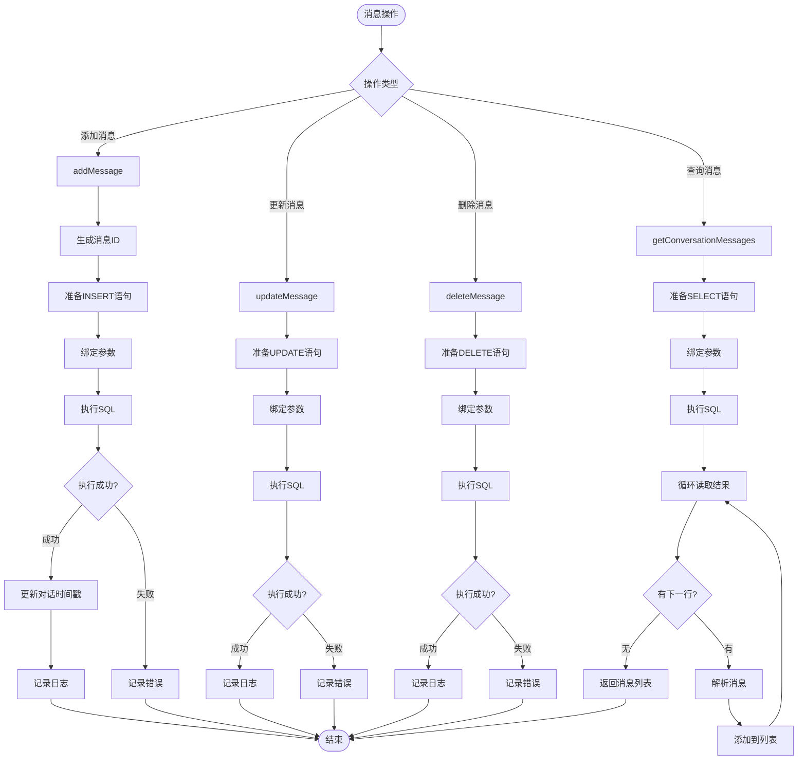
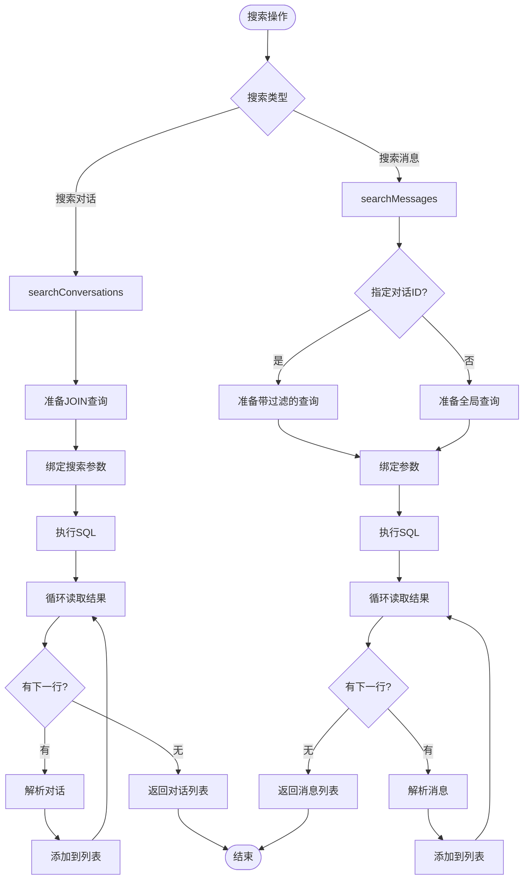
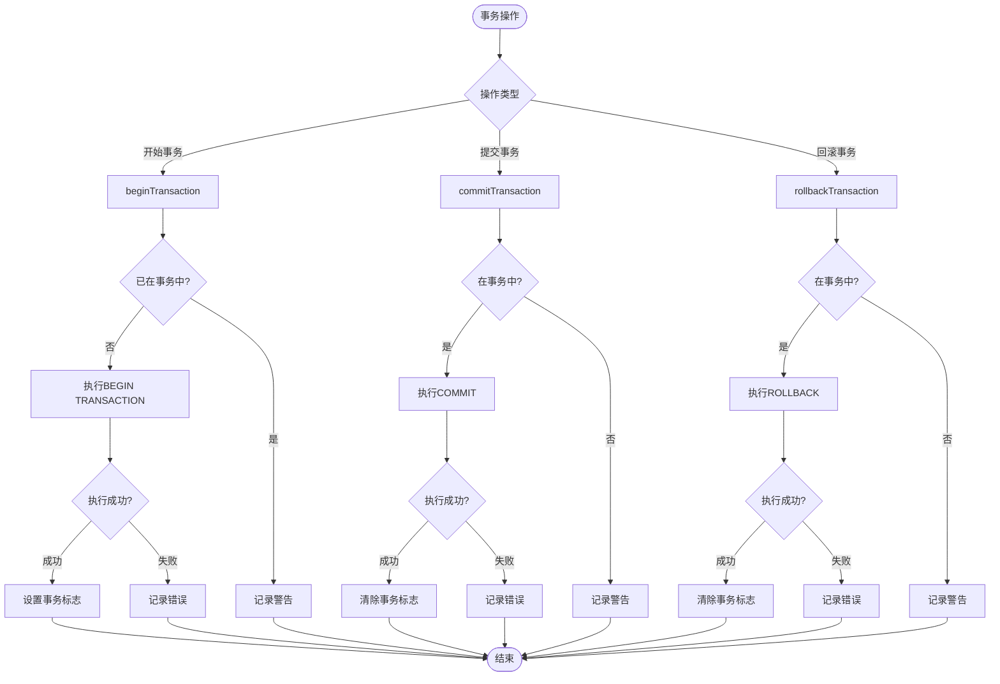
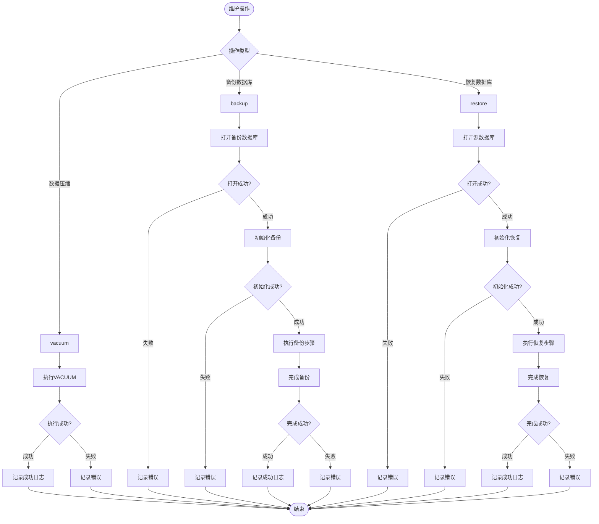
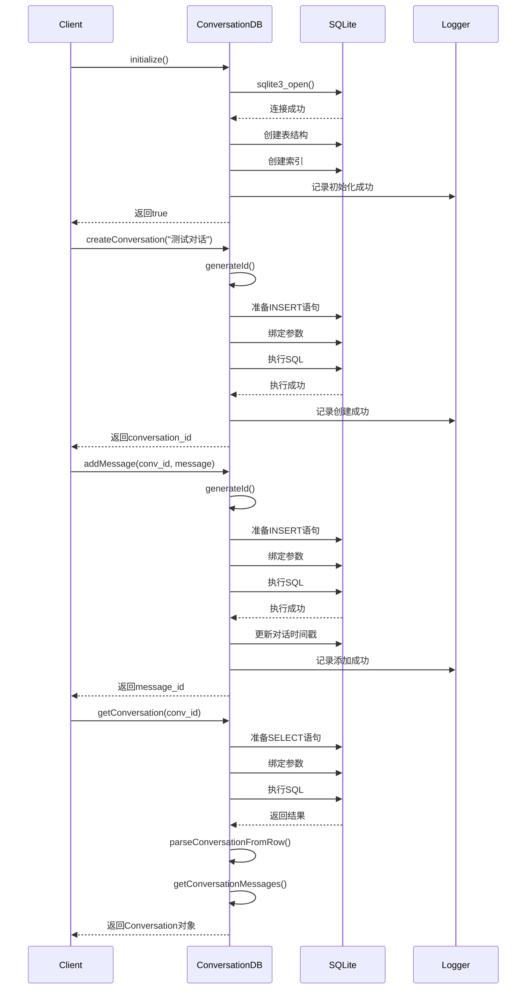

# conversation_db设计

## 1. ConversationDB 类图

```mermaid
classDiagram
    class ConversationDB {
        -sqlite3* db_
        -string db_path_
        -bool in_transaction_
        
        +ConversationDB(string db_path)
        +~ConversationDB()
        
        %% 初始化方法
        +bool initialize()
        +bool isInitialized() bool
        
        %% 对话管理
        +string createConversation(string title)
        +bool deleteConversation(ConversationId id)
        +bool updateConversationTitle(ConversationId id, string title)
        
        %% 消息操作
        +MessageId addMessage(ConversationId id, Message message)
        +bool updateMessage(MessageId id, string content)
        +bool deleteMessage(MessageId id)
        
        %% 查询操作
        +optional~Conversation~ getConversation(ConversationId id)
        +vector~Conversation~ getAllConversations()
        +vector~Conversation~ getRecentConversations(int limit)
        +vector~Message~ getConversationMessages(ConversationId id, int limit)
        +vector~Message~ getRecentMessages(ConversationId id, int limit)
        
        %% 搜索操作
        +vector~Conversation~ searchConversations(string query)
        +vector~Message~ searchMessages(string query, ConversationId id)
        
        %% 统计操作
        +int getConversationCount()
        +int getMessageCount(ConversationId id)
        
        %% 维护操作
        +bool vacuum()
        +bool backup(string backup_path)
        +bool restore(string backup_path)
        
        %% 事务操作
        +bool beginTransaction()
        +bool commitTransaction()
        +bool rollbackTransaction()
        
        %% 私有方法
        -bool createTables()
        -bool createIndexes()
        -string generateId()
        -Timestamp parseTimestamp(string timestamp_str)
        -string formatTimestamp(Timestamp timestamp)
        -bool executeSQL(string sql)
        -sqlite3_stmt* prepareStatement(string sql)
        -void finalizeStatement(sqlite3_stmt* stmt)
        -Message parseMessageFromRow(sqlite3_stmt* stmt)
        -Conversation parseConversationFromRow(sqlite3_stmt* stmt)
        -void logSQLError(string operation)
    }
    
    class Message {
        +MessageId id
        +ConversationId conversation_id
        +string role
        +string content
        +Timestamp timestamp
        +Message()
        +Message(string role, string content)
    }
    
    class Conversation {
        +ConversationId id
        +string title
        +vector~Message~ messages
        +Timestamp created_at
        +Timestamp updated_at
    }
    
    class ConfigManager {
        +AppConfig getAppConfig()
    }
    
    ConversationDB --> Message : manages
    ConversationDB --> Conversation : manages
    ConversationDB --> ConfigManager : uses
```

## 2. 数据库初始化流程图

```mermaid
flowchart TD
    START([开始初始化]) --> OPEN[打开数据库连接]
    OPEN --> CHECK{连接成功?}
    CHECK -->|失败| ERROR[记录错误并返回false]
    CHECK -->|成功| ENABLE[启用外键约束]
    ENABLE --> CREATE_TABLES[创建表结构]
    CREATE_TABLES --> CHECK_TABLES{表创建成功?}
    CHECK_TABLES -->|失败| ERROR
    CHECK_TABLES -->|成功| CREATE_INDEXES[创建索引]
    CREATE_INDEXES --> CHECK_INDEXES{索引创建成功?}
    CHECK_INDEXES -->|失败| ERROR
    CHECK_INDEXES -->|成功| SUCCESS[记录成功日志]
    SUCCESS --> END([初始化完成])
    ERROR --> END
```

## 3. 对话管理流程图

```mermaid
flowchart TD
    START([对话管理操作]) --> TYPE{操作类型}
    
    TYPE -->|创建对话| CREATE[createConversation]
    TYPE -->|删除对话| DELETE[deleteConversation]
    TYPE -->|更新标题| UPDATE[updateConversationTitle]
    TYPE -->|查询对话| QUERY[getConversation]
    
    CREATE --> GEN_ID[生成唯一ID]
    GEN_ID --> PREPARE_CREATE[准备INSERT语句]
    PREPARE_CREATE --> BIND_CREATE[绑定参数]
    BIND_CREATE --> EXEC_CREATE[执行SQL]
    EXEC_CREATE --> CHECK_CREATE{执行成功?}
    CHECK_CREATE -->|成功| LOG_CREATE[记录日志]
    CHECK_CREATE -->|失败| ERROR_CREATE[记录错误]
    
    DELETE --> PREPARE_DELETE[准备DELETE语句]
    PREPARE_DELETE --> BIND_DELETE[绑定参数]
    BIND_DELETE --> EXEC_DELETE[执行SQL]
    EXEC_DELETE --> CHECK_DELETE{执行成功?}
    CHECK_DELETE -->|成功| LOG_DELETE[记录日志]
    CHECK_DELETE -->|失败| ERROR_DELETE[记录错误]
    
    UPDATE --> PREPARE_UPDATE[准备UPDATE语句]
    PREPARE_UPDATE --> BIND_UPDATE[绑定参数]
    BIND_UPDATE --> EXEC_UPDATE[执行SQL]
    EXEC_UPDATE --> CHECK_UPDATE{执行成功?}
    CHECK_UPDATE -->|成功| LOG_UPDATE[记录日志]
    CHECK_UPDATE -->|失败| ERROR_UPDATE[记录错误]
    
    QUERY --> PREPARE_QUERY[准备SELECT语句]
    PREPARE_QUERY --> BIND_QUERY[绑定参数]
    BIND_QUERY --> EXEC_QUERY[执行SQL]
    EXEC_QUERY --> CHECK_QUERY{有结果?}
    CHECK_QUERY -->|有| PARSE[解析结果]
    CHECK_QUERY -->|无| RETURN_NULL[返回null]
    PARSE --> LOAD_MESSAGES[加载消息]
    LOAD_MESSAGES --> RETURN_RESULT[返回结果]
    
    LOG_CREATE --> END([结束])
    ERROR_CREATE --> END
    LOG_DELETE --> END
    ERROR_DELETE --> END
    LOG_UPDATE --> END
    ERROR_UPDATE --> END
    RETURN_RESULT --> END
    RETURN_NULL --> END
```

## 4. 消息操作详细流程图

```mermaid
flowchart TD
    START([消息操作]) --> TYPE{操作类型}
    
    TYPE -->|添加消息| ADD[addMessage]
    TYPE -->|更新消息| UPDATE[updateMessage]
    TYPE -->|删除消息| DELETE[deleteMessage]
    TYPE -->|查询消息| QUERY[getConversationMessages]
    
    ADD --> GEN_MSG_ID[生成消息ID]
    GEN_MSG_ID --> PREPARE_ADD[准备INSERT语句]
    PREPARE_ADD --> BIND_ADD[绑定参数]
    BIND_ADD --> EXEC_ADD[执行SQL]
    EXEC_ADD --> CHECK_ADD{执行成功?}
    CHECK_ADD -->|成功| UPDATE_CONV[更新对话时间戳]
    CHECK_ADD -->|失败| ERROR_ADD[记录错误]
    UPDATE_CONV --> LOG_ADD[记录日志]
    
    UPDATE --> PREPARE_UPDATE_MSG[准备UPDATE语句]
    PREPARE_UPDATE_MSG --> BIND_UPDATE_MSG[绑定参数]
    BIND_UPDATE_MSG --> EXEC_UPDATE_MSG[执行SQL]
    EXEC_UPDATE_MSG --> CHECK_UPDATE_MSG{执行成功?}
    CHECK_UPDATE_MSG -->|成功| LOG_UPDATE_MSG[记录日志]
    CHECK_UPDATE_MSG -->|失败| ERROR_UPDATE_MSG[记录错误]
    
    DELETE --> PREPARE_DELETE_MSG[准备DELETE语句]
    PREPARE_DELETE_MSG --> BIND_DELETE_MSG[绑定参数]
    BIND_DELETE_MSG --> EXEC_DELETE_MSG[执行SQL]
    EXEC_DELETE_MSG --> CHECK_DELETE_MSG{执行成功?}
    CHECK_DELETE_MSG -->|成功| LOG_DELETE_MSG[记录日志]
    CHECK_DELETE_MSG -->|失败| ERROR_DELETE_MSG[记录错误]
    
    QUERY --> PREPARE_QUERY_MSG[准备SELECT语句]
    PREPARE_QUERY_MSG --> BIND_QUERY_MSG[绑定参数]
    BIND_QUERY_MSG --> EXEC_QUERY_MSG[执行SQL]
    EXEC_QUERY_MSG --> LOOP[循环读取结果]
    LOOP --> CHECK_ROW{有下一行?}
    CHECK_ROW -->|有| PARSE_MSG[解析消息]
    CHECK_ROW -->|无| RETURN_MSGS[返回消息列表]
    PARSE_MSG --> ADD_TO_LIST[添加到列表]
    ADD_TO_LIST --> LOOP
    
    LOG_ADD --> END([结束])
    ERROR_ADD --> END
    LOG_UPDATE_MSG --> END
    ERROR_UPDATE_MSG --> END
    LOG_DELETE_MSG --> END
    ERROR_DELETE_MSG --> END
    RETURN_MSGS --> END
```

## 5. 搜索操作流程图

```mermaid
flowchart TD
    START([搜索操作]) --> TYPE{搜索类型}
    
    TYPE -->|搜索对话| SEARCH_CONV[searchConversations]
    TYPE -->|搜索消息| SEARCH_MSG[searchMessages]
    
    SEARCH_CONV --> PREPARE_CONV_SEARCH[准备JOIN查询]
    PREPARE_CONV_SEARCH --> BIND_CONV_SEARCH[绑定搜索参数]
    BIND_CONV_SEARCH --> EXEC_CONV_SEARCH[执行SQL]
    EXEC_CONV_SEARCH --> LOOP_CONV[循环读取结果]
    LOOP_CONV --> CHECK_CONV_ROW{有下一行?}
    CHECK_CONV_ROW -->|有| PARSE_CONV[解析对话]
    CHECK_CONV_ROW -->|无| RETURN_CONV[返回对话列表]
    PARSE_CONV --> ADD_CONV_TO_LIST[添加到列表]
    ADD_CONV_TO_LIST --> LOOP_CONV
    
    SEARCH_MSG --> CHECK_CONV_ID{指定对话ID?}
    CHECK_CONV_ID -->|是| PREPARE_MSG_SEARCH_FILTER[准备带过滤的查询]
    CHECK_CONV_ID -->|否| PREPARE_MSG_SEARCH_ALL[准备全局查询]
    PREPARE_MSG_SEARCH_FILTER --> BIND_MSG_SEARCH[绑定参数]
    PREPARE_MSG_SEARCH_ALL --> BIND_MSG_SEARCH
    BIND_MSG_SEARCH --> EXEC_MSG_SEARCH[执行SQL]
    EXEC_MSG_SEARCH --> LOOP_MSG[循环读取结果]
    LOOP_MSG --> CHECK_MSG_ROW{有下一行?}
    CHECK_MSG_ROW -->|有| PARSE_MSG_SEARCH[解析消息]
    CHECK_MSG_ROW -->|无| RETURN_MSG[返回消息列表]
    PARSE_MSG_SEARCH --> ADD_MSG_TO_LIST[添加到列表]
    ADD_MSG_TO_LIST --> LOOP_MSG
    
    RETURN_CONV --> END([结束])
    RETURN_MSG --> END
```

## 6. 事务管理流程图

```mermaid
flowchart TD
    START([事务操作]) --> TYPE{操作类型}
    
    TYPE -->|开始事务| BEGIN[beginTransaction]
    TYPE -->|提交事务| COMMIT[commitTransaction]
    TYPE -->|回滚事务| ROLLBACK[rollbackTransaction]
    
    BEGIN --> CHECK_TRANS{已在事务中?}
    CHECK_TRANS -->|是| WARN[记录警告]
    CHECK_TRANS -->|否| EXEC_BEGIN[执行BEGIN TRANSACTION]
    EXEC_BEGIN --> CHECK_BEGIN{执行成功?}
    CHECK_BEGIN -->|成功| SET_FLAG[设置事务标志]
    CHECK_BEGIN -->|失败| ERROR_BEGIN[记录错误]
    
    COMMIT --> CHECK_COMMIT{在事务中?}
    CHECK_COMMIT -->|否| WARN_COMMIT[记录警告]
    CHECK_COMMIT -->|是| EXEC_COMMIT[执行COMMIT]
    EXEC_COMMIT --> CHECK_COMMIT_SUCCESS{执行成功?}
    CHECK_COMMIT_SUCCESS -->|成功| CLEAR_FLAG[清除事务标志]
    CHECK_COMMIT_SUCCESS -->|失败| ERROR_COMMIT[记录错误]
    
    ROLLBACK --> CHECK_ROLLBACK{在事务中?}
    CHECK_ROLLBACK -->|否| WARN_ROLLBACK[记录警告]
    CHECK_ROLLBACK -->|是| EXEC_ROLLBACK[执行ROLLBACK]
    EXEC_ROLLBACK --> CHECK_ROLLBACK_SUCCESS{执行成功?}
    CHECK_ROLLBACK_SUCCESS -->|成功| CLEAR_FLAG_ROLL[清除事务标志]
    CHECK_ROLLBACK_SUCCESS -->|失败| ERROR_ROLLBACK[记录错误]
    
    SET_FLAG --> END([结束])
    ERROR_BEGIN --> END
    WARN --> END
    CLEAR_FLAG --> END
    ERROR_COMMIT --> END
    WARN_COMMIT --> END
    CLEAR_FLAG_ROLL --> END
    ERROR_ROLLBACK --> END
    WARN_ROLLBACK --> END
```

## 7. 数据库维护流程图

```mermaid
flowchart TD
    START([维护操作]) --> TYPE{操作类型}
    
    TYPE -->|数据压缩| VACUUM[vacuum]
    TYPE -->|备份数据库| BACKUP[backup]
    TYPE -->|恢复数据库| RESTORE[restore]
    
    VACUUM --> EXEC_VACUUM[执行VACUUM]
    EXEC_VACUUM --> CHECK_VACUUM{执行成功?}
    CHECK_VACUUM -->|成功| LOG_VACUUM[记录成功日志]
    CHECK_VACUUM -->|失败| ERROR_VACUUM[记录错误]
    
    BACKUP --> OPEN_BACKUP[打开备份数据库]
    OPEN_BACKUP --> CHECK_OPEN{打开成功?}
    CHECK_OPEN -->|失败| ERROR_OPEN[记录错误]
    CHECK_OPEN -->|成功| INIT_BACKUP[初始化备份]
    INIT_BACKUP --> CHECK_INIT{初始化成功?}
    CHECK_INIT -->|失败| ERROR_INIT[记录错误]
    CHECK_INIT -->|成功| STEP_BACKUP[执行备份步骤]
    STEP_BACKUP --> FINISH_BACKUP[完成备份]
    FINISH_BACKUP --> CHECK_FINISH{完成成功?}
    CHECK_FINISH -->|成功| LOG_BACKUP[记录成功日志]
    CHECK_FINISH -->|失败| ERROR_FINISH[记录错误]
    
    RESTORE --> OPEN_RESTORE[打开源数据库]
    OPEN_RESTORE --> CHECK_OPEN_RESTORE{打开成功?}
    CHECK_OPEN_RESTORE -->|失败| ERROR_OPEN_RESTORE[记录错误]
    CHECK_OPEN_RESTORE -->|成功| INIT_RESTORE[初始化恢复]
    INIT_RESTORE --> CHECK_INIT_RESTORE{初始化成功?}
    CHECK_INIT_RESTORE -->|失败| ERROR_INIT_RESTORE[记录错误]
    CHECK_INIT_RESTORE -->|成功| STEP_RESTORE[执行恢复步骤]
    STEP_RESTORE --> FINISH_RESTORE[完成恢复]
    FINISH_RESTORE --> CHECK_FINISH_RESTORE{完成成功?}
    CHECK_FINISH_RESTORE -->|成功| LOG_RESTORE[记录成功日志]
    CHECK_FINISH_RESTORE -->|失败| ERROR_FINISH_RESTORE[记录错误]
    
    LOG_VACUUM --> END([结束])
    ERROR_VACUUM --> END
    LOG_BACKUP --> END
    ERROR_OPEN --> END
    ERROR_INIT --> END
    ERROR_FINISH --> END
    LOG_RESTORE --> END
    ERROR_OPEN_RESTORE --> END
    ERROR_INIT_RESTORE --> END
    ERROR_FINISH_RESTORE --> END
```

## 8. 核心方法调用时序图

```mermaid
sequenceDiagram
    participant Client
    participant ConversationDB
    participant SQLite
    participant Logger
    
    Client->>ConversationDB: initialize()
    ConversationDB->>SQLite: sqlite3_open()
    SQLite-->>ConversationDB: 连接成功
    ConversationDB->>SQLite: 创建表结构
    ConversationDB->>SQLite: 创建索引
    ConversationDB->>Logger: 记录初始化成功
    ConversationDB-->>Client: 返回true
    
    Client->>ConversationDB: createConversation("测试对话")
    ConversationDB->>ConversationDB: generateId()
    ConversationDB->>SQLite: 准备INSERT语句
    ConversationDB->>SQLite: 绑定参数
    ConversationDB->>SQLite: 执行SQL
    SQLite-->>ConversationDB: 执行成功
    ConversationDB->>Logger: 记录创建成功
    ConversationDB-->>Client: 返回conversation_id
    
    Client->>ConversationDB: addMessage(conv_id, message)
    ConversationDB->>ConversationDB: generateId()
    ConversationDB->>SQLite: 准备INSERT语句
    ConversationDB->>SQLite: 绑定参数
    ConversationDB->>SQLite: 执行SQL
    SQLite-->>ConversationDB: 执行成功
    ConversationDB->>SQLite: 更新对话时间戳
    ConversationDB->>Logger: 记录添加成功
    ConversationDB-->>Client: 返回message_id
    
    Client->>ConversationDB: getConversation(conv_id)
    ConversationDB->>SQLite: 准备SELECT语句
    ConversationDB->>SQLite: 绑定参数
    ConversationDB->>SQLite: 执行SQL
    SQLite-->>ConversationDB: 返回结果
    ConversationDB->>ConversationDB: parseConversationFromRow()
    ConversationDB->>ConversationDB: getConversationMessages()
    ConversationDB-->>Client: 返回Conversation对象
```

