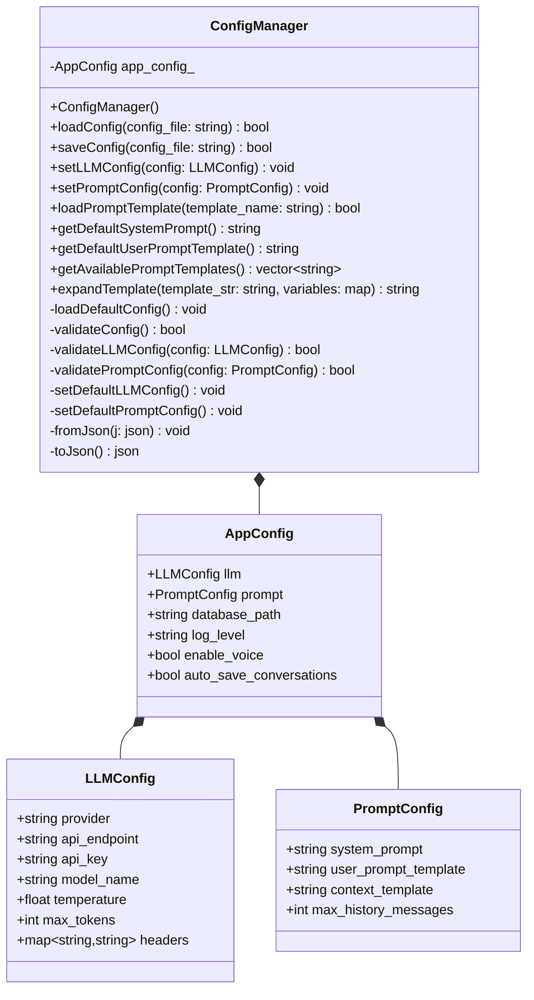

# 配置文件管理类图

从代码中可以看出，这是一个配置管理系统，主要包含了几个关键的类和结构体。

这个类图展示了以下关键组件和关系：

1. `ConfigManager` 类：
   - 这是主要的配置管理类
   - 包含了配置的加载、保存、验证等核心功能
   - 管理着默认配置的设置
   - 提供了模板管理和扩展功能

2. `AppConfig` 结构体：
   - 包含了应用程序的所有配置信息
   - 聚合了 LLM 配置和提示词配置
   - 包含基本的应用程序设置

3. `LLMConfig` 结构体：
   - 包含了语言模型的相关配置
   - 存储 API 密钥、端点等关键信息
   - 包含模型参数设置

4. `PromptConfig` 结构体：
   - 管理提示词相关的配置
   - 包含系统提示词和用户提示词模板
   - 管理对话历史相关设置

关系说明：
- `ConfigManager` 包含一个 `AppConfig` 实例（组合关系）
- `AppConfig` 包含 `LLMConfig` 和 `PromptConfig` 实例（组合关系）

