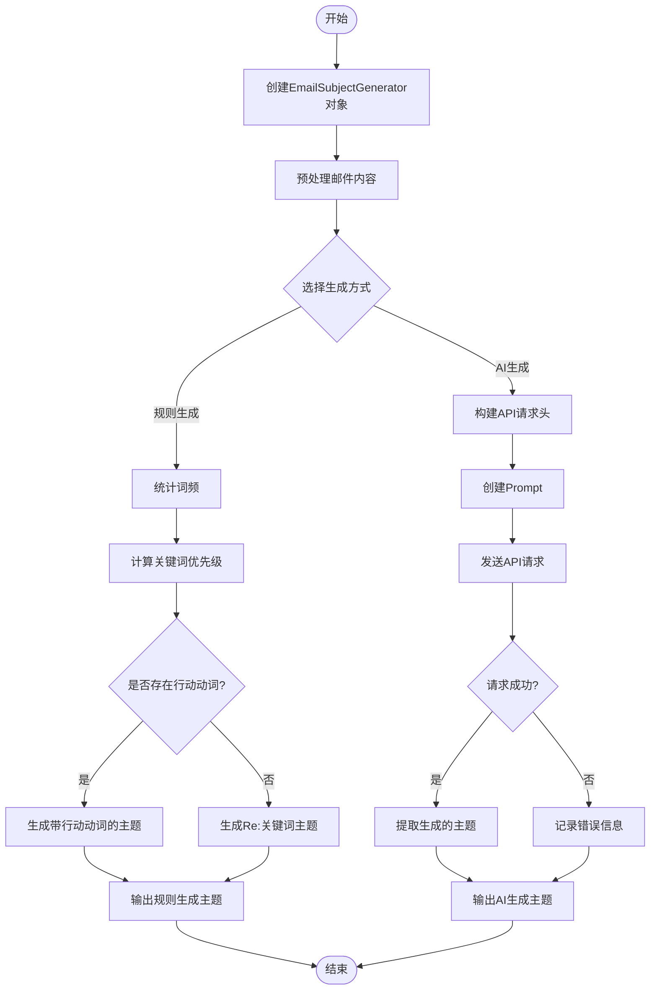

# lesson 1: 快速开始

## 环境搭建

### 克隆llm_engineering仓库

在windows下，创建一个本地项目路径：

```
D:\project\
```

这是我的本地路径：
```shelll
D:\project\llm_engineering
```

cd到创建的本地项目中，使用git克隆llm_engineering仓库：
```shell
git clone https://github.com/ed-donner/llm_engineering.git
```

### 下载安装Anaconda

1. 下载链接：[Anaconda](https://docs.anaconda.com/anaconda/install/windows/)

2. 设置环境：从“开始”菜单，或搜索栏搜索“Anaconda Powershell Prompt”，会在你的用户路径下打开终端；

   cd到刚才克隆的项目文件夹下，运行`conda env create -f environment.yml`；

   创建完成AI项目的环境后（需要一段时间下载和加载），运行`conda activate llms`激活llms

3. 运行`jupyter lab`：将会打开浏览器显示`Jupyter Notebook`的界面

## 快速开始

### 配置大模型API

1. 创建大模型API，获取API Key（我使用的是DeepSeek的，也可以使用openai）

2. 在`llm_engineering`项目文件夹下，创建`.env`文件，并向其中写入刚才创建的大模型API Key，并保存：

   ```shell
   DEEPSEEK_API_KEY=[your deepseek api key]
   OPENAI_API_KEY=[your openai api key]
   ```

3. 重新开启llms：

   ```shell
   conda activate llms
   ```

4. 运行`jupyter lab`

   ```shell
   jupyter lab
   ```

### Jupyter Notebook代码运行

按住shift+回车可以执行cell中的代码

#### 导入模块和包

```python
import os														      # 提供与操作系统交互的接口，用于管理文件、目录、环境变量和进程
import requests 													# 用于HTTP请求
from dotenv import load_dotenv									    # 用于环境变量管理
from bs4 import BeautifulSoup									     # 解析HTML/XML文档，提取结构化数据
from IPython.display import Markdown, display					     # 在Jupyter Notebook中渲染Markdown文本和富媒体内容
from openai import OpenAI										   # 调用OpenAI API

from selenium import webdriver									    # 控制浏览器模拟用户操作（点击、输入、滚动等）
from selenium.webdriver.chrome.service import Service
from selenium.webdriver.chrome.options import Options
from webdriver_manager.chrome import ChromeDriverManager	    # 添加延时
import time
```

#### 加载环境变量

```python
# Load environment variables in a file called .env

load_dotenv(override=True)
api_key = os.getenv('OPENAI_API_KEY')

# Check the key

if not api_key:
    print("No API key was found - please head over to the troubleshooting notebook in this folder to identify & fix!")
elif not api_key.startswith("sk-proj-"):
    print("An API key was found, but it doesn't start sk-proj-; please check you're using the right key - see troubleshooting notebook")
elif api_key.strip() != api_key:
    print("An API key was found, but it looks like it might have space or tab characters at the start or end - please remove them - see troubleshooting notebook")
else:
    print("API key found and looks good so far!")

```

#### 使用openai

```python
openai = OpenAI()
```

#### example-网页标题抓取和总结

```python
# A class to represent a Webpage
# If you're not familiar with Classes, check out the "Intermediate Python" notebook

# Some websites need you to use proper headers when fetching them:
headers = {
 "User-Agent": "Mozilla/5.0 (Windows NT 10.0; Win64; x64) AppleWebKit/537.36 (KHTML, like Gecko) Chrome/117.0.0.0 Safari/537.36"
}

class Website:

    def __init__(self, url):
        """
        Create this Website object from the given url using the BeautifulSoup library
        """
        self.url = url
        response = requests.get(url, headers=headers)
        soup = BeautifulSoup(response.content, 'html.parser')
        self.title = soup.title.string if soup.title else "No title found"
        for irrelevant in soup.body(["script", "style", "img", "input"]):
            irrelevant.decompose()
        self.text = soup.body.get_text(separator="\n", strip=True)
```

#### 设置用户prompt和系统prompt

```python
# Define our system prompt - you can experiment with this later, changing the last sentence to 'Respond in markdown in Spanish."

system_prompt = "You are an assistant that analyzes the contents of a website \
and provides a short summary, ignoring text that might be navigation related. \
Respond in markdown in Chinese."

# A function that writes a User Prompt that asks for summaries of websites:

def user_prompt_for(website):
    user_prompt = f"You are looking at a website titled {website.title}"
    user_prompt += "\nThe contents of this website is as follows; \
please provide a short summary of this website in markdown. \
If it includes news or announcements, then summarize these too.\n\n"
    user_prompt += website.text
    return user_prompt
    
# See how this function creates exactly the format above

def messages_for(website):
	"""
 	openai支持的消息如下：
	[
    	{"role": "system", "content": "system message goes here"},
    	{"role": "user", "content": "user message goes here"}
	]
 	"""
    return [
        {"role": "system", "content": system_prompt},
        {"role": "user", "content": user_prompt_for(website)}
    ]
 
```

#### 使用openai生成响应

```python
# And now: call the OpenAI API. You will get very familiar with this!

def summarize(url):
    website = Website(url)
    response = openai.chat.completions.create(
        model = "gpt-4o-mini",
        messages = messages_for(website)
    )
    return response.choices[0].message.content

# A function to display this nicely in the Jupyter output, using markdown

def display_summary(url):
    summary = summarize(url)
    display(Markdown(summary))
```

#### example-test

```python
display_summary("https://cnn.com")
```

## Examples

写一个可以接收电子邮件内容的东西，并为电子邮件建议一个合适的简短主题词。这种功能可能会被内置到商业电子邮件工具中

### Code

```python
from selenium import webdriver
from selenium.webdriver.chrome.service import Service
from selenium.webdriver.chrome.options import Options
from webdriver_manager.chrome import ChromeDriverManager
import time
import os
import re
import email
import logging
import requests
import json
from typing import Tuple, Optional

# ===== 配置区域 =====
# 1. DeepSeek API 配置
DEEPSEEK_API_KEY = os.getenv('DEEPSEEK_API_KEY') 
DEEPSEEK_API_URL = "https://api.deepseek.com/v1/chat/completions" 

# 2. 规则引擎配置
KEYWORD_PRIORITY = {
    "urgent": 10, "deadline": 9, "meeting": 8, "report": 7, 
    "request": 6, "follow up": 5, "update": 4, "reminder": 3
}

# 3. 日志配置
logging.basicConfig(level=logging.INFO, format='%(asctime)s - %(levelname)s - %(message)s')

# ===== 核心功能实现 =====
class EmailSubjectGenerator:
    def __init__(self, content: str):
        """
        初始化邮件内容处理器
        :param content: 原始邮件内容（字符串或bytes）
        """
        self.raw_content = content
        self.clean_text = self._preprocess_content()
        
    def _preprocess_content(self) -> str:
        """预处理邮件内容，返回纯文本（保持不变）"""
        # 字节类型转换
        if isinstance(self.raw_content, bytes):
            msg = email.message_from_bytes(self.raw_content)
        else:
            msg = email.message_from_string(self.raw_content)
        
        # 提取邮件正文
        body = ""
        if msg.is_multipart():
            for part in msg.walk():
                if part.get_content_type() == "text/plain":
                    body = part.get_payload(decode=True).decode()
                    break
        else:
            body = msg.get_payload(decode=True).decode()
        
        # 清理文本（删除多余空格/换行）
        return re.sub(r'\s+', ' ', body).strip()

    def generate_by_rules(self) -> str:
        """
        基于规则生成主题（无需API调用）
        实现原理：
          1. 提取高频关键词
          2. 识别行动动词（请求/通知/询问等）
          3. 检测时间敏感词
        """
        # 关键词提取
        word_freq = {}
        for word in re.findall(r'\b\w{4,}\b', self.clean_text.lower()):
            word_freq[word] = word_freq.get(word, 0) + 1
        
        # 按优先级排序
        candidates = []
        for word, count in word_freq.items():
            priority = KEYWORD_PRIORITY.get(word, min(KEYWORD_PRIORITY.values()) - 1)
            candidates.append((word, priority * count))
        
        # 选择TOP3关键词
        candidates.sort(key=lambda x: x[1], reverse=True)
        top_keywords = [w for w, _ in candidates[:3] if w in KEYWORD_PRIORITY] 
        
        # 构建主题（根据邮件类型）
        if not top_keywords:
            return "Important Message"
        
        action_verbs = {"request": "Request", "follow up": "Follow Up", "reminder": "Reminder"}
        for verb in action_verbs:
            if verb in self.clean_text:
                return f"{action_verbs[verb]} re: {'/'.join(top_keywords)}"
        
        return f"Re: {'/'.join(top_keywords).title()}"

    def generate_by_ai(self) -> Tuple[str, Optional[str]]:
        """
        使用 DeepSeek API 生成主题
        返回: (生成的主题, 错误信息)
        """
        # 构建 API 请求头
        headers = {
            "Authorization": f"Bearer {DEEPSEEK_API_KEY}",
            "Content-Type": "application/json"
        }
        
        # 构建优化邮件主题的 Prompt
        prompt = f"""
        你是一位专业的邮件主题优化助手，请根据以下邮件正文生成一个符合规范的邮件主题：
        1. 长度在6-8个英文单词或30个字符以内
        2. 开头包含核心关键词
        3. 明确体现邮件目的（如请求/通知/询问）
        4. 若内容紧急，添加[Urgent]标签
        
        邮件正文：
        {self.clean_text[:1000]}  # 截断长文本
        
        生成要求：
        - 只输出最终主题，不加任何解释
        - 保持专业且简洁
        - 避免使用ALL CAPS（全大写）
        """
        
        # 构建请求体
        payload = {
            "model": "deepseek-chat",  # DeepSeek 对话模型
            "messages": [{"role": "user", "content": prompt}],
            "temperature": 0.3,        # 低随机性保证稳定性
            "max_tokens": 50           # 限制输出长度
        }
        
        try:
            # 发送 API 请求
            response = requests.post(
                DEEPSEEK_API_URL,
                headers=headers,
                json=payload,
                timeout=15  # 超时设置
            )
            
            # 处理响应
            if response.status_code == 200:
                result = response.json()
                return result['choices'][0]['message']['content'].strip(), None
            else:
                error_msg = f"API错误 {response.status_code}: {response.text}"
                logging.error(error_msg)
                return "", error_msg
                
        except Exception as e:
            logging.error(f"请求失败: {str(e)}")
            return "", str(e)

# ===== 使用示例 =====
if __name__ == "__main__":
    # 示例邮件内容（实际使用时可替换为真实邮件）
    sample_email = """
    From: project.manager@company.com
    To: team@company.com
    
    Hi team,
    This is a reminder that the Q3 project report deadline is this Friday. 
    Please submit your sections by 5 PM tomorrow. This is URGENT!
    
    Best regards,
    Alex
    """
    
    # 处理邮件
    processor = EmailSubjectGenerator(sample_email)
    
    # 方案1：使用规则引擎
    rule_based_subject = processor.generate_by_rules()
    print(f"规则引擎生成: {rule_based_subject}")
    # 示例输出：Urgent Reminder re: report/deadline/submit
    
    # 方案2：使用AI引擎（DeepSeek）
    ai_subject, error = processor.generate_by_ai()
    if not error:
        print(f"AI引擎生成: {ai_subject}")
        # 示例输出：[Urgent] Reminder: Q3 Report Deadline This Friday
```

运行生成：

```shell
规则引擎生成: Reminder re: urgent/deadline/report
AI引擎生成: [Urgent] Q3 report submission deadline reminder
```

### 流程图



