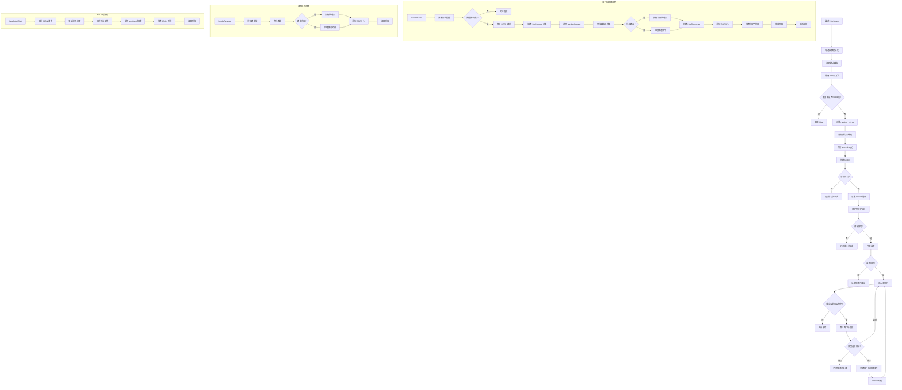
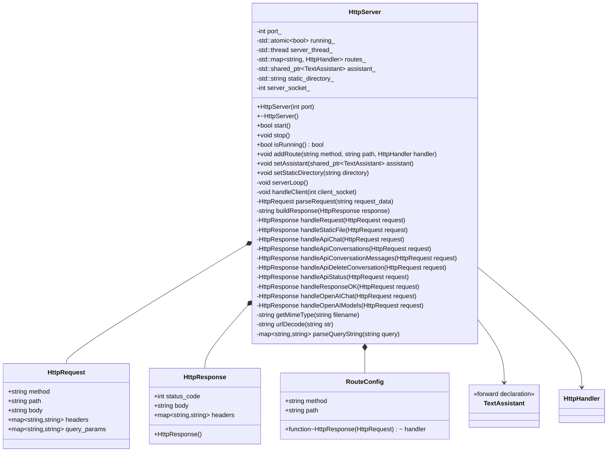
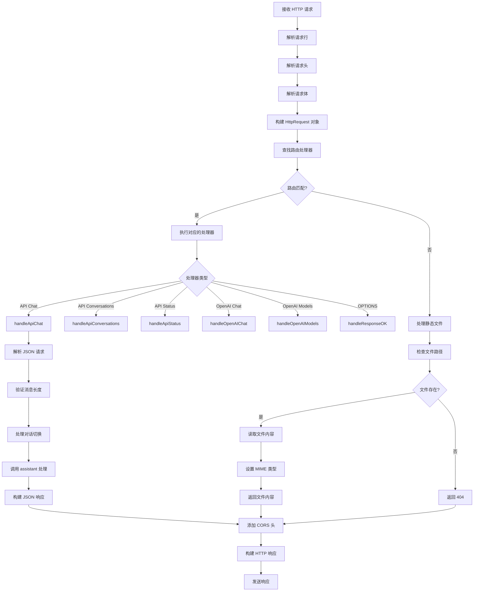
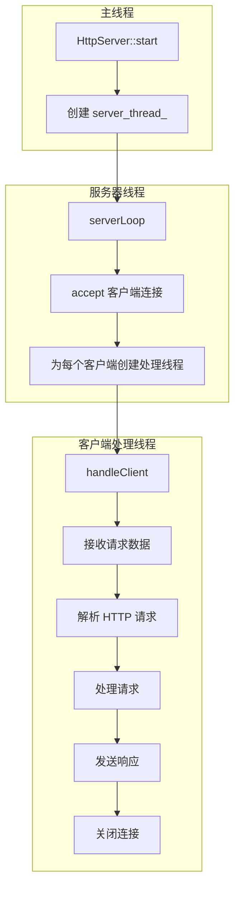
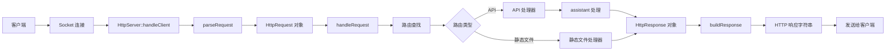

# Http服务类设计

## 1. HTTP 服务器详细流程图

```mermaid
flowchart TD
    A["启动 HttpServer"] --> B["构造函数初始化"]
    B --> C["注册默认路由"]
    C --> D["调用 start() 方法"]
    D --> E{"服务器是否已在运行?"}
    E -->|是| F["返回 false"]
    E -->|否| G["设置 running_ = true"]
    G --> H["创建服务器线程"]
    H --> I["执行 serverLoop()"]
    
    I --> J["创建 socket"]
    J --> K{"创建成功?"}
    K -->|否| L["记录错误并退出"]
    K -->|是| M["设置 socket 选项"]
    M --> N["绑定到指定端口"]
    N --> O{"绑定成功?"}
    O -->|否| P["记录错误并退出"]
    O -->|是| Q["开始监听"]
    Q --> R{"监听成功?"}
    R -->|否| S["记录错误并退出"]
    R -->|是| T["进入主循环"]
    
    T --> U{"服务器是否运行中?"}
    U -->|否| V["退出循环"]
    U -->|是| W["等待客户端连接"]
    W --> X{"接受连接成功?"}
    X -->|超时| T
    X -->|错误| Y["记录错误并继续"]
    X -->|成功| Z["创建客户端处理线程"]
    Z --> AA["detach 线程"]
    AA --> T
    
    subgraph CLIENT_HANDLING["客户端处理流程"]
        BB["handleClient"] --> CC["接收请求数据"]
        CC --> DD{"数据接收成功?"}
        DD -->|否| EE["关闭连接"]
        DD -->|是| FF["解析 HTTP 请求"]
        FF --> GG["构建 HttpRequest 对象"]
        GG --> HH["调用 handleRequest"]
        HH --> II["查找路由处理器"]
        II --> JJ{"找到路由?"}
        JJ -->|否| KK["处理静态文件"]
        JJ -->|是| LL["执行路由处理器"]
        LL --> MM["构建 HttpResponse"]
        KK --> MM
        MM --> NN["添加 CORS 头"]
        NN --> OO["构建响应字符串"]
        OO --> PP["发送响应"]
        PP --> QQ["关闭连接"]
    end
    
    subgraph REQUEST_PROCESS["请求处理流程"]
        RR["handleRequest"] --> SS["构建路由键"]
        SS --> TT["查找路由"]
        TT --> UU{"路由存在?"}
        UU -->|是| VV["执行处理器"]
        UU -->|否| WW["处理静态文件"]
        VV --> XX["添加 CORS 头"]
        WW --> XX
        XX --> YY["返回响应"]
    end
    
    subgraph API_PROCESS["API 处理流程"]
        ZZ["handleApiChat"] --> AAA["解析 JSON 请求"]
        AAA --> BBB["验证消息长度"]
        BBB --> CCC["处理对话切换"]
        CCC --> DDD["调用 assistant 处理"]
        DDD --> EEE["构建 JSON 响应"]
        EEE --> FFF["返回响应"]
    end
```

## 2. HTTP 服务器类图

```mermaid
classDiagram
    class HttpServer {
        -int port_
        -std::atomic~bool~ running_
        -std::thread server_thread_
        -std::map~string, HttpHandler~ routes_
        -std::shared_ptr~TextAssistant~ assistant_
        -std::string static_directory_
        -int server_socket_
        
        +HttpServer(int port)
        +~HttpServer()
        +bool start()
        +void stop()
        +bool isRunning() bool
        +void addRoute(string method, string path, HttpHandler handler)
        +void setAssistant(shared_ptr~TextAssistant~ assistant)
        +void setStaticDirectory(string directory)
        
        -void serverLoop()
        -void handleClient(int client_socket)
        -HttpRequest parseRequest(string request_data)
        -string buildResponse(HttpResponse response)
        -HttpResponse handleRequest(HttpRequest request)
        -HttpResponse handleStaticFile(HttpRequest request)
        -HttpResponse handleApiChat(HttpRequest request)
        -HttpResponse handleApiConversations(HttpRequest request)
        -HttpResponse handleApiConversationMessages(HttpRequest request)
        -HttpResponse handleApiDeleteConversation(HttpRequest request)
        -HttpResponse handleApiStatus(HttpRequest request)
        -HttpResponse handleResponseOK(HttpRequest request)
        -HttpResponse handleOpenAIChat(HttpRequest request)
        -HttpResponse handleOpenAIModels(HttpRequest request)
        -string getMimeType(string filename)
        -string urlDecode(string str)
        -map~string,string~ parseQueryString(string query)
    }

    class HttpRequest {
        +string method
        +string path
        +string body
        +map~string,string~ headers
        +map~string,string~ query_params
    }

    class HttpResponse {
        +int status_code
        +string body
        +map~string,string~ headers
        +HttpResponse()
    }

    class RouteConfig {
        +string method
        +string path
        +function~HttpResponse(HttpRequest)~ handler
    }

    class TextAssistant {
        <<forward declaration>>
    }

    HttpServer *-- HttpRequest
    HttpServer *-- HttpResponse
    HttpServer *-- RouteConfig
    HttpServer --> TextAssistant
    HttpServer --> HttpHandler
```

## 3. 路由处理流程图

```mermaid
flowchart TD
    A[接收 HTTP 请求] --> B[解析请求行]
    B --> C[解析请求头]
    C --> D[解析请求体]
    D --> E[构建 HttpRequest 对象]
    E --> F[查找路由处理器]
    
    F --> G{路由匹配?}
    G -->|是| H[执行对应的处理器]
    G -->|否| I[处理静态文件]
    
    H --> J{处理器类型}
    J -->|API Chat| K[handleApiChat]
    J -->|API Conversations| L[handleApiConversations]
    J -->|API Status| M[handleApiStatus]
    J -->|OpenAI Chat| N[handleOpenAIChat]
    J -->|OpenAI Models| O[handleOpenAIModels]
    J -->|OPTIONS| P[handleResponseOK]
    
    K --> Q[解析 JSON 请求]
    Q --> R[验证消息长度]
    R --> S[处理对话切换]
    S --> T[调用 assistant 处理]
    T --> U[构建 JSON 响应]
    
    I --> V[检查文件路径]
    V --> W{文件存在?}
    W -->|是| X[读取文件内容]
    W -->|否| Y[返回 404]
    X --> Z[设置 MIME 类型]
    Z --> AA[返回文件内容]
    
    U --> BB[添加 CORS 头]
    Y --> BB
    AA --> BB
    BB --> CC[构建 HTTP 响应]
    CC --> DD[发送响应]
```

## 4. 线程模型图

```mermaid
graph TB
    subgraph "主线程"
        A[HttpServer::start]
        B[创建 server_thread_]
    end
    
    subgraph "服务器线程"
        C[serverLoop]
        D[accept 客户端连接]
        E[为每个客户端创建处理线程]
    end
    
    subgraph "客户端处理线程"
        F[handleClient]
        G[接收请求数据]
        H[解析 HTTP 请求]
        I[处理请求]
        J[发送响应]
        K[关闭连接]
    end
    
    A --> B
    B --> C
    C --> D
    D --> E
    E --> F
    F --> G
    G --> H
    H --> I
    I --> J
    J --> K
```

## 5. 数据流图

```mermaid
flowchart LR
    A[客户端] --> B[Socket 连接]
    B --> C[HttpServer::handleClient]
    C --> D[parseRequest]
    D --> E[HttpRequest 对象]
    E --> F[handleRequest]
    F --> G[路由查找]
    G --> H{路由类型}
    H -->|API| I[API 处理器]
    H -->|静态文件| J[静态文件处理器]
    I --> K[assistant 处理]
    K --> L[HttpResponse 对象]
    J --> L
    L --> M[buildResponse]
    M --> N[HTTP 响应字符串]
    N --> O[发送给客户端]
```

