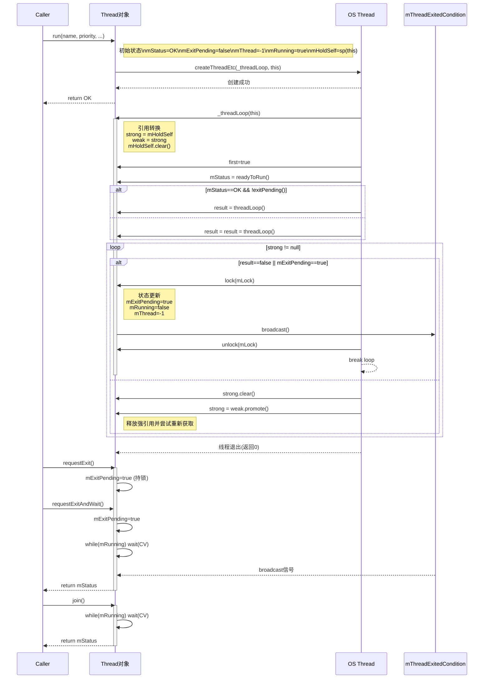

# AOSP组件源码：Thread

## AOSP介绍

### **Android开源项目 AOSP 概述**

**AOSP**（Android Open Source Project）是由Google主导的开源操作系统项目，基于Apache 2.0许可证发布，为移动设备提供基础框架和核心组件。其核心目标是打造一个开放、兼容的移动平台，允许开发者自由修改、分发和定制系统。

**关键特性与架构**

1. **模块化分层设计**：
   * **应用层**：包含系统预装应用（如相机、短信）和第三方应用。
   * **应用框架**：提供Java API（如`ActivityManager`），支撑应用开发。
   * **系统服务**：包括关键守护进程（如`SurfaceFlinger`渲染服务）和硬件抽象层（HAL）。
   * **原生库与运行时**：如`libc`、`libutils`等C/C++库，以及Android运行时（ART）执行环境。
   * **Linux内核**：负责硬件驱动、进程调度等底层功能。


### **libutils组件**

**libutils**是AOSP的核心底层库，以C++实现，提供基础数据结构和跨进程通信（IPC）支持。

**核心功能与组件**

1. **基础数据结构与工具类**：
   * **字符串处理**：`String8`（单字节字符串）、`String16`（UTF-16字符串），支持高效内存操作。
   * **容器类**：如`Vector`（动态数组）、`List`（链表）、`KeyedVector`（键值对），尽管部分已被STL替代，但仍在系统代码中广泛使用。
   * **线程与同步**：`Mutex`（互斥锁）、`Condition`（条件变量），封装POSIX线程API，简化并发控制。
2. **Binder IPC机制的基石**：
   * **进程间通信框架**：libutils提供Binder IPC的核心类，包括：
     * `IBinder`：Binder对象的抽象接口。
     * `Parcel`：序列化容器，用于跨进程数据传输。
     * `BpBinder`（代理端）和`BnBinder`（服务端）：实现远程调用代理与本地功能分发。
     * **接口生成工具**：通过`DECLARE_META_INTERFACE`/`IMPLEMENT_META_INTERFACE`宏自动生成Binder接口代码，简化服务开发。
3. **智能指针与资源管理**：
   * `RefBase`类实现引用计数，配合`sp`（强指针）、`wp`（弱指针）自动管理对象生命周期，避免内存泄漏。
4. **调试与错误处理**：
   * `Errors.h`定义状态码（如`status_t`）和错误常量（`NO_ERROR`、`INVALID_OPERATION`）。
   * `CallStack.h`支持调用堆栈追踪，辅助问题定位。

## Thread组件

`Thread`是 AOSP 中 `libutils`库的核心线程封装类，基于 POSIX 线程（`pthread`）实现，专为 Native 层设计。其核心价值在于简化线程生命周期管理、避免资源泄漏，并支持与 Java 虚拟机的交互能力。

### 核心功能和设计

**线程生命周期管理**

* **智能指针集成**：继承 `RefBase`，支持 `sp<>`（强指针）自动管理对象生命周期，防止线程未退出时对象被销毁
* **优雅退出机制**：通过 `requestExit()`设置退出标志，替代强制终止（`pthread_cancel`），避免资源泄漏

 **任务执行模型**

* **虚函数 `threadLoop()`**：子类必须重写此函数，其返回值决定线程行为：返回 `true`：继续循环执行，适用于持续任务（如消息循环）；返回 `false`：执行一次后退出
* **初始化钩子 `readyToRun()`**：线程首次执行 `threadLoop()`前调用，用于初始化（如分配资源）

**线程控制接口**

| 方法                    | 作用                                                         |
| :---------------------- | :----------------------------------------------------------- |
| `run("name", priority)` | 启动线程，参数包括线程名、优先级（如 `PRIORITY_URGENT_DISPLAY`）。 |
| `requestExit()`         | 异步请求退出，不阻塞调用线程。                               |
| `requestExitAndWait()`  | 同步退出，阻塞等待线程完全结束（需避免死锁）。               |
| `join()`                | 阻塞等待线程结束。                                           |


## Thread的使用

在了解了Thread的基本概念及其功能设计之后，我们在项目上如何使用它呢。之前在项目上有使用Thread来进行线程间通信和执行异步任务的情况，大概是这样的步骤：

```cpp
#include <utils/Thread.h>
#include <utils/Log.h>

using namespace android;

class CountThread : public Thread {
public:
    CountThread() : Thread(false), mCount(0) {}
    
    // 初始化计数器
    virtual status_t readyToRun() override {
        ALOGD("readyToRun: Initializing counter");
        mCount = 10;
        return OK;
    }

    // 任务循环：每轮计数减1，计数为0时退出
    virtual bool threadLoop() override {
        ALOGD("ThreadLoop: Count = %d", mCount);
        sleep(1);  // 模拟耗时操作
        return (mCount-- > 0);  // 计数>0时继续循环
    }

private:
    int mCount;
};

int main() {
    sp<CountThread> thread = new CountThread();
    thread->run("CountWorker", PRIORITY_DEFAULT);  // 启动线程
    
    thread->requestExitAndWait();  // 安全退出
    ALOGD("Thread exited");
    return 0;
}
```

简单说一下上面的示例代码遵循的原则：

* 我们在项目中要使用Thread组件，必须要将自己的线程类（即需要在线程中执行任务的类）继承于它
* 必须重写`threadLoop`方法，并确定实现的最后是返回`true`还是`false`，来决定Thread是否要执行下一个循环
* 在使用Thread对象进行调用的时候，使用的是`sp<>`强指针的方式

## Thread源码分析

需要遵循的原因我们马上就可以通过源码看到。首先可以先看下头文件：

```cpp
#ifndef _LIBS_UTILS_THREAD_H
#define _LIBS_UTILS_THREAD_H

#include <stdint.h>
#include <sys/types.h>
#include <time.h>

#if !defined(_WIN32)
# include <pthread.h>
#endif

#include <utils/Condition.h>
#include <utils/Errors.h>
#include <utils/Mutex.h>
#include <utils/RefBase.h>
#include <utils/Timers.h>
#include <utils/ThreadDefs.h>

// ---------------------------------------------------------------------------
namespace android {
// ---------------------------------------------------------------------------

class Thread : virtual public RefBase
{
public:
    explicit            Thread(bool canCallJava = true);
    virtual             ~Thread();

    virtual status_t    run(    const char* name,
                                int32_t priority = PRIORITY_DEFAULT,
                                size_t stack = 0);
    
    virtual void        requestExit();

    virtual status_t    readyToRun();
    
            status_t    requestExitAndWait();
            status_t    join();

            bool        isRunning() const;

#if defined(__ANDROID__)
    // Return the thread's kernel ID, same as the thread itself calling gettid(),
    // or -1 if the thread is not running.
            pid_t       getTid() const;
#endif

protected:
            bool        exitPending() const;
    
private:
    // Derived class must implement threadLoop(). The thread starts its life
    // here. There are two ways of using the Thread object:
    // 1) loop: if threadLoop() returns true, it will be called again if
    //          requestExit() wasn't called.
    // 2) once: if threadLoop() returns false, the thread will exit upon return.
    virtual bool        threadLoop() = 0;

private:
    Thread& operator=(const Thread&);
    static  int             _threadLoop(void* user);
    const   bool            mCanCallJava;
    // always hold mLock when reading or writing
            thread_id_t     mThread;
    mutable Mutex           mLock;
            Condition       mThreadExitedCondition;
            status_t        mStatus;
    // note that all accesses of mExitPending and mRunning need to hold mLock
    volatile bool           mExitPending;
    volatile bool           mRunning;
            sp<Thread>      mHoldSelf;
#if defined(__ANDROID__)
    // legacy for debugging, not used by getTid() as it is set by the child thread
    // and so is not initialized until the child reaches that point
            pid_t           mTid;
#endif
};

}  // namespace android

```

下面介绍下以上这些的作用是什么：

类的基础结构与继承

```cpp
class Thread : virtual public RefBase
```

* `RefBase` 是 Android 系统中用于引用计数的基类，`Thread` 继承它意味着该类对象的生命周期可通过引用计数自动管理（类似 “智能指针” 的作用，避免内存泄漏）。

构造函数与析构函数

```cpp
explicit Thread(bool canCallJava = true);
virtual ~Thread();
```

* **构造函数**：初始化线程对象，`canCallJava` 表示该线程是否允许调用 Java 代码（Android 是 Java/C++ 混合开发，此参数用于跨语言支持）。
* **析构函数**：销毁线程对象时清理资源（如释放锁、条件变量等）。

线程启动与核心任务（`run` 与 `threadLoop`）

```cpp
virtual status_t run(const char* name, int32_t priority = PRIORITY_DEFAULT, size_t stack = 0);
virtual bool threadLoop() = 0;
static int _threadLoop(void* user);
```

* **`run` 方法**：启动线程的入口。参数包括线程名（用于调试）、优先级（决定线程抢占 CPU 的优先级）、栈大小（线程栈的内存空间）。调用后会创建底层线程，并最终执行 `_threadLoop` 函数。
* **`_threadLoop` 静态函数**：线程的实际入口（因为线程 API 通常要求一个静态函数作为入口）。它会调用 `threadLoop` 方法，并根据返回值决定是否循环执行。
* **`threadLoop` 纯虚函数**：线程的核心任务逻辑，必须由派生类实现。返回 `true` 表示任务需要循环执行（如持续监听消息），返回 `false` 表示任务执行一次后结束。

线程退出与同步（`requestExit` 系列方法）

```cpp
virtual void requestExit();
status_t requestExitAndWait();
status_t join();
```

* **`requestExit`**：异步请求线程退出。仅设置 `mExitPending` 标记（类似 “挂出停工通知”），线程会在下次检查时退出，不阻塞调用者。
* **`requestExitAndWait`**：请求退出并等待线程实际结束（先 “挂通知”，再 “等工人下班”）。避免线程还在运行时就销毁资源，防止崩溃。
* **`join`**：单纯等待线程结束（不主动请求退出，适用于等待线程自然完成任务）。


接下来看看实现，看下使用规则下Thread的实现细节。

首先看下Thread的构造函数、析构函数和`readyToRun`：

```cpp
Thread::Thread(bool canCallJava)
    : mCanCallJava(canCallJava),
      mThread(thread_id_t(-1)),
      mLock("Thread::mLock"),
      mStatus(OK),
      mExitPending(false),
      mRunning(false)
#if defined(__ANDROID__)
      ,
      mTid(-1)
#endif
{
}

Thread::~Thread()
{
}

status_t Thread::readyToRun()
{
    return OK;
}
```

* 构造函数其实就是把成员给初始化了一下，这里可以看到成员`mLock`被传入了一个字符串"Thread::mLock"
* 析构函数什么也没做，没有额外的资源需要释放
* `readyToRun`直接返回OK

这里我们顺带看下在这里边定义的`Mutex`和`Condition`，因为在Thread运行中会用到，先看下mutex：

```cpp
inline Mutex::Mutex() {
    pthread_mutex_init(&mMutex, nullptr);
}
inline Mutex::Mutex(__attribute__((unused)) const char* name) {
    pthread_mutex_init(&mMutex, nullptr);
}
inline Mutex::Mutex(int type, __attribute__((unused)) const char* name) {
    if (type == SHARED) {
        pthread_mutexattr_t attr;
        pthread_mutexattr_init(&attr);
        pthread_mutexattr_setpshared(&attr, PTHREAD_PROCESS_SHARED);
        pthread_mutex_init(&mMutex, &attr);
        pthread_mutexattr_destroy(&attr);
    } else {
        pthread_mutex_init(&mMutex, nullptr);
    }
}
inline Mutex::~Mutex() {
    pthread_mutex_destroy(&mMutex);
}
inline status_t Mutex::lock() {
    return -pthread_mutex_lock(&mMutex);
}
inline void Mutex::unlock() {
    pthread_mutex_unlock(&mMutex);
}
inline status_t Mutex::tryLock() {
    return -pthread_mutex_trylock(&mMutex);
}
```

* 构造函数：使用POSIX标准的`pthread_mutex_init`初始化互斥量；还有一个传入字符串的参数构造，我们也可以看到压根就没使用；还有一个可以传入”类型“的参数构造，这个原来是用来判断想要设置的Mutex是不是进程共享的
* 析构函数：调用`pthread_mutex_destroy`销毁互斥量
* `lock`：调用`pthread_mutex_lock`
* `unlock`：调用`pthread_mutex_unlock`
* `tryLock`：调用`pthread_mutex_trylock`

可以看到Mutex是对POSIX标准的pthread mutex的接口封装。接下来看下Condition：

```cpp
inline Condition::Condition() : Condition(PRIVATE) {
}
inline Condition::Condition(int type) {
    pthread_condattr_t attr;
    pthread_condattr_init(&attr);
#if defined(__linux__)
    pthread_condattr_setclock(&attr, CLOCK_MONOTONIC);
#endif

    if (type == SHARED) {
        pthread_condattr_setpshared(&attr, PTHREAD_PROCESS_SHARED);
    }

    pthread_cond_init(&mCond, &attr);
    pthread_condattr_destroy(&attr);

}
inline Condition::~Condition() {
    pthread_cond_destroy(&mCond);
}
inline status_t Condition::wait(Mutex& mutex) {
    return -pthread_cond_wait(&mCond, &mutex.mMutex);
}
inline status_t Condition::waitRelative(Mutex& mutex, nsecs_t reltime) {
    struct timespec ts;
#if defined(__linux__)
    clock_gettime(CLOCK_MONOTONIC, &ts);
#else // __APPLE__
    // Apple doesn't support POSIX clocks.
    struct timeval t;
    gettimeofday(&t, nullptr);
    ts.tv_sec = t.tv_sec;
    ts.tv_nsec = t.tv_usec*1000;
#endif

    // On 32-bit devices, tv_sec is 32-bit, but `reltime` is 64-bit.
    int64_t reltime_sec = reltime/1000000000;

    ts.tv_nsec += static_cast<long>(reltime%1000000000);
    if (reltime_sec < INT64_MAX && ts.tv_nsec >= 1000000000) {
        ts.tv_nsec -= 1000000000;
        ++reltime_sec;
    }

    int64_t time_sec = ts.tv_sec;
    if (time_sec > INT64_MAX - reltime_sec) {
        time_sec = INT64_MAX;
    } else {
        time_sec += reltime_sec;
    }

    ts.tv_sec = (time_sec > LONG_MAX) ? LONG_MAX : static_cast<long>(time_sec);

    return -pthread_cond_timedwait(&mCond, &mutex.mMutex, &ts);
}
inline void Condition::signal() {
    pthread_cond_signal(&mCond);
}
inline void Condition::broadcast() {
    pthread_cond_broadcast(&mCond);
}
```

* 默认构造函数：这里使用了委托构造，将其委托给带参数type的构造函数，默认是`PRIVATE`，即线程间的
* **注意在带参数的构造函数里边，使用了`pthread_condattr_setclock`将其设置为`CLOCK_MONOTONIC`，是用来设置条件变量的时钟类型的，影响 `pthread_cond_timedwait()` 对超时参数的解释，这里设置为 `CLOCK_MONOTONIC`，表示超时计算基于单调时钟（只增不减），不受系统实时时间调整影响**，需要注意的是：
  * 只影响“带超时等待”的调用：`pthread_cond_timedwait()`；对 `pthread_cond_wait()` 没影响
  * 超时参数是“绝对时间”的 `timespec`，必须用同一时钟获取，例如：`clock_gettime(CLOCK_MONOTONIC, ...)` 来构造超时时刻；若用 `CLOCK_REALTIME` 构造会造成立即超时或等待过长，我们可以看到在后面的代码中，在`waitRelative`的实现中，进行条件判断的时候，如果是linux系统的话，使用的是`clock_gettime(CLOCK_MONOTONIC, ...)`
  * 该属性需在 `pthread_cond_init()` 时通过 `pthread_condattr_t` 设置；初始化后不能更改
* 其他的都是封装pthread标准接口，可以看下`waitRelative`：
  * 使用`clock_gettime(CLOCK_MONOTONIC, ...)`构造超时时刻（linux系统）
  * **将“相对超时时间”`reltime`（纳秒）转换为与 `CLOCK_MONOTONIC` 同源的“绝对超时点”`timespec ts`，并尽量避免整数溢出，最后用于 `pthread_cond_timedwait()`**，注释也说明了，所以使用`int64_t`来兼容；然后对纳秒的进位做处理，这里做了一次防止溢出的判断；后面转为`long`的时候再做了一次防止溢出判断
  * 最后调用`pthread_cond_timewait`

在看源码的时候还是会被这些小细节吸引住。不过我们分析源码的目的就是在于此。接下来继续看Thread。

我们看下当我们`run`一个Thread的时候发生了什么：

```cpp
status_t Thread::run(const char* name, int32_t priority, size_t stack)
{
    LOG_ALWAYS_FATAL_IF(name == nullptr, "thread name not provided to Thread::run");

    Mutex::Autolock _l(mLock);

    if (mRunning) {
        // thread already started
        return INVALID_OPERATION;
    }

    // reset status and exitPending to their default value, so we can
    // try again after an error happened (either below, or in readyToRun())
    mStatus = OK;
    mExitPending = false;
    mThread = thread_id_t(-1);

    // hold a strong reference on ourself
    mHoldSelf = sp<Thread>::fromExisting(this);

    mRunning = true;

    bool res;
    if (mCanCallJava) {
        res = createThreadEtc(_threadLoop,
                this, name, priority, stack, &mThread);
    } else {
        res = androidCreateRawThreadEtc(_threadLoop,
                this, name, priority, stack, &mThread);
    }

    if (res == false) {
        mStatus = UNKNOWN_ERROR;   // something happened!
        mRunning = false;
        mThread = thread_id_t(-1);
        mHoldSelf.clear();  // "this" may have gone away after this.

        return UNKNOWN_ERROR;
    }

    // Do not refer to mStatus here: The thread is already running (may, in fact
    // already have exited with a valid mStatus result). The OK indication
    // here merely indicates successfully starting the thread and does not
    // imply successful termination/execution.
    return OK;

    // Exiting scope of mLock is a memory barrier and allows new thread to run
}
```

这里的核心函数是`androidCreateRawThreadEtc`，由于我们不调用Java相关的，所以直接看这个。这个函数需要传入`_threadLoop`、stack线程栈大小和优先级等

```cpp
int androidCreateRawThreadEtc(android_thread_func_t entryFunction,
                               void *userData,
                               const char* threadName __android_unused,
                               int32_t threadPriority,
                               size_t threadStackSize,
                               android_thread_id_t *threadId)
{
    pthread_attr_t attr;
    pthread_attr_init(&attr);
    pthread_attr_setdetachstate(&attr, PTHREAD_CREATE_DETACHED);

#if defined(__ANDROID__)  /* valgrind is rejecting RT-priority create reqs */
    if (threadPriority != PRIORITY_DEFAULT || threadName != NULL) {
        // Now that the pthread_t has a method to find the associated
        // android_thread_id_t (pid) from pthread_t, it would be possible to avoid
        // this trampoline in some cases as the parent could set the properties
        // for the child.  However, there would be a race condition because the
        // child becomes ready immediately, and it doesn't work for the name.
        // prctl(PR_SET_NAME) only works for self; prctl(PR_SET_THREAD_NAME) was
        // proposed but not yet accepted.
        thread_data_t* t = new thread_data_t;
        t->priority = threadPriority;
        t->threadName = threadName ? strdup(threadName) : NULL;
        t->entryFunction = entryFunction;
        t->userData = userData;
        entryFunction = (android_thread_func_t)&thread_data_t::trampoline;
        userData = t;
    }
#endif

    if (threadStackSize) {
        pthread_attr_setstacksize(&attr, threadStackSize);
    }

    errno = 0;
    pthread_t thread;

    libutil_thread_data* pthread_arg = new libutil_thread_data;
    pthread_arg->entry_func = entryFunction;
    pthread_arg->entry_func_arg = userData;

    int result = pthread_create(&thread, &attr,
                    libutil_thread_trampoline, pthread_arg);
    pthread_attr_destroy(&attr);
    if (result != 0) {
        ALOGE("androidCreateRawThreadEtc failed (entry=%p, res=%d, %s)\n"
             "(android threadPriority=%d)",
            entryFunction, result, strerror(errno), threadPriority);
        return 0;
    }

    // Note that *threadID is directly available to the parent only, as it is
    // assigned after the child starts.  Use memory barrier / lock if the child
    // or other threads also need access.
    if (threadId != nullptr) {
        *threadId = (android_thread_id_t)thread; // XXX: this is not portable
    }
    return 1;
}
```

我们这里不看Android的处理代码，关注一下这个：

* `libutil_thread_data* pthread_arg = new libutil_thread_data;`：使用了一个`libutil_thread_data`来作为`pthread_create`的数据媒介，线程执行的任务是`libutil_thread_trampoline`

这里我们可以大致猜想`libutil_thread_trampoline`执行的时候，会将我们传进入`entryFunction`的`_threadLoop`和参数，即`this`指针，作为线程任务执行

```cpp
static void* _Nonnull libutil_thread_trampoline(void* _Nonnull arg) {
  libutil_thread_data *data_ptr = static_cast<libutil_thread_data*>(arg);
  int result = data_ptr->entry_func(data_ptr->entry_func_arg);
  delete data_ptr;
  return reinterpret_cast<void*>(static_cast<uintptr_t>(result));
}
```

果然如此！而且这里还及时调用了`delete data_ptr`来防止内存泄漏。

接下来让我们移步到`_threadLoop`这个函数：

```cpp
int Thread::_threadLoop(void* user)
{
    Thread* const self = static_cast<Thread*>(user);

    sp<Thread> strong(self->mHoldSelf);
    wp<Thread> weak(strong);
    self->mHoldSelf.clear();

#if defined(__ANDROID__)
    // this is very useful for debugging with gdb
    self->mTid = gettid();
#endif

    bool first = true;

    do {
        bool result;
        if (first) {
            first = false;
            self->mStatus = self->readyToRun();
            result = (self->mStatus == OK);

            if (result && !self->exitPending()) {
                // Binder threads (and maybe others) rely on threadLoop
                // running at least once after a successful ::readyToRun()
                // (unless, of course, the thread has already been asked to exit
                // at that point).
                // This is because threads are essentially used like this:
                //   (new ThreadSubclass())->run();
                // The caller therefore does not retain a strong reference to
                // the thread and the thread would simply disappear after the
                // successful ::readyToRun() call instead of entering the
                // threadLoop at least once.
                result = self->threadLoop();
            }
        } else {
            result = self->threadLoop();
        }

        // establish a scope for mLock
        {
        Mutex::Autolock _l(self->mLock);
        if (result == false || self->mExitPending) {
            self->mExitPending = true;
            self->mRunning = false;
            // clear thread ID so that requestExitAndWait() does not exit if
            // called by a new thread using the same thread ID as this one.
            self->mThread = thread_id_t(-1);
            // note that interested observers blocked in requestExitAndWait are
            // awoken by broadcast, but blocked on mLock until break exits scope
            self->mThreadExitedCondition.broadcast();
            break;
        }
        }

        // Release our strong reference, to let a chance to the thread
        // to die a peaceful death.
        strong.clear();
        // And immediately, re-acquire a strong reference for the next loop
        strong = weak.promote();
    } while(strong != nullptr);

    return 0;
}
```

进来先判断是否是第一次执行线程任务：

* 如果不是，则直接调用派生类的`threadLoop`，即用户继承的时候，重写的`threadLoop`
* 如果是，则先调用`readyToRun`，然后判断刚才看到的`status`和退出标志位为false都ok的情况下，执行用户继承重写的`threadLoop`

> 问：这里为什么要对第一次进入线程任务执行做这样的判断呢？
>
> 答：**保证“至少执行一次”线程主体**。若初始化成功且未被要求退出，立刻调用一次 `threadLoop()`。注释中特别提到 Binder 线程依赖这一点：`readyToRun()`成功后必须至少进入一次`threadLoop()`。常见用法是 `new ThreadSubclass()->run();` 调用者不持有强引用，如果不确保第一次就进入 `threadLoop()`，线程可能在初始化完成后很快结束，未真正“跑起来”。
> 

之后加锁判断：

* 如果我们前面`readyToRun`没有成功，或此时为退出状态，则调用`mThreadExitedCondition.broadcast()`广播通知调用Thread的（主）线程，此时的Thread线程执行完最后一次准备退出，调用者不用阻塞等待了，可以继续执行后续代码；Thread退出此时在`_threadLoop`中的循环

如果线程正常运行的话，会走到这两句代码：

```cpp
        // Release our strong reference, to let a chance to the thread
        // to die a peaceful death.
        strong.clear();
        // And immediately, re-acquire a strong reference for the next loop
        strong = weak.promote();
```

这段逻辑的目的：

* 释放自持强引用，允许“无人持有时”对象被销毁。在每次循环末尾清掉 `strong`，如果外界没有别的 `sp<Thread>`，则 Thread对象可在此时安全析构，不会因线程自身持有强引用而“自保活”导致内存泄漏或线程无法退出
* 通过弱引用决定是否继续循环
  * 立刻用 `weak.promote()` 重新获取强引用：若还能提升成功，说明外界仍有引用，进入下一轮循环。若提升失败，说明对象应当结束生命周期

* 每一轮循环体开始时持有 `strong`，确保在本轮中 `this` 不会被析构；循环末尾短暂放手，给“平和死亡”的机会。


看完`run`之后，我们该如何停止Thread的运行呢？既然在每次循环的时候，如果我们设置了退出状态，那Thread就会在`_threadLoop`中广播`condition`，我们就需要对`condition`进行等待的。前面提到，我们可以使用`join`、`requestExit`和`requestExitAndWait`这几个接口来完成。接下来让我们一睹为快：

```cpp
status_t Thread::join()
{
    Mutex::Autolock _l(mLock);
    if (mThread == getThreadId()) {
        ALOGW(
        "Thread (this=%p): don't call join() from this "
        "Thread object's thread. It's a guaranteed deadlock!",
        this);

        return WOULD_BLOCK;
    }

    while (mRunning == true) {
        mThreadExitedCondition.wait(mLock);
    }

    return mStatus;
}

```

我们先来看下`join`：

* 首先判断当前调用join的线程和Thread是不是同一个，如果是就说明错误调用了，在Thread内不能调这个，这个是在调用Thread子的（主）线程调用的
* 接下来就是对`condition`的等待，直到在`_threadLoop`的循环中，在退出线程任务的时候将运行标志位置为false

接下来看下剩下两个接口：

```cpp
void Thread::requestExit()
{
    Mutex::Autolock _l(mLock);
    mExitPending = true;
}

status_t Thread::requestExitAndWait()
{
    Mutex::Autolock _l(mLock);
    if (mThread == getThreadId()) {
        ALOGW(
        "Thread (this=%p): don't call waitForExit() from this "
        "Thread object's thread. It's a guaranteed deadlock!",
        this);

        return WOULD_BLOCK;
    }

    mExitPending = true;

    while (mRunning == true) {
        mThreadExitedCondition.wait(mLock);
    }
    // This next line is probably not needed any more, but is being left for
    // historical reference. Note that each interested party will clear flag.
    mExitPending = false;

    return mStatus;
}
```

* 对于`requestExit`来说，不需要等待Thread执行完成或退出，它只是将退出状态置上就可以继续往下执行了。
* 对于`requestExitAndWait`来说，实现与`join`基本无二。最后的这行代码我理解没什么用，大家可以自己看注释。


到这里呢，Thread的源码分析基本就结束了，我们也能理解在使用的时候需要遵循的那几条规则了。下面再总结一下。

## 总结

Thread的使用规则：

* 使用Thread组件，需要将自己的线程类（即需要在线程中执行任务的类）继承于它
* 必须重写`threadLoop`方法，并确定实现的最后是返回`true`还是`false`，来决定Thread是否要执行下一个循环
* 在使用Thread对象进行调用的时候，使用的是`sp<>`强指针的方式

运行方式：

* `run`：仅表示线程任务创建完成，并不代表线程任务执行成功
* 最终结果看mStatus，还是得在`requestExitAndWait()或join()`返回时的可靠获取

退出方式：

* `requestExit`无需等待Thread执行完成，调用者可以继续往下执行
* `join`和`requestExitAndWait`需要等待Thread完成或退出调用者才可以继续往下执行

生命周期管理：

* 每轮末尾 `strong.clear()` 后用 `weak.promote()` 决定是否继续循环；外界无强引用时，线程对象可“平和死亡”


## 总体时序图



