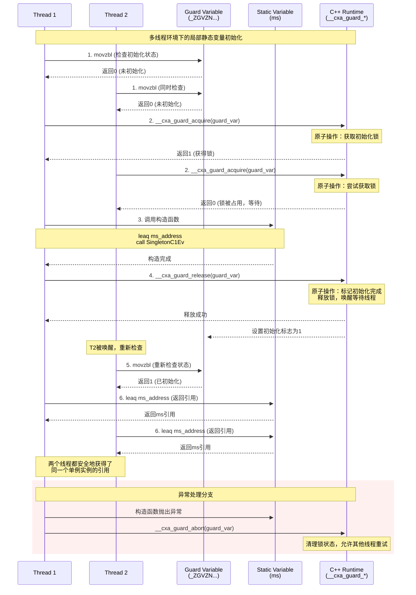

# C++11 懒汉单例模式的静态变量探索

C++11的单例模式是我们所熟知的最佳实践之一。利用了静态变量的特性，以非常简洁的代码安全地实现了**延迟初始化**、**线程安全**和**自动内存管理**。

这种C++11的懒汉式单例模式写法大概如下：
```cpp
#include <iostream>

class Singleton{
public:
    static Singleton& getInstance() {
        static Singleton ms;
        return ms;
    }

    void func() {
        std::cout << __func__ << std::endl;
    }

    Singleton(const Singleton&) = delete;
    Singleton& operator=(const Singleton&) = delete;
private:
    Singleton() = default;
};

int main() {
    Singleton::getInstance().func();
    return 0;
}
```

写法关键点如下：

* 默认构造函数需要是private的
* 可以将拷贝和复制禁止掉
* `getInstance`静态成员方法，返回静态的`Singleton`

在使用时，我们可以直接使用`Singleton::getInstance()`来获取单例对象。这样的代码写起来简洁易懂，也给我们的开发带来了很多方便。

静态变量的生命周期是在程序的整个运行周期内，且对于C++11及以上，静态成员方法返回静态变量，整个变量的初始化是线程安全的，也就意味着当我们拿到这个变量的时候，它所有的资源已经初始化好了，不存在申请了内存还没构造完毕就返回的情况。

我当时在使用的时候，就有一个疑问：

> 那上面的这个ms，是在什么时候就确定下它的位置的？


## ms在ELF中的位置

在验证之前，我们需要将上面的程序编译链接为可执行文件。

之后我们使用objdump工具来查看`getInstance`的相关反汇编代码：

```shell
g++ -g test_singleton_static.cpp -o test_singleton_static
objdump -S test_singleton_static| c++filt
```

输出内容中，我们关注下`getInstance`的汇编部分：

```assembly
0000000000001234 <Singleton::getInstance()>:
    static Singleton& getInstance() {
    1234:       f3 0f 1e fa             endbr64 
    1238:       55                      push   %rbp
    1239:       48 89 e5                mov    %rsp,%rbp
        return ms;
    123c:       48 8d 05 0f 2f 00 00    lea    0x2f0f(%rip),%rax        # 4152 <Singleton::getInstance()::ms>
    }
    1243:       5d                      pop    %rbp
    1244:       c3                      ret    
    1245:       90                      nop

```

现在我们看下以上汇编都代码上面意思：

**函数头部信息**

```assembly
0000000000001234 <Singleton::getInstance()>:
```

* `0000000000001234`: 函数在内存中的地址
* `<Singleton::getInstance()>`: 函数名称

**函数序言**

```assembly
static Singleton& getInstance() {
1234:   f3 0f 1e fa             endbr64 
1238:   55                      push   %rbp
1239:   48 89 e5                mov    %rsp,%rbp
```

* `endbr64`: Intel CET (Control-flow Enforcement Technology) 指令，用于防止ROP/JOP攻击
* `push %rbp`: 保存调用者的栈基址指针
* `mov %rsp,%rbp`: 设置当前函数的栈基址指针

**核心语句**

```assembly
return ms;
123c:   48 8d 05 0f 2f 00 00    lea    0x2f0f(%rip),%rax        # 4152 <Singleton::getInstance()::ms>
```

这是最关键的一行：

* `lea`: Load Effective Address，加载有效地址
* `0x2f0f(%rip)`: 使用RIP相对寻址，计算静态变量`ms`的地址
* `%rax`: 将地址存储到返回值寄存器
* `# 4152 <Singleton::getInstance()::ms>`: 注释显示实际地址和变量名

**函数尾声**

```assembly
}
1243:   5d                      pop    %rbp
1244:   c3                      ret    
1245:   90                      nop
```

* `pop %rbp`: 恢复调用者的栈基址指针
* `ret`: 返回到调用者
* `nop`: 空操作，用于对齐

我们看下上面说的核心语句中，对于静态变量`ms`的地址计算：

**实际地址 = RIP + 偏移量**

* RIP：指向下一个指令的地址
* 偏移量：这里是`0x2f0f`

所以计算方式是：当前指令的地址`123c` + 偏移量`0x2f0f` + 指令长度（7个字节）`7` = `4152`

我们找到了静态变量`ms`的地址，那`ms`的地址在ELF的哪个位置呢？我们可以查看下`test_singleton_static`节的相关信息：

```shell
objdump -h test_singleton_static |c++filt
```

输出如下：

```shell

test_singleton_static:     file format elf64-x86-64

Sections:
Idx Name          Size      VMA               LMA               File off  Algn
  0 .interp       0000001c  0000000000000318  0000000000000318  00000318  2**0
                  CONTENTS, ALLOC, LOAD, READONLY, DATA
  1 .note.gnu.property 00000030  0000000000000338  0000000000000338  00000338  2**3
                  CONTENTS, ALLOC, LOAD, READONLY, DATA
  2 .note.gnu.build-id 00000024  0000000000000368  0000000000000368  00000368  2**2
                  CONTENTS, ALLOC, LOAD, READONLY, DATA
  3 .note.ABI-tag 00000020  000000000000038c  000000000000038c  0000038c  2**2
                  CONTENTS, ALLOC, LOAD, READONLY, DATA
  4 .gnu.hash     00000028  00000000000003b0  00000000000003b0  000003b0  2**3
                  CONTENTS, ALLOC, LOAD, READONLY, DATA
  5 .dynsym       00000138  00000000000003d8  00000000000003d8  000003d8  2**3
                  CONTENTS, ALLOC, LOAD, READONLY, DATA
  6 .dynstr       0000016e  0000000000000510  0000000000000510  00000510  2**0
                  CONTENTS, ALLOC, LOAD, READONLY, DATA
  7 .gnu.version  0000001a  000000000000067e  000000000000067e  0000067e  2**1
                  CONTENTS, ALLOC, LOAD, READONLY, DATA
  8 .gnu.version_r 00000050  0000000000000698  0000000000000698  00000698  2**3
                  CONTENTS, ALLOC, LOAD, READONLY, DATA
  9 .rela.dyn     00000120  00000000000006e8  00000000000006e8  000006e8  2**3
                  CONTENTS, ALLOC, LOAD, READONLY, DATA
 10 .rela.plt     00000060  0000000000000808  0000000000000808  00000808  2**3
                  CONTENTS, ALLOC, LOAD, READONLY, DATA
 11 .init         0000001b  0000000000001000  0000000000001000  00001000  2**2
                  CONTENTS, ALLOC, LOAD, READONLY, CODE
 12 .plt          00000050  0000000000001020  0000000000001020  00001020  2**4
                  CONTENTS, ALLOC, LOAD, READONLY, CODE
 13 .plt.got      00000010  0000000000001070  0000000000001070  00001070  2**4
                  CONTENTS, ALLOC, LOAD, READONLY, CODE
 14 .plt.sec      00000040  0000000000001080  0000000000001080  00001080  2**4
                  CONTENTS, ALLOC, LOAD, READONLY, CODE
 15 .text         000001c4  00000000000010c0  00000000000010c0  000010c0  2**4
                  CONTENTS, ALLOC, LOAD, READONLY, CODE
 16 .fini         0000000d  0000000000001284  0000000000001284  00001284  2**2
                  CONTENTS, ALLOC, LOAD, READONLY, CODE
 17 .rodata       00000009  0000000000002000  0000000000002000  00002000  2**2
                  CONTENTS, ALLOC, LOAD, READONLY, DATA
 18 .eh_frame_hdr 00000054  000000000000200c  000000000000200c  0000200c  2**2
                  CONTENTS, ALLOC, LOAD, READONLY, DATA
 19 .eh_frame     0000012c  0000000000002060  0000000000002060  00002060  2**3
                  CONTENTS, ALLOC, LOAD, READONLY, DATA
 20 .init_array   00000010  0000000000003d78  0000000000003d78  00002d78  2**3
                  CONTENTS, ALLOC, LOAD, DATA
 21 .fini_array   00000008  0000000000003d88  0000000000003d88  00002d88  2**3
                  CONTENTS, ALLOC, LOAD, DATA
 22 .dynamic      00000200  0000000000003d90  0000000000003d90  00002d90  2**3
                  CONTENTS, ALLOC, LOAD, DATA
 23 .got          00000070  0000000000003f90  0000000000003f90  00002f90  2**3
                  CONTENTS, ALLOC, LOAD, DATA
 24 .data         00000010  0000000000004000  0000000000004000  00003000  2**3
                  CONTENTS, ALLOC, LOAD, DATA
 25 .bss          00000118  0000000000004040  0000000000004040  00003010  2**6
                  ALLOC
 26 .comment      0000002d  0000000000000000  0000000000000000  00003010  2**0
                  CONTENTS, READONLY
 27 .debug_aranges 00000050  0000000000000000  0000000000000000  0000303d  2**0
                  CONTENTS, READONLY, DEBUGGING, OCTETS
 28 .debug_info   000024f6  0000000000000000  0000000000000000  0000308d  2**0
                  CONTENTS, READONLY, DEBUGGING, OCTETS
 29 .debug_abbrev 00000655  0000000000000000  0000000000000000  00005583  2**0
                  CONTENTS, READONLY, DEBUGGING, OCTETS
 30 .debug_line   00000184  0000000000000000  0000000000000000  00005bd8  2**0
                  CONTENTS, READONLY, DEBUGGING, OCTETS
 31 .debug_str    000012bf  0000000000000000  0000000000000000  00005d5c  2**0
                  CONTENTS, READONLY, DEBUGGING, OCTETS
 32 .debug_line_str 0000028b  0000000000000000  0000000000000000  0000701b  2**0
                  CONTENTS, READONLY, DEBUGGING, OCTETS
 33 .debug_rnglists 0000002c  0000000000000000  0000000000000000  000072a6  2**0
                  CONTENTS, READONLY, DEBUGGING, OCTETS
```

我们关注下第三列的信息(`VMA`)，可以看到：

```shell
........
25 .bss          00000118  0000000000004040  0000000000004040  00003010  2**6
                  ALLOC
 26 .comment      0000002d  0000000000000000  0000000000000000  00003010  2**0
                  CONTENTS, READONLY
........
```

我们可以看到，**静态变量`ms`落在了`.bss`段！**

通过以下`readelf`指令：

```shell
zjp-android@zjpandroid-virtual-machine:~/test/test_cpp$ readelf -x .bss test_singleton_static
Section '.bss' has no data to dump.
```

我们也可以在知道，**静态变量在ELF一般不占用实际空间**。

同样地，`readelf`也可以查看节头的相关信息：

```shell
readelf -S test_singleton_static|c++filt
```

输出如下，验证结果一致：

```shell
There are 38 section headers, starting at offset 0x7c70:

Section Headers:
  [Nr] Name              Type             Address           Offset
       Size              EntSize          Flags  Link  Info  Align
  [ 0]                   NULL             0000000000000000  00000000
       0000000000000000  0000000000000000           0     0     0
  [ 1] .interp           PROGBITS         0000000000000318  00000318
       000000000000001c  0000000000000000   A       0     0     1
  [ 2] .note.gnu.pr[...] NOTE             0000000000000338  00000338
       0000000000000030  0000000000000000   A       0     0     8
  [ 3] .note.gnu.bu[...] NOTE             0000000000000368  00000368
       0000000000000024  0000000000000000   A       0     0     4
  [ 4] .note.ABI-tag     NOTE             000000000000038c  0000038c
       0000000000000020  0000000000000000   A       0     0     4
  [ 5] .gnu.hash         GNU_HASH         00000000000003b0  000003b0
       0000000000000028  0000000000000000   A       6     0     8
  [ 6] .dynsym           DYNSYM           00000000000003d8  000003d8
       0000000000000138  0000000000000018   A       7     1     8
  [ 7] .dynstr           STRTAB           0000000000000510  00000510
       000000000000016e  0000000000000000   A       0     0     1
  [ 8] .gnu.version      VERSYM           000000000000067e  0000067e
       000000000000001a  0000000000000002   A       6     0     2
  [ 9] .gnu.version_r    VERNEED          0000000000000698  00000698
       0000000000000050  0000000000000000   A       7     2     8
  [10] .rela.dyn         RELA             00000000000006e8  000006e8
       0000000000000120  0000000000000018   A       6     0     8
  [11] .rela.plt         RELA             0000000000000808  00000808
       0000000000000060  0000000000000018  AI       6    24     8
  [12] .init             PROGBITS         0000000000001000  00001000
       000000000000001b  0000000000000000  AX       0     0     4
  [13] .plt              PROGBITS         0000000000001020  00001020
       0000000000000050  0000000000000010  AX       0     0     16
  [14] .plt.got          PROGBITS         0000000000001070  00001070
       0000000000000010  0000000000000010  AX       0     0     16
  [15] .plt.sec          PROGBITS         0000000000001080  00001080
       0000000000000040  0000000000000010  AX       0     0     16
  [16] .text             PROGBITS         00000000000010c0  000010c0
       00000000000001c4  0000000000000000  AX       0     0     16
  [17] .fini             PROGBITS         0000000000001284  00001284
       000000000000000d  0000000000000000  AX       0     0     4
  [18] .rodata           PROGBITS         0000000000002000  00002000
       0000000000000009  0000000000000000   A       0     0     4
  [19] .eh_frame_hdr     PROGBITS         000000000000200c  0000200c
       0000000000000054  0000000000000000   A       0     0     4
  [20] .eh_frame         PROGBITS         0000000000002060  00002060
       000000000000012c  0000000000000000   A       0     0     8
  [21] .init_array       INIT_ARRAY       0000000000003d78  00002d78
       0000000000000010  0000000000000008  WA       0     0     8
  [22] .fini_array       FINI_ARRAY       0000000000003d88  00002d88
       0000000000000008  0000000000000008  WA       0     0     8
  [23] .dynamic          DYNAMIC          0000000000003d90  00002d90
       0000000000000200  0000000000000010  WA       7     0     8
  [24] .got              PROGBITS         0000000000003f90  00002f90
       0000000000000070  0000000000000008  WA       0     0     8
  [25] .data             PROGBITS         0000000000004000  00003000
       0000000000000010  0000000000000000  WA       0     0     8
  [26] .bss              NOBITS           0000000000004040  00003010
       0000000000000118  0000000000000000  WA       0     0     64
  [27] .comment          PROGBITS         0000000000000000  00003010
       000000000000002d  0000000000000001  MS       0     0     1
  [28] .debug_aranges    PROGBITS         0000000000000000  0000303d
       0000000000000050  0000000000000000           0     0     1
  [29] .debug_info       PROGBITS         0000000000000000  0000308d
       00000000000024f6  0000000000000000           0     0     1
  [30] .debug_abbrev     PROGBITS         0000000000000000  00005583
       0000000000000655  0000000000000000           0     0     1
  [31] .debug_line       PROGBITS         0000000000000000  00005bd8
       0000000000000184  0000000000000000           0     0     1
  [32] .debug_str        PROGBITS         0000000000000000  00005d5c
       00000000000012bf  0000000000000001  MS       0     0     1
  [33] .debug_line_str   PROGBITS         0000000000000000  0000701b
       000000000000028b  0000000000000001  MS       0     0     1
  [34] .debug_rnglists   PROGBITS         0000000000000000  000072a6
       000000000000002c  0000000000000000           0     0     1
  [35] .symtab           SYMTAB           0000000000000000  000072d8
       0000000000000480  0000000000000018          36    21     8
  [36] .strtab           STRTAB           0000000000000000  00007758
       000000000000039d  0000000000000000           0     0     1
  [37] .shstrtab         STRTAB           0000000000000000  00007af5
       000000000000017a  0000000000000000           0     0     1
Key to Flags:
  W (write), A (alloc), X (execute), M (merge), S (strings), I (info),
  L (link order), O (extra OS processing required), G (group), T (TLS),
  C (compressed), x (unknown), o (OS specific), E (exclude),
  R (retain), D (mbind), l (large), p (processor specific)
```

接下来我们探究一下，静态变量的线程安全是怎么做到的。


## ms的初始化线程安全

一开始我们想使用gdb来直接调试以上程序，发现当我打断点在函数`getInstance`中的`static Singleton ms`的时候，会自动跳过，把断点打在了`return ms`这一行，那么这样运行时就会观察不到。

查看了gdb运行时在`getInstance`处的汇编代码：

```assembly
(gdb) disassemble 
Dump of assembler code for function _ZN9Singleton11getInstanceEv:
   0x0000555555555234 <+0>:     endbr64 
   0x0000555555555238 <+4>:     push   %rbp
   0x0000555555555239 <+5>:     mov    %rsp,%rbp
=> 0x000055555555523c <+8>:     lea    0x2f0f(%rip),%rax        # 0x555555558152 <_ZZN9Singleton11getInstanceEvE2ms>
   0x0000555555555243 <+15>:    pop    %rbp
   0x0000555555555244 <+16>:    ret    
End of assembler dump.
(gdb) 
```

我们可以看到在这里`ms`的地址变成了`0x555555558152`。这是因为在`objdump`中观察到的地址时**相对虚拟地址**，是假设从地址0开始加载时的**偏移量**，在ELF中是静态确定的。`0x555555558152`是运行时的实际地址。

这里和objdump的汇编代码观察到的行为类似，并没有看到`ms`的初始化过程。我猜测可能是我们的程序过于简单，没有涉及线程间初始化的相关操作，导致编译器进行了优化。

所以我打算修改一下代码，让线程参与其中：

```cpp
#include <iostream>
#include <thread>

class Singleton{
public:
    static Singleton& getInstance() {
        static Singleton ms;
        return ms;
    }

    void func() {
        std::cout << __func__ << " m_a=" << m_a << std::endl;
    }
private:
    Singleton() : m_a(42) {  // 非零初始化，强制调用构造函数
        std::cout << "Singleton constructor called" << std::endl;
    }
    int m_a;
};

int main() {
    std::thread t([]() {
        Singleton::getInstance().func();
    });
    t.detach();
    Singleton::getInstance().func();
    return 0;
}
```

* 增加`std:：thread`开启线程，并在线程中获取单例对象执行`func`
* 对`Singleton`加入变量`m_a`，并进行非零初始化，期望编译器能强制调用构造函数，这样才能观察到初始化的过程

我在这里打算使用另外一种方式，不适用gdb来查看汇编内容了：使用编译参数和选项来生成**带有详细注释的汇编代码**，方便我们浏览：

```shell
g++ -S -fverbose-asm test_singleton_static.cpp -o test_singleton_static.s
```

下面解释一下这个指令的参数和编译选项的作用：

* `-S`：停止在汇编阶段，不进行连接；会输出汇编代码文件(`.s`)
* `-fverbose-asm`：在汇编代码中添加详细的注释（包含：**原始C++代码行号和内容、变量名和函数名、寄存器使用说明、编译器优化信息等**）

大家可以自行在自己的linux环境中试验，这里我就不将全部文件贴上来了，我们关注下初始化的过程即可：

1. **静态变量ms的定义**

   ```assembly
   # ms变量本身（4字节，存储Singleton对象）
   _ZZN9Singleton11getInstanceEvE2ms:
       .zero 4
   
   # Guard Variable（8字节，用于线程安全控制）
   _ZGVZN9Singleton11getInstanceEvE2ms:
       .zero 8
   ```

2. **完整的线程安全初始化流程**

   ```assembly
   # 1. 检查是否已初始化
   movzbl _ZGVZN9Singleton11getInstanceEvE2ms(%rip), %eax
   testb  %al, %al
   sete   %al
   testb  %al, %al
   je     .L11    # 如果已初始化，跳转到返回
   
   # 2. 获取初始化锁（线程安全）
   leaq   _ZGVZN9Singleton11getInstanceEvE2ms(%rip), %rax
   movq   %rax, %rdi
   call   __cxa_guard_acquire@PLT
   testl  %eax, %eax
   ```

3. **构造函数的调用**

   ```assembly
   # 3. 调用Singleton构造函数
   leaq   _ZZN9Singleton11getInstanceEvE2ms(%rip), %rax
   movq   %rax, %rdi
   call   _ZN9SingletonC1Ev    # 构造函数调用
   
   # 4. 释放初始化锁
   leaq   _ZGVZN9Singleton11getInstanceEvE2ms(%rip), %rax
   movq   %rax, %rdi
   call   __cxa_guard_release@PLT
   ```

4. **异常安全处理**

   ```assembly
   # 如果构造函数抛出异常，调用guard_abort
   leaq   _ZGVZN9Singleton11getInstanceEvE2ms(%rip), %rax
   movq   %rax, %rdi
   call   __cxa_guard_abort@PLT
   ```

* **`__cxa_guard_acquire`**：原子地检查并获取初始化锁

* **`__cxa_guard_release`**：标记初始化完成，释放锁
* **`__cxa_guard_abort`**：在异常情况下清理锁状态

至此，我们就知道对于GCC来说，静态变量`ms`的初始化过程中的线程安全是如何保证的，我们对此做个小结：



## 对PLT的小关注

我使用objdump对`__cxa_guard_acquire`的跳转是如何实现的：

```assembly
0000000000001230 <__cxa_guard_acquire@plt>:
    1230:	f3 0f 1e fa          	endbr64 
    1234:	f2 ff 25 85 2d 00 00 	bnd jmp *0x2d85(%rip)        # 3fc0 <__cxa_guard_acquire@CXXABI_1.3>
    123b:	0f 1f 44 00 00       	nopl   0x0(%rax,%rax,1)
```

**函数标签**

```assembly
0000000000001230 <__cxa_guard_acquire@plt>:
```
* `0x1230`：PLT表中该函数的地址
* `@plt`：表示这是PLT（过程链接表）中的条目
* `__cxa_guard_acquire`：C++ ABI中的guard函数

**安全指令**

```assembly
1230: f3 0f 1e fa    endbr64
```
* **Intel CET**（Control-flow Enforcement Technology）指令
* 防止ROP/JOP攻击的安全机制
* 标记合法的间接跳转目标

**间接跳转**

```assembly
1234: f2 ff 25 85 2d 00 00    bnd jmp *0x2d85(%rip)    # 3fc0
```
* `bnd jmp`：带边界检查的间接跳转
* `*0x2d85(%rip)`：RIP相对寻址，跳转到地址`0x3fc0``
* ``0x3fc0`：GOT（Global Offset Table）中的实际函数地址

**填充指令**

```assembly
123b: 0f 1f 44 00 00    nopl 0x0(%rax,%rax,1)
```
* **NOP指令**：不执行任何操作
* 用于指令对齐，提高CPU缓存效率

#### PLT/GOT机制说明

**工作原理**

1. **首次调用**：跳转到动态链接器，解析实际函数地址
2. **后续调用**：直接跳转到已解析的函数地址

**地址计算**

```
目标地址 = 当前指令地址 + 偏移量
0x3fc0 = 0x1234 + 0x2d85 + 7（指令长度）
```


## 总结

本文深入探索了C++11懒汉式单例模式中局部静态变量的底层实现机制，主要发现如下：

**1. 静态变量内存布局**

- 局部静态变量`ms`存储在ELF文件的`.bss`段中
- ELF文件中显示相对虚拟地址（如`0x4152`），运行时通过基地址重定位到实际地址（如`0x555555558152`）
- 使用`RIP`相对寻址访问静态变量

**2. 线程安全机制**

- 编译器为复杂构造函数生成完整的线程安全初始化代码
- 使用**Guard Variable**（`_ZGVZN...`符号）跟踪初始化状态
- 通过C++ ABI函数实现原子操作：
  - `__cxa_guard_acquire`：获取初始化锁
  - `__cxa_guard_release`：标记初始化完成
  - `__cxa_guard_abort`：异常情况下清理锁状态

**3. 编译器优化**

- 对于简单的零初始化类，编译器会跳过复杂的初始化机制
- 非零初始化构造函数会强制生成完整的线程安全代码
- `PLT/GOT`机制实现动态链接库函数的延迟绑定

### 关键技术点

- **延迟初始化**：首次调用时才执行构造函数
- **线程安全**：C++11标准保证多线程环境下的安全初始化
- **异常安全**：构造函数异常时允许其他线程重试
- **内存管理**：程序结束时自动析构，无需手动管理

