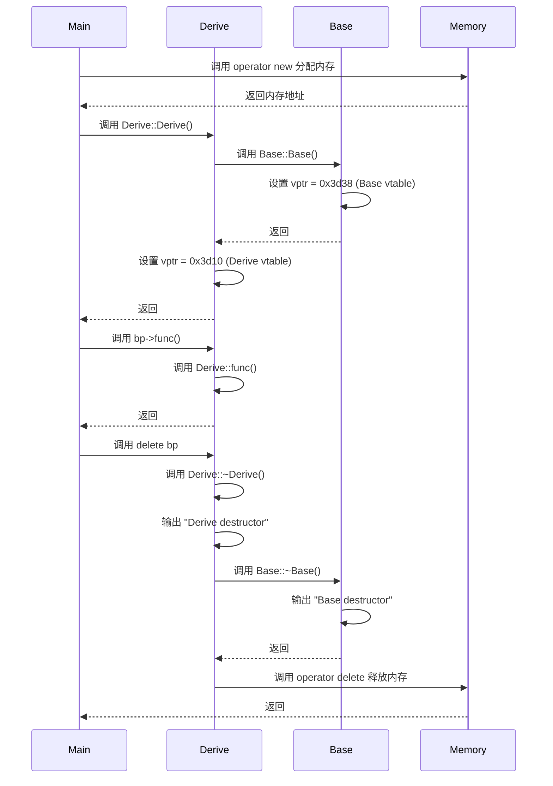

# C++虚函数：Base和Derive构造中虚函数指针的设置关系

在[C++虚函数表在哪个位置呢？](https://www.zjp7071.cn/docs/coding/C++%E6%8E%A2%E7%B4%A2%E5%92%8C%E8%AE%B0%E5%BD%95/C++%E8%99%9A%E5%87%BD%E6%95%B0%E8%A1%A8%E6%8C%87%E9%92%88%E5%92%8C%E8%99%9A%E5%87%BD%E6%95%B0%E8%A1%A8%E5%9C%A8%E8%BF%9B%E7%A8%8B%E7%A9%BA%E9%97%B4%E7%9A%84%E4%BD%8D%E7%BD%AE)这一篇文章中，我们介绍了下C++中虚函数表在ELF文件中的位置，以及在进程空间中的对应位置，也探索了工具的使用，来验证我们之前熟知的言论。

在留言中看到问题：

>1.  base构造函数里设置自己的vptr？
>2.  析构函数里，是否也会设置自己的vptr，以便覆盖掉子类的？

虽然文章探索的内容是关于虚函数表的位置问题，但是我认为这两个问题也值得我们学习。事不宜迟，我们编译一下示例程序之后开始探索！

示例程序依旧和之前一样，一个简单的例子：

```cpp
#include <iostream>

classBase{
public:
    Base() = default;
    virtual ~Base() {
        std::cout << "Base destructor" << std::endl;
    }

    virtual void func() {
        std::cout << "Base func call" << std::endl;
    }
private:
};

classDerive: public Base {
public:
    Derive() = default;
    ~Derive() {
        std::cout << "Derive destructor" << std::endl;
    }

    void func() override {
        std::cout << "Derive func call" << std::endl;
    } 
private:
};

int main() {
    Base *bp = newDerive();
    bp->func();
    delete bp;

    return0;
}
```

编译指令如下：

```shell
g++ -g test.cpp -o test
```

## Base构造函数里边设置自己的vptr

我们使用`objdump`查看下反汇编代码：

```shell
objdump -S test | c++filt
```

输出内容中关注一下Base的构造函数部分：

```assembly
0000000000001474 <Base::Base()>:
    Base() = default;
    1474:       f3 0f 1e fa             endbr64 
    1478:       55                      push   %rbp
    1479:       48 89 e5                mov    %rsp,%rbp
    147c:       48 89 7d f8             mov    %rdi,-0x8(%rbp)
    1480:       48 8d 15 b1 28 00 00    lea    0x28b1(%rip),%rdx        # 3d38 <vtable for Base+0x10>
    1487:       48 8b 45 f8             mov    -0x8(%rbp),%rax
    148b:       48 89 10                mov    %rdx,(%rax)
    148e:       90                      nop
    148f:       5d                      pop    %rbp
    1490:       c3                      ret    
    1491:       90                      nop

```

以上反汇编主要解读：

* 设置栈帧：将当前栈指针 `%rsp` 保存到栈帧基址寄存器 `%rbp`，并将 `%rbp` 压入栈中
*  将传入的 `this` 指针（存储在 `%rdi` 中）保存到当前栈帧的局部变量区域（`-0x8(%rbp)`）
*  通过 `RIP` 相对寻址，计算 Base 虚表的地址，并将其加载到 `%rdx` 寄存器中。这里的地址是 `3d38`，表示**虚表中虚函数指针的地址**（`vtable for Base+0x10`）
* 从栈帧中取出 `this` 指针（存储在 `-0x8(%rbp)`），并加载到 `%rax` 寄存器中
*  将虚表地址（`%rdx`）写入 `this` 指针指向的对象内存的起始位置，完成虚表指针的设置
*  恢复调用者的栈帧并返回

对于我们本次的主题来说，我们的关注点在于Base的构造函数设置了虚函数表指针，使得`this`指向虚表中的虚函数地址。

再看下Derive的构造函数部分：

```assembly
0000000000001492 <Derive::Derive()>:
    Derive() = default;
    1492:       f3 0f 1e fa             endbr64 
    1496:       55                      push   %rbp
    1497:       48 89 e5                mov    %rsp,%rbp
    149a:       48 83 ec 10             sub    $0x10,%rsp
    149e:       48 89 7d f8             mov    %rdi,-0x8(%rbp)
    14a2:       48 8b 45 f8             mov    -0x8(%rbp),%rax
    14a6:       48 89 c7                mov    %rax,%rdi
    14a9:       e8 c6 ff ff ff          call   1474 <Base::Base()>
    14ae:       48 8d 15 5b 28 00 00    lea    0x285b(%rip),%rdx        # 3d10 <vtable for Derive+0x10>
    14b5:       48 8b 45 f8             mov    -0x8(%rbp),%rax
    14b9:       48 89 10                mov    %rdx,(%rax)
    14bc:       90                      nop
    14bd:       c9                      leave  
    14be:       c3                      ret    

```

* 设置栈帧，并为局部变量分配 16 字节的空间
* 将传入的 `this` 指针保存到当前栈帧的局部变量区域
* 从栈帧中取出 `this` 指针，并将其传递给 Base 的构造函数
* **调用Base的构造函数，完成Base部分的初始化**
* 通过 `RIP` 相对寻址，计算 Derive 虚表的地址，并将其加载到 `%rdx` 寄存器中。这里的地址是 `3d10`，**表示虚表中虚函数指针的地址**（`vtable for Derive+0x10`）
* **将虚表地址（`%rdx`）写入 `this` 指针指向的对象内存的起始位置，覆盖 Base 构造函数设置的虚表指针**
* 恢复调用者的栈帧并返回

对于Derive构造函数来说，关注的关键操作是将计算的虚函数地址覆盖到在Base的构造函数设置的虚函数表指针。

## 析构函数里，是否也会设置自己的vptr，以便覆盖掉子类的？

到析构函数的部分，我在objdump下看到了有趣的一幕，先看看Base的析构函数：

```assembly
00000000000012f4 <Base::~Base()>:
    virtual ~Base() {
    12f4:       f3 0f 1e fa             endbr64 
    12f8:       55                      push   %rbp
    12f9:       48 89 e5                mov    %rsp,%rbp
    12fc:       48 83 ec 10             sub    $0x10,%rsp
    1300:       48 89 7d f8             mov    %rdi,-0x8(%rbp)
    1304:       48 8d 15 2d 2a 00 00    lea    0x2a2d(%rip),%rdx        # 3d38 <vtable for Base+0x10>
    130b:       48 8b 45 f8             mov    -0x8(%rbp),%rax
    130f:       48 89 10                mov    %rdx,(%rax)
        std::cout << "Base destructor" << std::endl;
    1312:       48 8d 05 eb 0c 00 00    lea    0xceb(%rip),%rax        # 2004 <_IO_stdin_used+0x4>
    1319:       48 89 c6                mov    %rax,%rsi
    131c:       48 8d 05 1d 2d 00 00    lea    0x2d1d(%rip),%rax        # 4040 <std::cout@GLIBCXX_3.4>
    1323:       48 89 c7                mov    %rax,%rdi
    1326:       e8 a5 fd ff ff          call   10d0 <std::basic_ostream<char, std::char_traits<char> >& std::operator<< <std::char_traits<char> >(std::basic_ostream<char, std::char_traits<char> >&, char const*)@plt>
    132b:       48 8b 15 9e 2c 00 00    mov    0x2c9e(%rip),%rdx        # 3fd0 <std::basic_ostream<char, std::char_traits<char> >& std::endl<char, std::char_traits<char> >(std::basic_ostream<char, std::char_traits<char> >&)@GLIBCXX_3.4>
    1332:       48 89 d6                mov    %rdx,%rsi
    1335:       48 89 c7                mov    %rax,%rdi
    1338:       e8 c3 fd ff ff          call   1100 <std::basic_ostream<char, std::char_traits<char> >::operator<<(std::basic_ostream<char, std::char_traits<char> >& (*)(std::basic_ostream<char, std::char_traits<char> >&))@plt>
    }
    133d:       90                      nop
    133e:       c9                      leave  
    133f:       c3                      ret    

0000000000001340 <Base::~Base()>:
    virtual ~Base() {
    1340:       f3 0f 1e fa             endbr64 
    1344:       55                      push   %rbp
    1345:       48 89 e5                mov    %rsp,%rbp
    1348:       48 83 ec 10             sub    $0x10,%rsp
    134c:       48 89 7d f8             mov    %rdi,-0x8(%rbp)
    }
    1350:       48 8b 45 f8             mov    -0x8(%rbp),%rax
    1354:       48 89 c7                mov    %rax,%rdi
    1357:       e8 98 ff ff ff          call   12f4 <Base::~Base()>
    135c:       48 8b 45 f8             mov    -0x8(%rbp),%rax
    1360:       be 08 00 00 00          mov    $0x8,%esi
    1365:       48 89 c7                mov    %rax,%rdi
    1368:       e8 83 fd ff ff          call   10f0 <operator delete(void*, unsigned long)@plt>
    136d:       c9                      leave  
    136e:       c3                      ret    
    136f:       90                      nop

```

**有两个Base的析构函数的反汇编版本，其中一个调用了另外一个**。我们先看下解读：

* **普通析构函数**：
  * 设置栈帧
  * 为局部变量分配 16 字节的栈空间
  * 将传入的 `this` 指针（存储在 `%rdi` 中）保存到当前栈帧的局部变量区域（`-0x8(%rbp)`）
  * 通过 `RIP` 相对寻址，计算 Base 虚表的地址，并将其加载到 `%rdx` 寄存器中。这里的地址是 `3d38`
  * 将虚表地址（`%rdx`）写入 `this` 指针指向的对象内存的起始位置，完成虚表指针的设置
  * 后面是 `std::cout << "Base destructor"` 的实现：
    * 加载字符串地址到 `%rsi`
    * 加载 `std::cout` 的地址到 `%rdi`
    * 调用 `std::operator<<` 输出字符串
  * 再后面是`std::endl` 的实现：
    * 加载 `std::endl` 的地址到 `%rsi`
    * 调用 `std::operator<<` 输出换行符
  * 恢复调用者的栈帧并返回
* **删除析构函数**：
  * 设置栈帧并保存 `this` 指针
  * **调用普通析构函数（`call 12f4 <Base::~Base()>`）来销毁对象的资源**
  * 调用 `operator delete` 释放对象的内存：
    * 将 `this` 指针加载到 `%rdi`。
    * 将对象大小（`0x8` 字节）加载到 `%esi`。
    * 调用 `operator delete`
    * 恢复调用者的栈帧并返回

我们再来看下Derive的：

```assembly
00000000000013ae <Derive::~Derive()>:
    ~Derive() {
    13ae:       f3 0f 1e fa             endbr64 
    13b2:       55                      push   %rbp
    13b3:       48 89 e5                mov    %rsp,%rbp
    13b6:       48 83 ec 10             sub    $0x10,%rsp
    13ba:       48 89 7d f8             mov    %rdi,-0x8(%rbp)
    13be:       48 8d 15 4b 29 00 00    lea    0x294b(%rip),%rdx        # 3d10 <vtable for Derive+0x10>
    13c5:       48 8b 45 f8             mov    -0x8(%rbp),%rax
    13c9:       48 89 10                mov    %rdx,(%rax)
        std::cout << "Derive destructor" << std::endl;
    13cc:       48 8d 05 50 0c 00 00    lea    0xc50(%rip),%rax        # 2023 <_IO_stdin_used+0x23>
    13d3:       48 89 c6                mov    %rax,%rsi
    13d6:       48 8d 05 63 2c 00 00    lea    0x2c63(%rip),%rax        # 4040 <std::cout@GLIBCXX_3.4>
    13dd:       48 89 c7                mov    %rax,%rdi
    13e0:       e8 eb fc ff ff          call   10d0 <std::basic_ostream<char, std::char_traits<char> >& std::operator<< <std::char_traits<char> >(std::basic_ostream<char, std::char_traits<char> >&, char const*)@plt>
    13e5:       48 8b 15 e4 2b 00 00    mov    0x2be4(%rip),%rdx        # 3fd0 <std::basic_ostream<char, std::char_traits<char> >& std::endl<char, std::char_traits<char> >(std::basic_ostream<char, std::char_traits<char> >&)@GLIBCXX_3.4>
    13ec:       48 89 d6                mov    %rdx,%rsi
    13ef:       48 89 c7                mov    %rax,%rdi
    13f2:       e8 09 fd ff ff          call   1100 <std::basic_ostream<char, std::char_traits<char> >::operator<<(std::basic_ostream<char, std::char_traits<char> >& (*)(std::basic_ostream<char, std::char_traits<char> >&))@plt>
    }
    13f7:       48 8b 45 f8             mov    -0x8(%rbp),%rax
    13fb:       48 89 c7                mov    %rax,%rdi
    13fe:       e8 f1 fe ff ff          call   12f4 <Base::~Base()>
    1403:       90                      nop
    1404:       c9                      leave  
    1405:       c3                      ret    

0000000000001406 <Derive::~Derive()>:
    ~Derive() {
    1406:       f3 0f 1e fa             endbr64 
    140a:       55                      push   %rbp
    140b:       48 89 e5                mov    %rsp,%rbp
    140e:       48 83 ec 10             sub    $0x10,%rsp
    1412:       48 89 7d f8             mov    %rdi,-0x8(%rbp)
    }
    1416:       48 8b 45 f8             mov    -0x8(%rbp),%rax
    141a:       48 89 c7                mov    %rax,%rdi
    141d:       e8 8c ff ff ff          call   13ae <Derive::~Derive()>
    1422:       48 8b 45 f8             mov    -0x8(%rbp),%rax
    1426:       be 08 00 00 00          mov    $0x8,%esi
    142b:       48 89 c7                mov    %rax,%rdi
    142e:       e8 bd fc ff ff          call   10f0 <operator delete(void*, unsigned long)@plt>
    1433:       c9                      leave  
    1434:       c3                      ret    
    1435:       90                      nop

```

* **普通析构函数版本**
  * 设置栈帧
  * 为局部变量分配 16 字节的栈空间，将传入的 `this` 指针（存储在 `%rdi` 中）保存到当前栈帧的局部变量区域（`-0x8(%rbp)`）
  * 通过 `RIP` 相对寻址，计算Derive虚表的地址，并将其加载到 `%rdx` 寄存器中，将虚表地址写入 `this` 指针指向的对象内存的起始位置
  * 后面同样是`std::cout`和`std::endl`的实现
  * **调用Base的析构函数，销毁Base的资源**
  * 恢复调用者的栈帧并返回
* **删除析构函数版本**
  * 设置栈帧并保存 `this` 指针
  * 调用普通析构函数（`call 13ae <Derive::~Derive()>`）来销毁对象的资源
  * 调用 `operator delete` 释放对象的内存
  * 恢复调用者的栈帧并返回

可以看到，对于Base和Derive的析构函数，都有两个版本，一个是设置虚函数地址到this并调用删除版本的普通版本，另一个则负责operator delete释放内存。**对于Derive来说，普通析构函数调用了Base的普通析构函数**

接下来，我们可以看下当调用`delete bp`时发生了什么。

```assembly
delete bp;
    1261:       48 8b 45 e8             mov    -0x18(%rbp),%rax
    1265:       48 85 c0                test   %rax,%rax
    1268:       74 0f                   je     1279 <main+0x70>
    126a:       48 8b 10                mov    (%rax),%rdx
    126d:       48 83 c2 08             add    $0x8,%rdx
    1271:       48 8b 12                mov    (%rdx),%rdx
    1274:       48 89 c7                mov    %rax,%rdi
    1277:       ff d2                   call   *%rdx

```

* 从栈帧中加载 `bp` 的值（存储在 `-0x18(%rbp)`）到 `%rax` 寄存器中
* 检查`bp`是否为空：
  * `test %rax, %rax` 会对 `%rax` 的值进行按位与操作，但不存储结果，只更新标志位。
  * 如果 `%rax` 为 0（即`bp == nullptr`），则设置零标志位
    * 如果bp为nullptr，则跳转到`1279`，跳过析构函数的调用，这是一种安全检查，防止对空指针调用析构函数
* 从`bp`指向的对象内存中加载虚表指针的地址到 `%rdx`。`(%rax)` 表示解引用 `bp`，即读取 `bp`指向的对象的起始地址（虚表指针存储在对象的起始位置）
* 将虚表指针偏移 `0x8` 字节，得到虚表中析构函数的地址
* 从虚表中加载偏移 `0x8` 处的析构函数地址到 `%rdx`

上面是通过虚表找到析构函数的过程。继续看：

* 将`bp`的值，即this指针，加载到 `%rdi` 中。在 x86-64 的调用约定中，`%rdi` 是第一个函数参数寄存器
* 调用虚表中存储的析构函数地址（`*%rdx`）

从示例代码可以知道，`bp`指向的是Derive对象，所以这里会调用`Derive::~Derive()`普通析构函数。

由此可以总结`Base`和`Derive`各自指向的虚函数表，还有虚表函数位置的关系大致如下图表示：

```shell
Base 对象:
+--------------------+       +--------------------+
| vptr = 0x3d38      |-----> | vtable for Base:    |
+--------------------+       +--------------------+
                             | 0x3d68 (RTTI)      |
                             +--------------------+
                             | 0x12f4 (Base::~Base)|
                             +--------------------+
                             | 0x1340 (Base del)  |
                             +--------------------+
                             | 0x1312 (Base::func)|
                             +--------------------+
```

```shell
Derive 对象:
+--------------------+       +--------------------+
| vptr = 0x3d10      |-----> | vtable for Derive:  |
+--------------------+       +--------------------+
                             | 0x3d50 (RTTI)      |
                             +--------------------+
                             | 0x13ae (Derive::~Derive)|
                             +--------------------+
                             | 0x1406 (Derive del)|
                             +--------------------+
                             | 0x13cc (Derive::func)|
                             +--------------------+
```

## 探索问题的结果

我们画一个mermaid图总结一下我们以上的探索过程：



对于问题开篇的问题，我们有了答案：

>1.  base构造函数里设置自己的vptr？
>2.  析构函数里，是否也会设置自己的vptr，以便覆盖掉子类的？

回答：

1. 是的，Base构造函数会设置自己的虚表指针，指向`vtable for Base + 0x10`的位置；在Derive的构造中，在调用完Base的构造之后，会设置自己的虚表指针指向`vtable for Derive+0x10`的位置。*(这也是为什么我们使用`readelf -s test | c++filt`会看到`vtable for Base`会在`3d28`，而objdump查看汇编的时候会在`3d38`的原因。)*
2. 是的，Base析构函数会设置自己的虚表指针，以覆盖子类的。在子类的析构过程中，子类的析构函数会先被调用，然后调用Base的析构函数，在Base的析构函数中，虚表指针会重新被设置为Base的虚表指针。

在此感谢留言！一起学习！