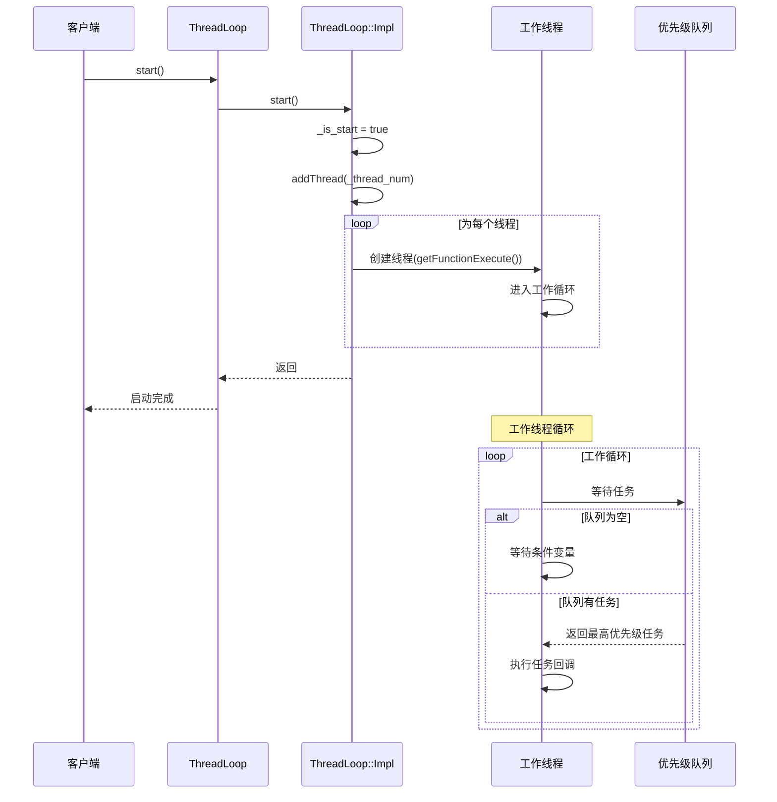
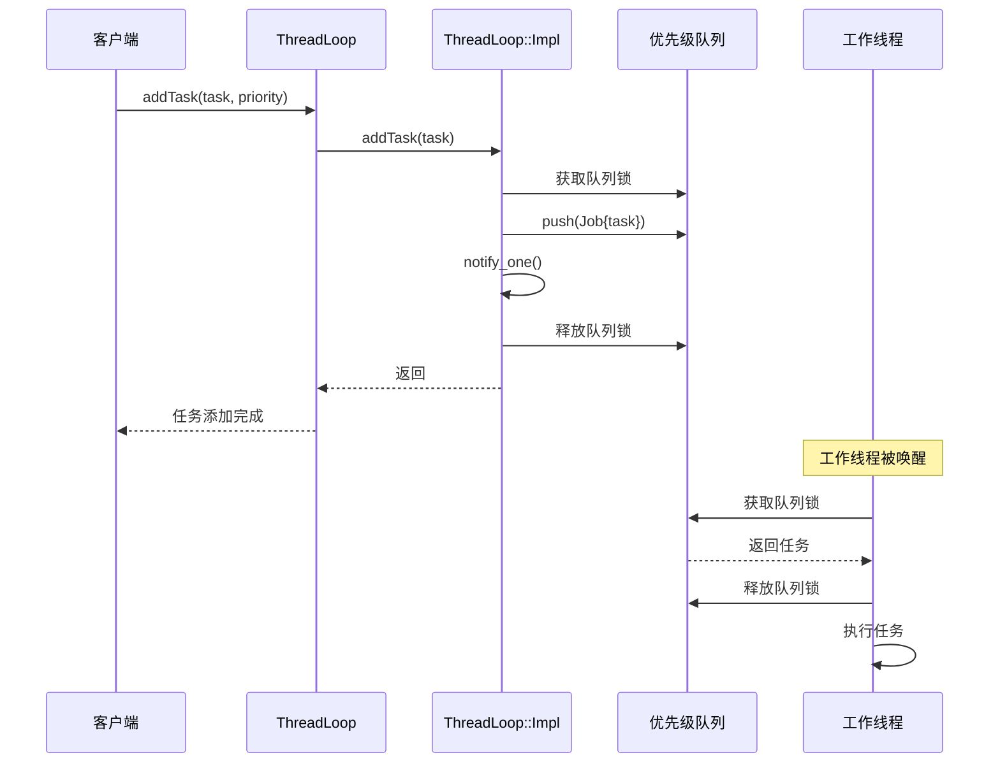
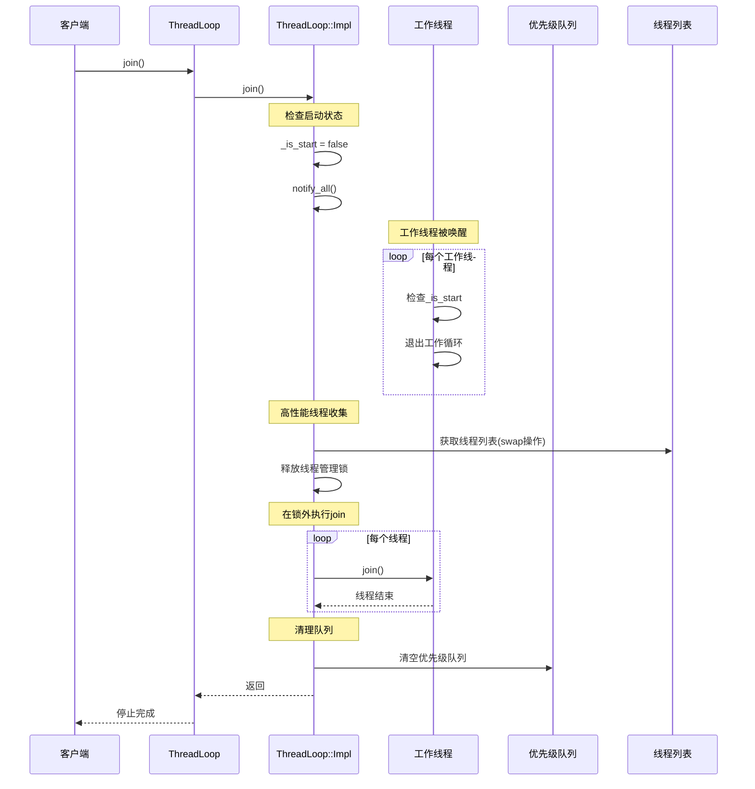
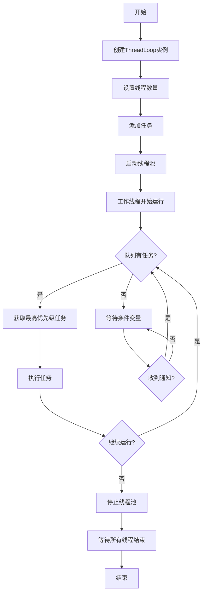
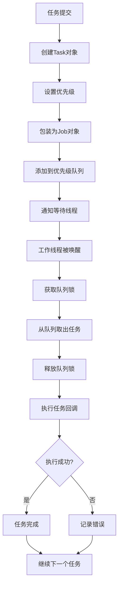

# ThreadLoop 架构文档

>*github地址：[ZJPThreadLoop](https://github.com/mo-xiaoxiu/ZJPThreadLoop)*

## 目录

1. [系统概述](#系统概述)
2. [架构设计](#架构设计)
3. [核心组件](#核心组件)
4. [时序图](#时序图)
5. [流程图](#流程图)
6. [API解析](#api解析)
7. [性能特性](#性能特性)
8. [扩展性设计](#扩展性设计)

## 系统概述

ThreadLoop是一个高性能的线程池库，支持优先级任务队列。采用PIMPL（Pointer to Implementation）设计模式，提供线程安全的API接口。

### 主要特性
- 优先级任务队列
- 线程安全
- 支持静态库和动态库
- 使用PIMPL模式
- 单例模式

## 架构设计

### 整体架构图

```
┌─────────────────────────────────────────────────────────────┐
│                   用户应用程序                              │
├─────────────────────────────────────────────────────────────┤
│                    ThreadLoop API                          │
│  ┌─────────────┐  ┌─────────────┐  ┌─────────────┐      │
│  │   ThreadLoop│  │    Task     │  │   Job       │      │
│  │   (Public)  │  │  (Public)   │  │ (Internal)  │      │
│  └─────────────┘  └─────────────┘  └─────────────┘      │
├─────────────────────────────────────────────────────────────┤
│                    PIMPL 接口层                            │
│  ┌─────────────┐  ┌─────────────┐  ┌─────────────┐      │
│  │ ThreadLoop  │  │   Task      │  │   Job       │      │
│  │   Impl      │  │  Impl       │  │  Impl       │      │
│  └─────────────┘  └─────────────┘  └─────────────┘      │
├─────────────────────────────────────────────────────────────┤
│                    核心实现层                              │
│  ┌─────────────┐  ┌─────────────┐  ┌─────────────┐      │
│  │  线程管理   │  │  任务队列   │  │  优先级队列 │      │
│  │ ThreadPool  │  │ TaskQueue   │  │ PriorityQ   │      │
│  └─────────────┘  └─────────────┘  └─────────────┘      │
├─────────────────────────────────────────────────────────────┤
│                    系统资源层                              │
│  ┌─────────────┐  ┌─────────────┐  ┌─────────────┐      │
│  │   std::thread│  │ std::mutex  │  │ std::condition│   │
│  │   std::vector│  │ std::queue  │  │ std::atomic  │   │
│  └─────────────┘  └─────────────┘  └─────────────┘      │
└─────────────────────────────────────────────────────────────┘
```

## 核心组件

### 1. ThreadLoop 类
- **职责**: 提供公共API接口
- **设计模式**: PIMPL模式
- **线程安全**: 是

### 2. Task 结构体
- **职责**: 封装任务和优先级
- **成员**:
  - `_priority`: 任务优先级
  - `_task_callback`: 任务回调函数

### 3. Job 结构体
- **职责**: 内部任务包装器
- **成员**:
  - `_task`: Task对象
  - `_timestamp`: 创建时间戳

### 4. ThreadLoop::Impl 类
- **职责**: 实际实现逻辑
- **核心成员**:
  - `_threadLoop`: 存放线程的vector
  - `_priority_queue`: 任务的优先级队列
  - `_thread_mutex`: 线程管理互斥锁
  - `_queue_mutex`: 队列操作互斥锁
  - `_cv`: 条件变量
  - `_is_start`: 启动状态原子变量

## 时序图

### 线程池启动时序图



### 任务添加时序图



### 线程池停止时序图



## 流程图

### 主工作流程



### 任务执行流程



## API解析

### 核心类API

#### ThreadLoop 类

```cpp
class THREADLOOP_API ThreadLoop {
public:
    // 构造函数
    explicit ThreadLoop(size_t num = 5);
    
    // 析构函数
    ~ThreadLoop();
    
    // 单例访问
    static ThreadLoop& getThreadLoopInstance();
    
    // 线程管理
    void start();                    // 启动线程池
    void join();                     // 等待所有线程结束
    void setThreadNum(size_t num);   // 设置线程数量
    void addThread(size_t threadNum); // 添加线程
    
    // 任务管理
    void addTask(Task &&task);       // 添加任务对象
    void addTask(std::function<void()> &&func, int priority = 0); // 添加函数任务
    
    // 状态查询
    size_t getCurThreadLoopNum() const; // 获取当前线程数
    size_t getCurQueueNum() const;      // 获取队列中任务数
    bool isRunning() const;             // 检查是否正在运行
};
```

#### Task 结构体

```cpp
struct THREADLOOP_API Task {
    int _priority{0};                    // 任务优先级
    std::function<void()> _task_callback; // 任务回调函数
    
    // 构造函数
    Task() = default;
    Task(std::function<void()> &&task);
    Task(std::function<void()> &&task, int priority);
};
```

### API使用示例

#### 基本使用

```cpp
#include "ThreadLoop.h"

int main() {
    auto& threadPool = threadloop::ThreadLoop::getThreadLoopInstance();
    
    // 设置线程数量
    threadPool.setThreadNum(4);
    
    // 添加任务
    threadPool.addTask([]() {
        std::cout << "Task 1 executed" << std::endl;
    }, 5);
    
    threadPool.addTask([]() {
        std::cout << "Task 2 executed" << std::endl;
    }, 3);
    
    // 启动线程池
    threadPool.start();
    
    // 等待任务完成
    std::this_thread::sleep_for(std::chrono::seconds(1));
    
    // 停止线程池
    threadPool.join();
    
    return 0;
}
```

#### 高级使用

```cpp
#include "ThreadLoop.h"

class TaskManager {
private:
    threadloop::ThreadLoop& _pool;
    
public:
    TaskManager() : _pool(threadloop::ThreadLoop::getThreadLoopInstance()) {
        _pool.setThreadNum(8);
        _pool.start();
    }
    
    void addHighPriorityTask(std::function<void()> task) {
        _pool.addTask(std::move(task), 10); // 高优先级
    }
    
    void addLowPriorityTask(std::function<void()> task) {
        _pool.addTask(std::move(task), 1);  // 低优先级
    }
    
    ~TaskManager() {
        _pool.join();
    }
};
```

## 性能特性

### 时间复杂度
- **任务添加**: O(log n) - 优先级队列插入
- **任务获取**: O(1) - 优先级队列顶部访问
- **线程创建**: O(n) - n为线程数量
- **线程销毁**: O(n) - n为线程数量

### 空间复杂度
- **内存使用**: O(n + m) - n为线程数，m为队列中任务数
- **栈空间**: 每个线程独立栈空间

### 并发特性
- **线程安全**: 完全线程安全
- **无锁操作**: 仅在必要时使用锁
- **条件变量**: 高效的任务等待机制

## 扩展性设计

### 1. 插件化设计
- PIMPL模式便于扩展内部实现
- 公共API保持稳定

### 2. 配置化支持
- 可配置线程数量
- 可配置任务优先级范围
- 可配置队列大小限制

### 3. 监控和调试
- 提供运行时状态查询
- 支持任务执行统计
- 错误处理和日志记录

### 4. 未来扩展点
- 支持任务取消
- 支持任务依赖关系
- 支持动态线程池大小调整
- 支持任务执行超时控制 