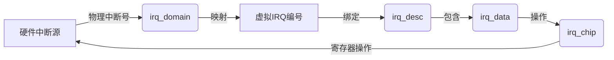
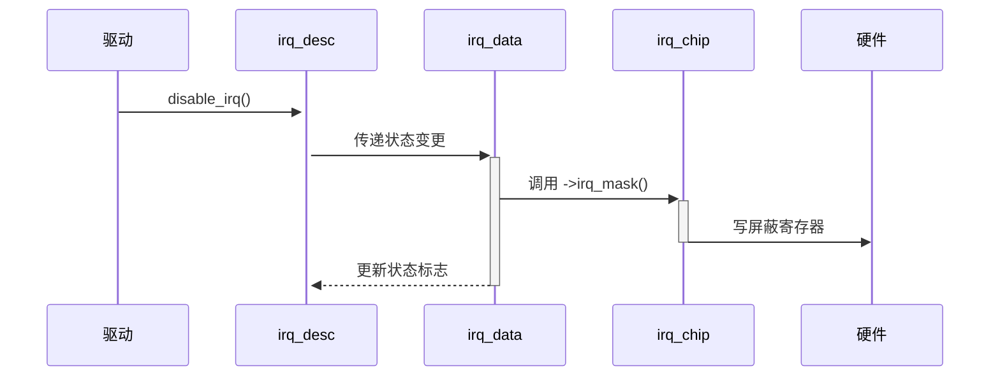
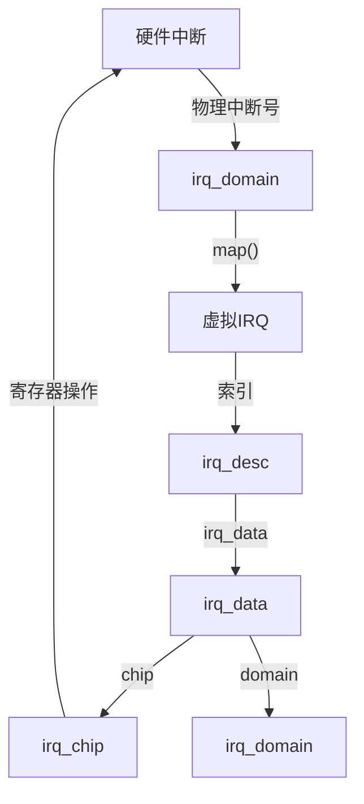
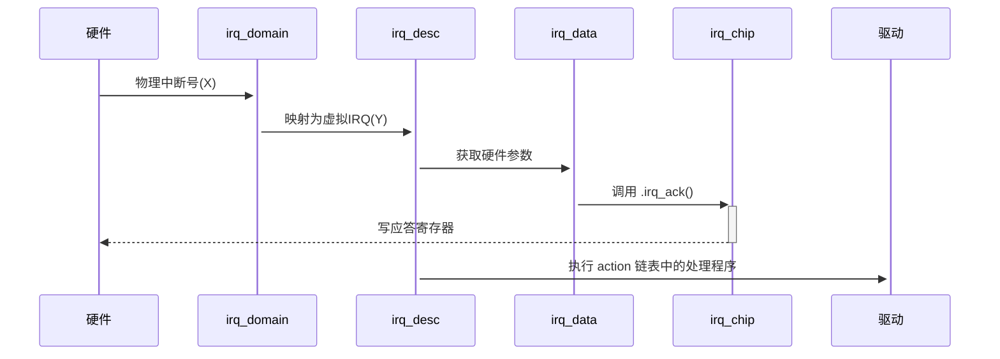

## Linux中断相关问题

共享中断的处理机制如下（基于中断框架设计）：

### 1. **正确执行设备处理程序**

- **唯一设备标识符 (dev_id)**
  每个设备通过 `request_irq()` 注册中断处理程序时，必须提供**唯一的设备 ID**（如设备结构体指针）。当中断触发时，内核遍历该 IRQ 线上所有注册的处理程序，并调用每个处理程序的函数，同时传入对应的 `dev_id`。
- **处理程序自检机制**
  每个中断处理程序（ISR）需主动检查中断是否由自己的设备触发（例如读取设备状态寄存器）。若设备未触发中断，处理程序立即返回 `IRQ_NONE`；若确认中断，则处理并返回 `IRQ_HANDLED`。

### 2. **避免竞争条件**

- **原子上下文执行**
  所有中断处理程序在**中断上下文**中运行，此时本地 CPU 的中断被禁用，确保同一 CPU 上不会发生抢占。
- **共享锁机制**
  若多个设备可能并发访问共享资源（如公共寄存器），驱动程序需使用**自旋锁**（`spin_lock_irqsave`）保护临界区，防止跨 CPU 竞争。

### 3. **确保所有设备被服务**

- **链式调用设计**
  内核按注册顺序依次调用该 IRQ 线上所有设备的处理程序。每个处理程序必须高效执行，避免阻塞后续设备。
- **中断状态跟踪**
  通过 `irq_desc` 结构体跟踪中断线状态（如 `IRQ_INPROGRESS`），确保中断未完成前不会重复触发。

### 底层支持

* **irq_chip 结构体**
  定义硬件级操作（如屏蔽/使能中断），确保架构无关性。
* **irq_domain 机制**
  将硬件中断号映射到虚拟中断号（如设备树中的 `interrupts` 属性），统一管理不同中断控制器。

> **总结**：共享中断的核心是 **"唯一设备 ID + 处理程序自检 + 原子执行"**。框架通过 `request_irq()` 注册时强制要求 `dev_id`，处理程序在中断上下文中串行执行并主动验证中断源，结合锁机制防止资源竞争。

## 在通用中断处理流程中，若遇到虚假中断（spurious interrupt），内核的具体处理策略是什么？如何区分其与真实设备请求？

虚假中断（非设备触发的异常中断）的处理策略如下：

------

### **虚假中断的检测与区分机制**

1. **处理程序自检验证**

   - 每个中断处理程序**必须检查自身设备状态寄存器**（硬件层面）
   - 若寄存器显示**无中断标志**（如无待处理中断位），则判定为虚假中断
   - 处理程序返回 `IRQ_NONE`（核心标识）

2. **内核层统计过滤**

   - 内核维护

      

     ```
     irq_desc
     ```

      

     结构体中的计数器：

     - `->irq_count`：总中断次数
     - `->irqs_unhandled`：未处理中断计数

   - 当连续返回 `IRQ_NONE` 的次数**超过阈值**（默认99,000次/30秒），触发虚假中断处理流程

3. **中断控制器协同验证**

   - ARM GIC等中断控制器提供**硬件级中断状态寄存器**
   - 内核读取寄存器验证中断线是否**实际被断言**（防止电子噪声干扰）

------

### **内核处理与恢复流程**

1. **动态抑制机制**

   - 当确认为虚假中断源时，内核**临时屏蔽该中断线**
   - 通过 `irq_settings_set_nothread()` 防止中断线程化浪费资源

2. **指数退避重试**

   ```c
   // kernel/irq/spurious.c 
   if (desc->irqs_unhandled > 99900) {
       disable_irq_nosync(irq);  // 立即屏蔽
       mod_timer(&poll_spurious_irq_timer, jiffies + POLL_SPURIOUS_IRQ_INTERVAL); // 启动定时重试
   }
   ```

   - 定时器周期性**重新使能中断**并检测是否仍为虚假信号

3. **procfs 监控接口**

   - 通过`/proc/interrupts`查看"spurious"计数列：

     ```
/proc/interrupts
     
     CPU0       CPU1      
     170000:       12          0   GICv3  27 Level     eth0
SPUR:          3          0   // 虚假中断计数
     ```

   - `/proc/sys/kernel/irq/` 下可调整阈值参数（如 `spurious_threshold`）

4. **硬件错误隔离**

   - 若某中断线持续触发虚假中断，内核标记其为 **"broken"** 并永久禁用
   - 通过 `dmesg` 输出告警：`"IRQ {irq} is stuck, disabling for safety"`

------

### **设计哲学**

- **亮点1**：虚假中断处理体现Linux **"故障包容"** 设计
  → 通过统计而非单次判断避免误杀真实中断（如设备响应延迟场景）
- **亮点2**：**分层防御体系**
  硬件（GIC状态寄存器）→ 驱动（dev_id验证）→ 内核（irq_desc统计）三层过滤
- **亮点3**：**动态恢复机制**
  退避重试设计兼顾系统稳定性与设备可恢复性

>  **spurious.c** 的独立性：该模块专注处理“电子噪声/硬件缺陷”等非设备中断，与常规中断路径解耦，确保核心流程高效性。

## 设置不可屏蔽中断（NMI）时，驱动程序需调用`request_nmi()`，其在内核中的实现机制与普通可屏蔽中断有何关键差异？

基于Linux内核中断处理机制，`request_nmi()` 与 `request_irq()` 的关键差异如下：

------

### **核心差异：不可屏蔽中断（NMI）的本质约束**

| **维度**              | `request_irq()` (普通中断)          | `request_nmi()` (NMI)                                        | **技术原因**                                                 |
| --------------------- | ----------------------------------- | ------------------------------------------------------------ | ------------------------------------------------------------ |
| **1. 上下文执行约束** | 在**中断上下文**运行（可嵌套/抢占） | 在**严格原子上下文**运行                                     | NMI **无视CPU中断屏蔽**，任何阻塞操作将导致死锁              |
| **抢占规则**          | 可被更高优先级中断抢占              | **不可抢占**（最高优先级）                                   | NMI设计用于硬件级紧急事件（如看门狗超时）                    |
| **2. 同步机制**       | 支持共享IRQ（`dev_id`+自旋锁）      | **禁止共享NMI**（仅允许单处理程序）                          | NMI处理中无法使用锁（包括自旋锁），因锁可能被NMI打断的代码持有 |
| **并发控制**          | 通过`spin_lock_irqsave()`防竞争     | 依赖**无锁编程**（如per-CPU变量）                            | 获取锁会导致死锁（NMI可能在锁持有期间触发）                  |
| **3. 硬件管理要求**   | 通过`irq_chip`抽象层操作控制器      | **直接操作硬件寄存器**（架构相关）                           | NMI绕过中断控制器标准流程（如x86需写APIC寄存器）             |
| **启用方式**          | 调用`enable_irq()`启用              | 注册时**自动启用**（无单独启用函数）                         | NMI必须常驻生效（"不可屏蔽"特性）                            |
| **4. 安全保证**       | 允许调用部分内核API                 | **禁止任何阻塞操作**（如kmalloc、调度）                      | NMI处理程序必须在**固定时间**内完成（通常<10μs）             |
| **内存访问**          | 可访问进程地址空间                  | 仅限**原子上下文安全内存**（如NMI专用缓冲区）                | 防止触发页错误（缺页中断被屏蔽）                             |
| **5. 注册流程验证**   | 检查IRQ编号有效性                   | 额外验证：<br> - **处理程序位置**（必须在`.text.lock段`）<br> - **栈深度**（禁用栈溢出检测） | 确保处理程序可重入且无追溯调用                               |

------

### **底层实现关键点**

1. **NMI专用操作集**

   - 无`irq_chip`标准操作（如`irq_enable/disable`）
   - 直接绑定架构相关函数（如x86的`nmi_enable()`通过写APIC的NMI寄存器）

2. **procfs 特殊标识**

   ```bash
   # /proc/interrupts 中的NMI标记
   NMI:          0          0   Non-maskable interrupts
   ```

   - 独立于普通IRQ统计（procfs中断展示）

3. **注册函数原型差异**

   ```c
   // 普通中断注册
   int request_irq(unsigned int irq, irq_handler_t handler, ...);
   
   // NMI注册（无dev_id/shared标志）
   int request_nmi(unsigned int irq, nmi_handler_t handler, const char *name, void *dev_id);
   ```

   - **关键限制**：`nmi_handler_t`函数禁止返回错误（无`IRQ_NONE`机制）

------

###  **设计哲学**

- **亮点1**：NMI处理体现 **"最小化信任"** 原则
  → 驱动程序必须自证安全性（如静态分配资源）
- **亮点2**：**硬件直通架构**
  跳过中断控制器抽象层（`irq_domain`不适用于NMI）
- **亮点3**：**生存性优先**
  牺牲灵活性（无共享/动态启用）换取极端场景可靠性（如内核崩溃时保存日志）

>  **"不可屏蔽"** 本质：NMI是硬件级应急通道，其注册流程强制开发者面对原子性、无锁编程等核心约束，与普通中断的通用框架形成鲜明对比。


## irq_desc、irq_data和irq_domain之间是如何联系在一起的

基于Linux内核中断子系统设计，`irq_desc`、`irq_data` 和 `irq_domain` 的关系及协作机制如下：

------

###  **核心结构关系图**



### 1. **硬件中断到驱动处理程序的连接**

| 结构体         | 作用                                                         | 协作流程示例                                                 |
| -------------- | ------------------------------------------------------------ | ------------------------------------------------------------ |
| **irq_domain** | 将**硬件中断号**（如设备树中的物理中断）映射为**虚拟IRQ编号** | 设备树解析时，`irq_domain->ops->xlate()` 转换物理中断号→Linux虚拟IRQ |
| **irq_desc**   | 存储中断的**完整状态**（如触发类型）和**处理程序**（`action`链表） | 驱动通过 `request_irq()` 将处理程序注册到 `irq_desc->action` |
| **irq_data**   | 作为**粘合层**，关联 `irq_desc` 与硬件操作（`irq_chip`）     | 中断触发时，`irq_desc->irq_data->chip->irq_ack()` 应答硬件   |

> **关键路径**：硬件中断 → `irq_domain` 映射 → 虚拟IRQ → `irq_desc` 查找 → 执行 `action` 中的驱动处理程序

------

### 2. **中断号翻译机制**

| 结构体         | 翻译职责                                                     |
| -------------- | ------------------------------------------------------------ |
| **irq_domain** | 提供两类核心操作：<br /> • `->translate()`：设备树/ACPI中断号→硬件中断号<br /> • `->map()`：硬件中断号→虚拟IRQ |
| **irq_data**   | 存储**当前层级**的硬件中断号（`hwirq`）和虚拟IRQ映射关系     |
| **irq_desc**   | 通过 `irq_desc->irq_data` 链式访问多级映射（级联中断控制器场景） |

> 多级 `irq_domain` 形成树状结构（如GIC+GPIO控制器），`irq_data` 在每级传递 `hwirq`

------

### 3. **中断状态传播**

当驱动调用 `disable_irq()` 时：



| 结构体         | 状态管理角色                                                 |
| -------------- | ------------------------------------------------------------ |
| **irq_desc**   | 维护**软件状态**（如 `IRQD_IRQ_DISABLED`）和流控制（嵌套禁用计数） |
| **irq_data**   | 存储**硬件状态**（通过 `irq_chip` 同步），如：<br /> • 中断线电平/边沿触发类型<br /> • 屏蔽状态 |
| **irq_domain** | 不直接参与状态操作，但提供 `irq_chip` 的访问路径             |

------

### 4. **责任边界与存储内容**

| 结构体         | 核心职责         | 关键成员示例（视频提及）                                     |
| -------------- | ---------------- | ------------------------------------------------------------ |
| **irq_domain** | 中断号映射抽象层 | `->ops`（xlate/map函数）<br /> `->host_data`（控制器私有数据） |
| **irq_data**   | 硬件操作代理层   | `->hwirq`（硬件中断号）<br /> `->chip`（指向irq_chip）<br /> `->domain`（所属域） |
| **irq_desc**   | 中断流控制中心   | `->handle_irq`（流处理函数）<br /> `->action`（驱动处理程序链表）<br /> `->irq_data`（硬件关联） |

> **设计亮点**：
>
> - **分层解耦**：`irq_desc` 屏蔽架构差异，`irq_data` 抽象硬件操作，`irq_domain` 统一映射规则
> - **级联支持**：`irq_data` 形成链表（`->parent_data`），支持多级中断控制器（如PCI MSI→IOAPIC→GIC）
> - **高效查找**：虚拟IRQ为索引直接定位 `irq_desc`，避免映射表查询开销

------

###  总结关系链

```
硬件中断信号 
→ 由 irq_domain 映射为虚拟IRQ 
→ 通过虚拟IRQ索引 irq_desc 
→ irq_desc.irq_data 提供硬件操作接口 
→ irq_data.chip 执行最终硬件控制
```

此设计确保：

1. **可扩展性**：新增中断控制器只需实现 `irq_domain_ops`
2. **安全性**：硬件操作隔离在 `irq_chip` 中（如NMI场景直接绕过）
3. **高效性**：中断处理路径无动态内存分配（结构体静态预分配）


## irq_desc、irq_data、irq_domain和irq_chip之间是如何联系在一起的

根据Linux内核中断子系统设计，`irq_desc`、`irq_data`、`irq_domain` 和 `irq_chip` 的关系及协作机制如下（附结构体指针连接和职责边界）：

------

###  **核心关系与指针连接**



### 1. **结构体职责与边界**

| 结构体         | 核心职责                                             | 关键成员（指针连接）                                         | 责任边界               |
| -------------- | ---------------------------------------------------- | ------------------------------------------------------------ | ---------------------- |
| **irq_domain** | **硬件中断号映射**<br />（物理中断号→虚拟IRQ）       | `->ops->xlate()`<br />`->ops->map()`                         | 仅负责中断号转换       |
| **irq_desc**   | **中断处理中心**<br />存储处理程序/状态/流控制       | `->handle_irq`（流处理函数）<br />`->action`（驱动处理程序链表）<br />`→irq_data` | 全生命周期管理中断     |
| **irq_data**   | **硬件操作代理**<br />关联具体硬件参数和操作接口     | `->hwirq`（硬件中断号）<br />`->chip`（指向irq_chip）<br />`->domain`（所属域） | 连接软件描述与硬件操作 |
| **irq_chip**   | **硬件寄存器操作**<br />提供屏蔽/应答/触发等底层方法 | `->irq_ack()`<br />`->irq_mask()`<br />`->irq_unmask()`      | 直接操控硬件寄存器     |

>  **关键点**：
>
> - *"irq_data 嵌套在层级结构中"* → 支持多级中断控制器（如 `irq_data->parent_data`）
> - *"irq_chip 在低级别与硬件交互"* → 操作如 `irq_ack()` 直接写寄存器

------

### 2. **中断处理流程中的协作**

#### 场景：硬件中断触发 → 执行驱动处理程序



#### 关键步骤解析：

1. **映射阶段**（`irq_domain`）
   - 通过 `irq_domain->ops->xlate()` 转换设备树/ACPI中的物理中断号
   - 调用 `irq_domain->ops->map()` 绑定虚拟IRQ与 `irq_desc`（*"域操作分配 irq 结构"*）
2. **硬件交互阶段**（`irq_data + irq_chip`）
   - `irq_desc->irq_data->chip->irq_ack()` 应答中断控制器
   - `irq_data->hwirq` 提供当前层级的硬件中断号（*"irq_data 是每个芯片的数据"*）
3. **处理程序执行**（`irq_desc`）
   - 遍历 `irq_desc->action` 链表调用驱动注册的函数
   - 嵌套中断通过 `irq_desc->irq_data->parent_data` 传递到上级控制器

------

### 3. **多级中断控制器场景**

```c
// 示例：级联中断控制器的 irq_data 链
struct irq_data {
    struct irq_data     *parent_data;  // 上级控制器数据 ← "嵌套层级"
    struct irq_chip     *chip;        // 当前层级操作
    struct irq_domain   *domain;      // 所属映射域
    irq_hw_number_t      hwirq;       // 当前层级硬件中断号
};
```

- **硬件中断号传递**：
  原始硬件中断号 → GIC `irq_data`（`hwirq=32`） → GPIO控制器 `irq_data`（`hwirq=5`）
- **职责分离**：
  `irq_domain` 负责各级映射，`irq_chip` 处理各级硬件操作

------

###  **总结设计亮点**（核心思想）

1. **分层解耦**

   - `irq_domain` 隔离硬件差异（ARM/x86）
   - `irq_chip` 封装硬件操作（如NMI绕过标准流）
   - `irq_data` 粘合各层（*"irq_data 是两者之间的间接联系"*）

2. **高效映射**

   - 虚拟IRQ直接索引 `irq_desc` 数组（O(1)查找）
   - `irq_desc->irq_data` 避免动态查询映射表

3. **扩展性**

   - 新增中断控制器只需实现：

     ```c
     struct irq_domain_ops my_ops;  // 提供 .xlate/.map
     struct irq_chip my_chip;       // 提供 .irq_mask 等
     ```

     无需修改核心中断流（"该结构用于驱动硬件"）


> 通过此设计，Linux内核在保证性能的同时，支持从嵌入式设备（单级）到服务器（多级MSI）的全场景中断处理。
