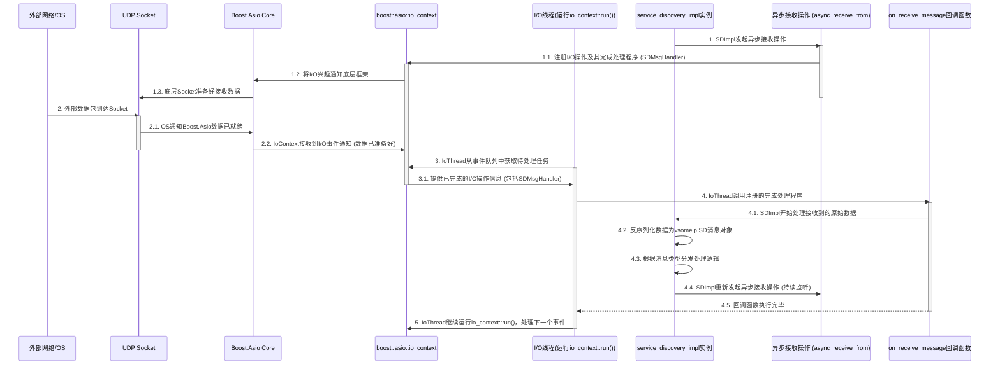

# vsomeip源码探究：接收到I/O事件之后数据如何传递到Service Discovery

这个图展示了从底层网络事件到vsomeip应用层回调的整个异步处理链。

```mermaid
 sequenceDiagram
      participant Network as 外部网络/OS
      participant Socket as UDP Socket
      participant BoostAsioCore as Boost.Asio Core
      participant IoContext as boost::asio::io_context
      participant IoThread as I/O线程(运行io_context::run())
      participant SDImpl as service_discovery_impl实例
      participant SDAsyncOp as 异步接收操作 (async_receive_from)
      participant SDMsgHandler as on_receive_message回调函数
      SDImpl->>SDAsyncOp: 1. SDImpl发起异步接收操作
  activate SDAsyncOp
  SDAsyncOp->>IoContext: 1.1. 注册I/O操作及其完成处理程序 (SDMsgHandler)
  activate IoContext
  IoContext->>BoostAsioCore: 1.2. 将I/O兴趣通知底层框架
  BoostAsioCore->>Socket: 1.3. 底层Socket准备好接收数据
  deactivate SDAsyncOp

  Network->>Socket: 2. 外部数据包到达Socket
  activate Socket
  Socket->>BoostAsioCore: 2.1. OS通知Boost.Asio数据已就绪
  BoostAsioCore->>IoContext: 2.2. IoContext接收到I/O事件通知 (数据已准备好)
  deactivate Socket

  IoThread->>IoContext: 3. IoThread从事件队列中获取待处理任务
  activate IoThread
  IoContext->>IoThread: 3.1. 提供已完成的I/O操作信息 (包括SDMsgHandler)
  deactivate IoContext

  IoThread->>SDMsgHandler: 4. IoThread调用注册的完成处理程序
  activate SDMsgHandler
  SDMsgHandler->>SDImpl: 4.1. SDImpl开始处理接收到的原始数据
  SDImpl->>SDImpl: 4.2. 反序列化数据为vsomeip SD消息对象
  SDImpl->>SDImpl: 4.3. 根据消息类型分发处理逻辑
  SDImpl->>SDAsyncOp: 4.4. SDImpl重新发起异步接收操作 (持续监听)
  activate SDAsyncOp
  SDMsgHandler-->>IoThread: 4.5. 回调函数执行完毕
  deactivate SDMsgHandler

  IoThread->>IoContext: 5. IoThread继续运行io_context::run()，处理下一个事件
  deactivate IoThread
```

