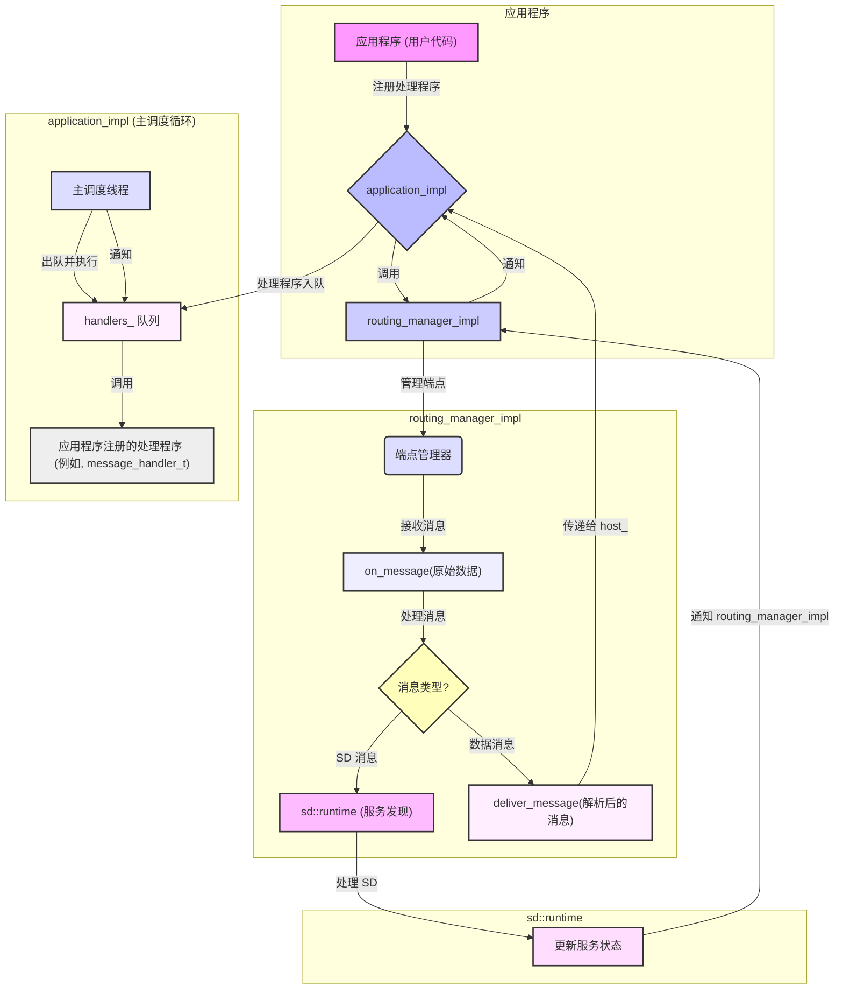
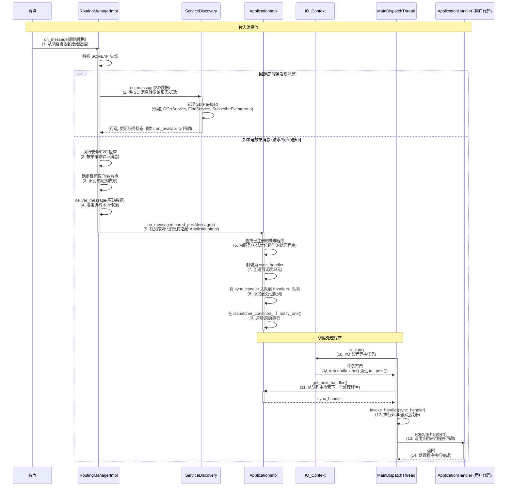
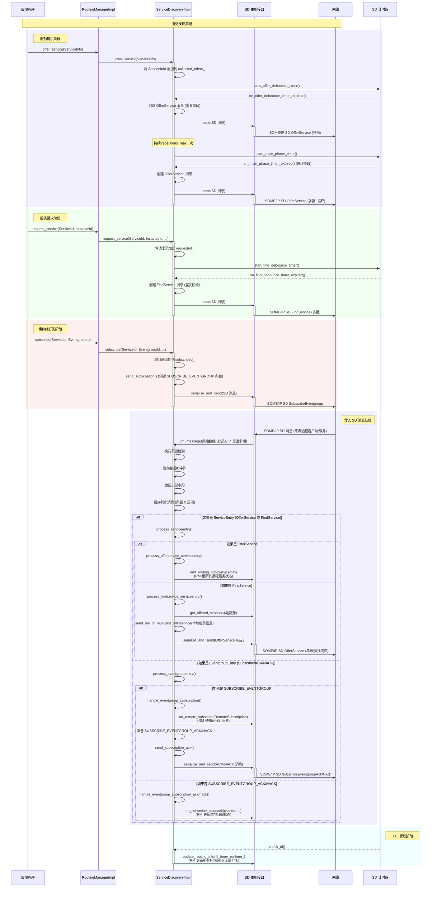
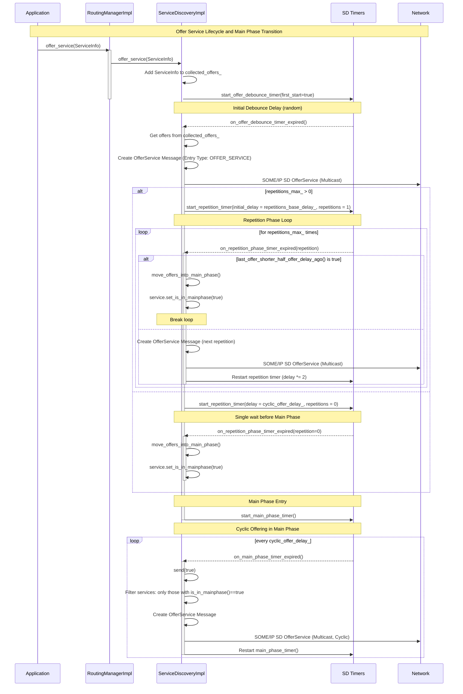

# vsomeip源码探索 - SOME/IP SD主要阶段分析

## vSomeIP路由管理器分析

以下是vSomeIP路由管理器如何将消息传入io_context、通知主调度线程、主调度线程获取并执行handler，最后由服务发现进行相应操作的详细过程和Mermaid图。

**详细过程：**

1.  **应用初始化与io_context设置：**
    *   创建一个`application_impl`对象，它包含一个`boost::asio::io_context`（`io_`）实例。
    *   在`application_impl::init()`期间，`application_impl`会确定它是作为`routing_manager_host`（直接托管路由管理器）还是`routing_manager_client`（连接到远程路由管理器）运行。
    *   实例化并初始化一个`routing_manager_impl`（如果是主机）或`routing_manager_client`，并接收`application_impl`的`io_context`引用。

2.  **启动调度线程：**
    *   当`application_impl::start()`调用时，它会设置一个I/O线程池，包括一个执行`application_impl::main_dispatch()`的“主调度”线程。
    *   这些I/O线程负责运行`io_context`（`io_.run()`），它将异步操作（例如，网络事件，计时器）分派给它们相应的处理程序。

3.  **消息入站（进入`routing_manager_impl`）：**
    *   网络端点（TCP/UDP服务器/客户端）接收传入的SOME/IP消息。这些端点由`endpoint_manager_impl`（`routing_manager_impl`的成员）管理。
    *   当一个端点接收到数据时，它会调用`routing_manager_impl::on_message(const byte_t *_data, ...)`。

4.  **`routing_manager_impl`中的消息处理：**
    *   `routing_manager_impl::on_message`执行SOME/IP头的初始解析，以确定消息类型（请求、响应、通知、服务发现）。
    *   **服务发现消息：** 如果消息是SOME/IP服务发现（SD）消息，`routing_manager_impl`会检查服务发现是否已启用（`configuration_->is_sd_enabled()`），然后将消息转发给`discovery_->on_message()`。`discovery_`对象（`sd::runtime`的一个实例）处理SD负载，更新其关于服务可用性、提供和请求的内部状态。
    *   **常规SOME/IP消息（请求、响应、通知）：** 对于常规SOME/IP消息，`routing_manager_impl::on_message`调用其重载版本`routing_manager_impl::on_message(service_t _service, instance_t _instance, ...)`。此函数可能会应用E2E保护，执行安全检查，并确定目标客户端。
    *   最终，对于发送给本地应用程序的非SD消息，会调用`routing_manager_impl::deliver_message()`。

5.  **传递给`application_impl`和处理程序入队：**
    *   `routing_manager_impl::deliver_message()`将原始消息字节反序列化为`std::shared_ptr<message_impl>`。
    *   然后它调用`host_->on_message(std::move(its_message))`，其中`host_`是`application_impl`实例。
    *   `application_impl::on_message()`使用`find_handlers()`检索应用程序注册的适当`message_handler_t`（或`message_handler_ext_t`）。
    *   然后它将消息和处理程序包装在一个`sync_handler`对象中，并将其推入`handlers_`队列（`application_impl`中的`std::deque`）。
    *   调用`dispatcher_condition_.notify_one()`，通知其中一个调度线程队列中有新任务。

6.  **主调度线程和处理程序执行：**
    *   `main_dispatch`（或其他运行`io_.run()`的I/O线程）在`dispatcher_condition_`上等待。
    *   收到通知后，它调用`get_next_handler()`从`handlers_`队列中检索一个`sync_handler`。此函数处理排序并确保给定服务/实例对只有一个可用性处理程序处于活动状态。
    *   `invoke_handler()`函数（在`main_dispatch`中调用）执行`sync_handler`的`operator()`，这反过来又调用实际的应用程序注册消息处理程序（例如，`message_handler_t`）。
    *   这是执行SOME/IP消息处理的应用程序业务逻辑的地方。

7.  **服务发现的作用和回调：**
    *   `sd::runtime`（服务发现）通过提供服务可用性变化的回调与`routing_manager_impl`交互。
    *   例如，当`sd::runtime`发现新服务或现有服务变得不可用时，它会通知`routing_manager_impl`。
    *   调用`routing_manager_impl::on_availability()`，这反过来又通过`host_->on_availability()`通知`application_impl`。
    *   然后，`application_impl::on_availability()`查找并将相关的`availability_state_handler_t`入队到`handlers_`队列中，然后由主线程调度。这允许应用程序对服务可用性的变化做出反应。

**Mermaid 图：**



## vSomeIP消息流：详细序列图

本序列图详细说明了vSomeIP中消息的流向，从端点接收到消息到最终由应用程序注册的回调进行传递和处理。它强调了`RoutingManagerImpl`、`ApplicationImpl`、`io_context`、主调度线程和服务发现组件的作用。



## vSomeIP 服务发现详细分析

以下是从源代码角度对服务发现每个阶段的详细分析：

**服务发现阶段：**

1.  **初始化（`init()`）：**
    *   `service_discovery_impl`构造函数初始化内部状态，包括用于各种阶段（TTL、提供去抖、查找去抖、主阶段、最后收到的消息）的`boost::asio::steady_timer`对象。
    *   它设置可配置参数，如默认SD端口（`VSOMEIP_SD_DEFAULT_PORT`）、可靠性（`reliable_`）、消息大小限制（`max_message_size_`）、默认TTL（`VSOMEIP_SD_DEFAULT_TTL`）以及重复延迟（`repetitions_base_delay_`、`repetitions_max_`、`cyclic_offer_delay_`）。
    *   生成一个随机的`initial_delay_`以随机化提供和查找阶段的开始，防止网络风暴。这对于分布式系统来说至关重要，可以避免所有节点同时开始发现。
    *   它从配置中填充`unicast_`（节点的单播地址）和`sd_multicast_`（SD多播地址）。

2.  **启动（`start()`）：**
    *   当vSomeIP应用程序变为活动状态时调用。
    *   它通过`host_`（通常是`routing_manager_impl`）创建一个服务发现端点（`endpoint_`）。此端点负责通过网络（UDP或TCP）实际发送和接收SOME/IP SD消息。
    *   清除接收和发送的会话ID的内部映射（`sessions_received_`、`sessions_sent_`）。
    *   如果系统先前已暂停，它会重置所有待处理`FindService`请求的`sent_counter`，确保它们将被重新发送。对于UDP，它还会重新加入多播组。
    *   最重要的是，此方法启动驱动SD协议的主要计时器：
        *   `main_phase_timer_`：在进入主阶段后调度`OfferService`消息的循环发送。
        *   `offer_debounce_timer_`：触发`on_offer_debounce_timer_expired()`回调，该回调管理`OfferService`消息的初始和重复阶段。
        *   `find_debounce_timer_`：触发`on_find_debounce_timer_expired()`回调，管理`FindService`消息的初始和重复阶段。
        *   `ttl_timer_`：定期调用`check_ttl()`，通过更新其生存时间（TTL）来维护已发现服务和订阅的新鲜度。

3.  **停止（`stop()`）：**
    *   设置`is_suspended_`标志为`true`，表示服务发现操作应暂停。
    *   取消所有活动计时器（`ttl_timer_`、`last_msg_received_timer_`、`main_phase_timer_`），以防止进一步的SD消息传输和处理。

4.  **提供服务（`offer_service()`和消息发送）：**
    *   当应用程序调用`vsomeip::application::offer_service()`时，请求会传播到`routing_manager_impl::offer_service()`，然后调用`service_discovery_impl::offer_service(const std::shared_ptr<serviceinfo> &_info)`。
    *   `serviceinfo`对象（包含服务ID、实例ID、主/次版本以及关联端点等详细信息）被添加到`collected_offers_`中。
    *   将offer添加到`collected_offers_`通常会触发`offer_debounce_timer_`（如果尚未运行）。此计时器通过不同阶段协调`OfferService`消息的发送：
        *   **初始延迟阶段：** 在可配置的随机延迟（`initial_delay_`）之后，调用`on_offer_debounce_timer_expired()`。这首先收集所有累积的offers。
        *   **重复阶段：** `OfferService`消息被重复发送（重复次数由`repetitions_max_`定义）。重复之间的延迟加倍（`repetitions_base_delay_`），以处理网络条件并给响应者留出时间。`insert_offer_entries()`函数负责创建类型为`OFFER_SERVICE`的`ServiceEntry`对象，并使用端点选项（IP地址和端口用于可靠/不可靠传输）填充它们。
        *   **主阶段（循环offers）：** 一旦重复阶段完成（或`repetitions_max_`为0），提供的服务将进入“主阶段”。然后，`main_phase_timer_`以固定间隔（`cyclic_offer_delay_`）循环触发`send(true)`。这些循环offers用于持续宣布服务的可用性。
    *   `send(bool _is_announcing)`和`serialize_and_send()`方法是通用辅助函数，它们接收准备好的SD `message_impl`对象，附加会话ID，对其进行序列化，并通过SD端点发送出去。`OfferService`消息通常通过多播发送。

5.  **请求服务（`request_service()`和消息发送）：**
    *   当应用程序调用`vsomeip::application::request_service()`时，它最终会调用`service_discovery_impl::request_service(...)`。
    *   请求的服务（服务ID、实例ID、主/次版本和TTL）存储在`requested_`映射中。
    *   此操作启动`find_debounce_timer_`，其操作类似于offer debounce计时器：
        *   **初始延迟阶段：** 在`initial_delay_`之后，调用`on_find_debounce_timer_expired()`。它从`requested_`映射中收集所有尚未发送的请求（即`get_sent_counter() == 0`）。
        *   **重复阶段：** `FindService`消息被重复发送，延迟加倍。`insert_find_entries()`函数生成类型为`FIND_SERVICE`的`ServiceEntry`对象。每个请求的`send_counter`都会递增以跟踪重复。
    *   `send(std::vector<std::shared_ptr<message_impl>> &_messages)`用于序列化和发送这些`FindService`消息，通常通过多播。与`OfferService`不同，`FindService`消息通常没有连续的“主阶段”；它们会一直发送，直到收到匹配的`OfferService`或达到最大重复次数。

6.  **订阅事件组（`subscribe()`和消息发送）：**
    *   应用程序对`vsomeip::application::subscribe()`的调用转换为`routing_manager_impl::subscribe()`，然后调用`service_discovery_impl::subscribe(...)`。
    *   订阅详细信息（服务ID、实例ID、事件组ID、主版本、TTL、客户端ID和`eventgroupinfo`对象）存储在`subscribed_`映射中。此映射跟踪所有活动订阅。
    *   调用`send_subscription()`以构建`SUBSCRIBE_EVENTGROUP`消息。此消息是使用`create_eventgroup_entry()`创建的，该函数生成一个`EventgroupEntry`，其中包含事件组ID、TTL、主版本以及关键的`EndpointOption`，表示订阅者的IP地址和端口。对于选择性订阅，还可以添加`SelectiveOption`来指定订阅客户端。
    *   生成的SOME/IP SD消息然后通过`serialize_and_send()`发送。

7.  **取消订阅事件组（`unsubscribe()`，`unsubscribe_all()`）：**
    *   应用程序对`vsomeip::application::unsubscribe()`或`unsubscribe_all()`的调用会导致`service_discovery_impl::unsubscribe(...)`或`unsubscribe_all(...)`。
    *   `subscribed_`映射中相关的`subscription`对象被标记为TTL为0。
    *   使用`create_eventgroup_entry()`构建一个`StopSubscribeEventgroup`消息（本质上是TTL为0的`SUBSCRIBE_EVENTGROUP`条目），并使用`serialize_and_send()`发送。这些消息的格式与Subscribe消息相同，但TTL为`0`表示服务正在被删除。
    *   消息发送后，`subscribed_`映射中相应的订阅条目将被删除，并清理相关资源。`unsubscribe_all_on_suspend()`专门处理在暂停事件时取消订阅所有事件组。

8.  **接收SOME/IP SD消息（`on_message()`）：**
    *   这是所有传入原始SOME/IP SD消息的中央处理程序。当`routing_manager_impl`将传入消息识别为SD消息时，它会调用此函数。
    *   **预处理：**
        *   它首先检查源IP地址（确保它不是节点自己的地址）。
        *   它使用`is_reboot()`执行**重启检测**：此机制使用传入消息中的重启标志和会话ID来检测远程vSomeIP参与者是否已重新启动。如果检测到重启，则立即使与该发送方关联的所有远程offer和订阅失效，以确保删除过时信息。
        *   **会话ID序列检查：** `check_session_id_sequence()`验证来自给定发送方的消息是否按顺序的会话ID接收，并报告丢失消息的警告。
        *   **头部验证：** `check_static_header_fields()`验证SOME/IP SD头部（协议版本、接口版本、消息类型、返回码）。
    *   **反序列化和条目处理：**
        *   原始消息数据被反序列化为`message_impl`对象，其中包含`entries`（ServiceEntry或EventgroupEntry）和`options`列表。
        *   `on_message`方法然后遍历每个`entry`：
            *   **`ServiceEntry`处理（`process_serviceentry()`）：**
                *   提取服务ID、实例ID、版本、TTL和任何关联的IP端点选项。
                *   如果条目类型是`OFFER_SERVICE`，则调用`process_offerservice_serviceentry()`。这对于发现服务至关重要。它更新远程提供服务的内部状态，如果需要，可能会调整事件组的可靠性类型。它还调用`host_->add_routing_info()`来更新路由管理器对可用服务的视图。此处还会执行安全检查（例如，`is_secure_service`、`is_protected_port`）。
                *   如果条目类型是`FIND_SERVICE`，则调用`process_findservice_serviceentry()`。如果请求的服务是本地提供的，则将`OfferService`消息单播或多播回`FindService`消息的发送方。
            *   **`EventgroupEntry`处理（`process_eventgroupentry()`）：**
                *   提取事件组ID、类型（Subscribe、StopSubscribe、ACK、NACK）以及指示特定客户端的任何`SelectiveOption`。
                *   如果是`SUBSCRIBE_EVENTGROUP`条目：
                    *   它 undergoes extensive validation (e.g., multicast source check, valid options, correct protocol types).
                    *   调用`handle_eventgroup_subscription()`。此函数根据本地服务配置（例如，匹配主版本、远程订阅的安全接受）验证订阅。然后，它调用`host_->on_remote_subscribe()`通知路由管理器新的远程订阅，并准备要发送回订阅者的`SUBSCRIBE_EVENTGROUP_ACK`（如果接受）或`SUBSCRIBE_EVENTGROUP_NACK`（如果拒绝）消息。
                *   如果是`SUBSCRIBE_EVENTGROUP_ACK`或`SUBSCRIBE_EVENTGROUP_NACK`条目：
                    *   调用`handle_eventgroup_subscription_ack()`或`handle_eventgroup_subscription_nack()`。这些函数更新本地发起的订阅的状态（`subscribed_`映射），并通过`host_->on_subscribe_ack()`或`host_->on_subscribe_nack()`通知`routing_manager_impl`。

9.  **TTL管理和过期（`check_ttl()`，`expire_subscriptions()`）：**
    *   `ttl_timer_`定期调用`check_ttl()`。此函数反过来又调用`host_->update_routing_info()`，该函数遍历所有已知服务和订阅并递减它们的TTL。如果TTL达到零，则相应的服务或订阅将被视为过期并被删除。
    *   类似地，`subscription_expiration_timer_`触发`expire_subscriptions()`，该函数调用`host_->expire_subscriptions()`，专门清理过期的远程事件组订阅。这确保了过时的订阅信息被删除。
    *   `last_msg_received_timer_`用于检测在一定时间内是否未收到多播SD消息。如果它过期，它可能会触发重新加入多播组以重新建立连接。

实质上，`service_discovery_impl`充当一个复杂的有限状态机和消息处理器，实现了SOME/IP服务发现协议。它管理提供服务和请求/订阅事件组的生命周期，通过定时消息交换和状态更新动态适应网络条件和远程参与者行为。

### vSomeIP 服务发现序列图


## vSomeIP 主阶段计时器分析

vSomeIP 服务发现中的主阶段计时器旨在对服务进行持续的周期性广播，而不是对特定更改做出反应。它的“必要性”植根于协议要求不断宣布服务可用性。

### 主阶段计时器如何确定“必要性”

`service_discovery_impl`中的`main_phase_timer_`以固定间隔（`cyclic_offer_delay_`）触发`on_main_phase_timer_expired()`函数。

1.  **`on_main_phase_timer_expired()`的操作：**
    *   此函数仅调用`send(true)`，然后重新启动`main_phase_timer_`。此处没有条件逻辑来检查是否发生了任何“更改”或发送是否在响应式事件的意义上是特别“必要的”。它按照固定计划运行。

2.  **`send(bool _is_announcing)`的作用：**
    *   当`_is_announcing`为`true`（与从`main_phase_timer_`调用时一样）时，此函数从主机（`host_->get_offered_services()`）检索当前提供的服务。
    *   然后它调用`insert_offer_entries()`将这些服务条目添加到SOME/IP SD消息中。

3.  **`insert_offer_entries()`的过滤：**
    *   在`insert_offer_entries()`内部，有一个关键条件决定了哪些服务包含在传出的SD消息中：
        ```cpp
        if ((_ignore_phase || its_instance.second->is_in_mainphase()) &&
                (its_instance.second->get_endpoint(false) || its_instance.second->get_endpoint(true)))
    
    *   每个`serviceinfo`对象（表示提供的服务）的`is_in_mainphase()`标志是关键。只有已成功完成其初始和重复阶段（或配置为跳过这些阶段）的服务才将此标志设置为`true`。
    
    *   此外，服务必须至少有一个有效的端点（可靠或不可靠）配置。

**关于“必要性”的结论：**
在主阶段发送SD消息的“必要性”不是由检测服务状态的变化（例如，服务变为可用或不可用）来确定的。相反，它是SOME/IP SD协议规定的**周期性广播机制**。任何已完成其初始提供阶段并当前处于活动状态且配置为处于“主阶段”（`is_in_mainphase() == true`）的服务都将包含在这些循环广播中。`main_phase_timer_`的作用是确保这些循环广播持续发生，以允许其他参与者持续发现和维护服务的可用性。

### 进入主阶段的其他场景

提供服务的到主阶段的转换主要发生在初始和重复阶段完成之后。但是，此转换的发生方式存在细微差别：

1.  **重复阶段之后（正常转换）：**
    *   在`OfferService`消息已发送`repetitions_max_`次之后，`on_repetition_phase_timer_expired()`函数将以`_repetition`设置为`0`调用。
    *   此时，通过调用`move_offers_into_main_phase(_timer)`将服务的关联`serviceinfo`移动到主阶段。此函数将先前与该重复计时器关联的所有服务的`is_in_mainphase()`标志设置为`true`。
    *   下次`main_phase_timer_`到期时，这些服务将包含在循环`OfferService`广播中。

2.  **重复阶段之后（优化/提前转换）：**
    *   在`on_repetition_phase_timer_expired()`函数中，如果当前重复`> 0`（即不是最后一次重复或初始等待），则执行检查：`if (last_offer_shorter_half_offer_delay_ago())`。
    *   `last_offer_shorter_half_offer_delay_ago()`函数确定上次`OfferService`消息发送距`cyclic_offer_delay_`的一半时间是否更短。这是一种优化。
    *   如果此条件为`true`，则意味着系统可以提前转换到主阶段而不会违反协议的循环提供时间。在这种情况下，立即调用`move_offers_into_main_phase(_timer)`，并有效地跳过剩余的重复。这有助于在网络条件稳定且offer持续得到确认后更快地进行服务广播。

3.  **无重复阶段（`repetitions_max_ == 0`）：**
    *   如果`repetitions_max_`配置参数设置为`0`，则“重复阶段”被有效地跳过。
    *   当`on_offer_debounce_timer_expired()`首次调用时，它将安排`on_repetition_phase_timer_expired()`在等于`cyclic_offer_delay_`的延迟后调用一次，并将`_repetition`设置为`0`。
    *   这意味着在初始随机去抖延迟之后，提供的服务将等待一个完整的`cyclic_offer_delay_`间隔，然后立即转换到主阶段（因为`_repetition == 0`将触发`move_offers_into_main_phase()`）。

总之，所有提供的服务最终都会进入主阶段进行循环广播。进入此阶段的路径可以是完整的重复序列、从重复阶段提前转换，或者如果未配置重复则在初始等待后直接转换。

### Mermaid 序列图：提供服务生命周期和主阶段转换

