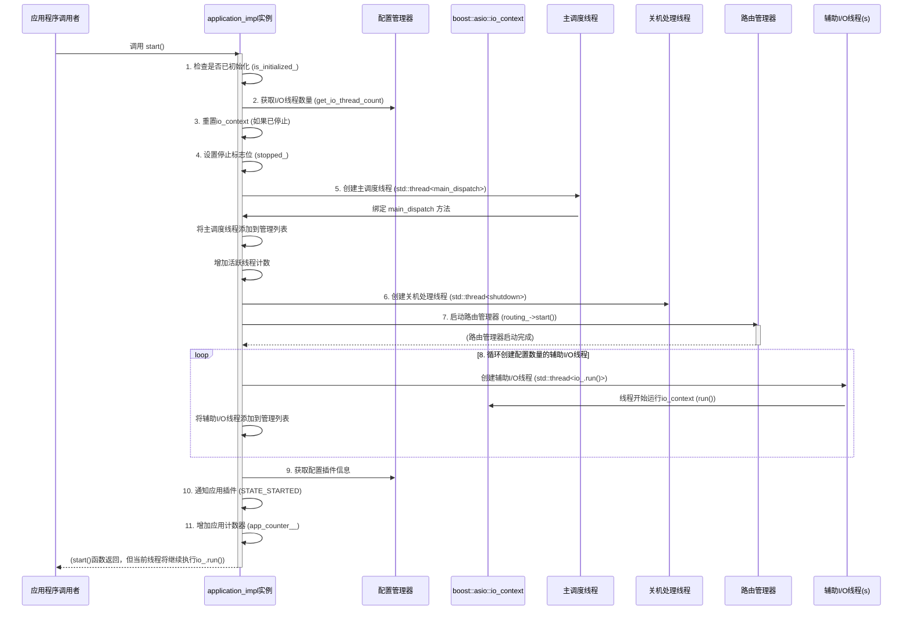
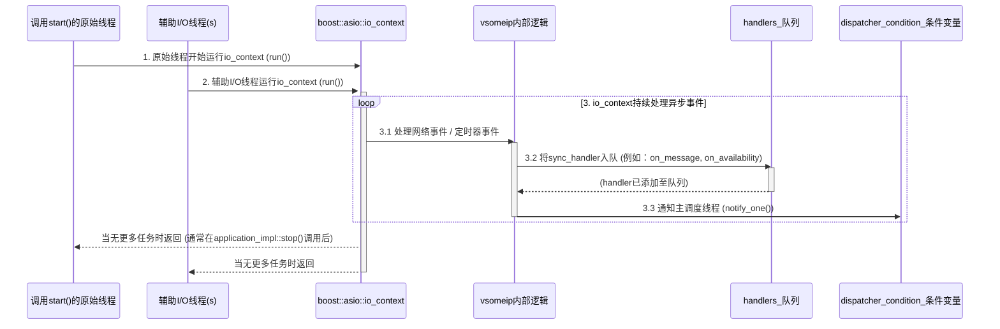
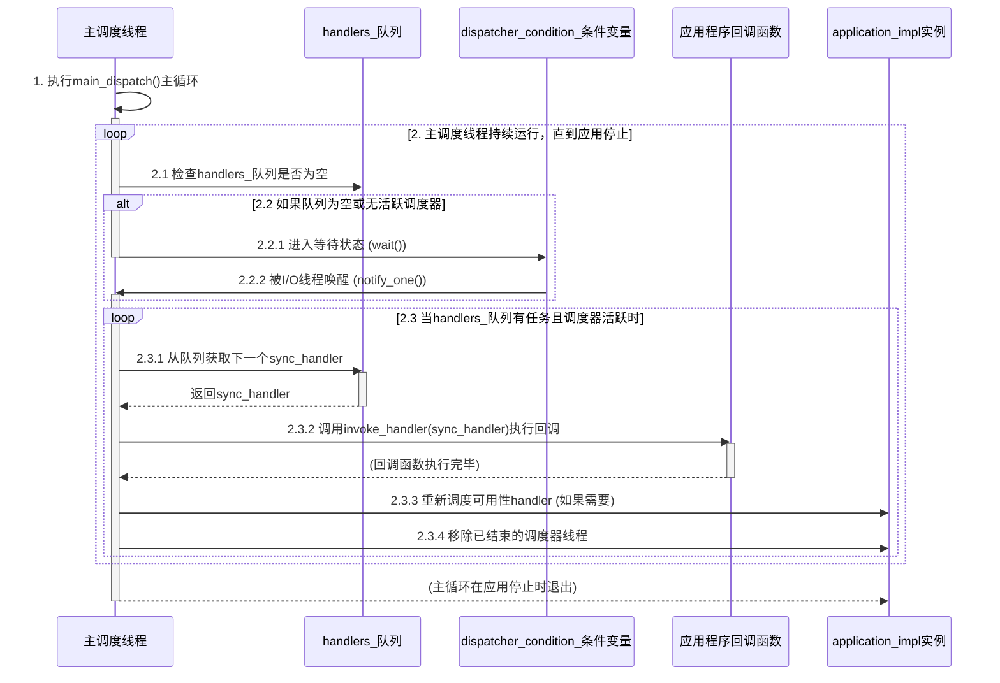

# vsomeip源码探索：start和I/O调度

在汽车电子通信领域，`vsomeip`库扮演着举足轻重的角色。作为一个开源的`SOME/IP（Scalable service-Oriented Middleware over IP）`协议栈实现，它为车辆内部以及车云之间的服务通信提供了高效可靠的解决方案。那么，当我们调用`vsomeip`应用中的`app_->start()`时，幕后究竟发生了什么？`vsomeip`是如何管理其复杂的并发任务，确保消息的及时处理和事件的有序分发呢？今天，我们就来深度剖析vsomeip库的启动流程及其核心事件处理机制。

## 一切的开始：`app_->start() `的魔力

  `app_->start()` 函数是vsomeip应用生命周期的关键起点，它负责初始化和启动整个vsomeip运行环境。这个函数不仅仅是简单的“启动”，更是一系列精心设计的步骤，确保vsomeip能够高效、稳定地运行。

    1. 就绪检查: 在真正启动之前，`start() `函数会首先确认应用程序是否已经通过 `init()`函数进行了必要的初始化。如果应用尚未准备就绪，它会友好地发出警告并中止启动，避免在不稳定的状态下运行。
    2. `I/O `上下文的激活: vsomeip 依赖于 `boost::asio::io_context` 来管理所有异步I/O操作。start()函数会确保这个I/O上下文处于可运行状态，如果之前停止过，它会进行重置。
    3. 线程池的构建: 这是并发处理的核心。start() 会根据配置，启动一组专用的线程来处理不同类型的任务：
       * 主调度线程: 这是一个独特的线程，其职责是处理vsomeip内部的高层次事件分发。
       * 辅助I/O线程: 除了**主应用程序线程本身也作为I/O线程**之外，vsomeip还会根据配置启动额外的辅助I/O线程。这些线程共同协作，处理底层的网络通信和定时器事件。

    4. 路由管理器的启动: vsomeip 应用**可以是路由管理器的主机，也可以是其代理**。start()函数会根据应用的配置，启动相应的路由管理`（routing_manager_impl 或 routing_manager_client）`，这是 vsomeip服务发现和消息路由的关键组件。
    5. 插件的生命周期管理: 如果应用加载了特定的插件，start()函数会通知这些插件，告诉它们应用程序已经进入了**“已启动”**状态，允许插件执行其启动相关的逻辑。
  6. 应用程序计数: 内部维护一个计数器，跟踪当前正在运行的**vsomeip应用程序实例数量**，这对于资源管理和调试非常有用。

## 幕后的功臣：I/O 线程与主调度线程的精妙协作

  在vsomeip的并发模型中，I/O线程和主调度线程各自承担着明确的职责，并通过一种高效的`“生产者-消费者”`模式进行交互。

### I/O 线程：底层的“辛勤生产者”

  I/O线程，**包括调用app_->start()的主应用程序线程以及所有额外创建的辅助I/O线程**，是vsomeip异步操作的直接驱动者。

* 核心职责: 它们主要围绕` boost::asio::io_context`运转。当网络数据到达（例如，接收到来自其他vsomeip应用的请求或通知）或定时器触发时，`io_context`会将这些事件分发给I/O线程进行处理。
* 网络通信: I/O线程负责所有底层的网络操作，包括建立和维护TCP/UDP连接、数据的序列化与反序列化，以及实际的数据传输。它们确保了vsomeip消息能够在网络中高效流动。
* 事件“生产”: 这是I/O线程与主调度线程交互的关键一环。当I/O线程处理完一个底层的网络事件，并识别出这是一个vsomeip层面的“高层次事件”（比如一个完整的vsomeip消息已接收，或者某个服务的可用性状态发生了变化），它并不会立即执行相关的应用程序逻辑，它会将这个高层次事件封装成一个`sync_handler`对象。
* 入队与通知: 这些封装好的`sync_handler`对象随后被安全地放入一个名为`handlers_`内部队列中。为了告知主调度线程有新任务到来，I/O线程会发送一个通知信号（通过`条件变量dispatcher_condition_.notify_one()`），唤醒主调度线程。

### 主调度线程：高层次的“有序消费者”

  主调度线程是vsomeip事件处理的核心“消费者”，它负责执行应用程序开发者注册的业务逻辑。

* 核心职责: 它的主要任务是从`handlers_`队列中取出`sync_handler`对象，并按照接收到的顺序执行其中封装的应用程序回调函数。这些回调函数包括：

  * 消息处理器: 处理接收到的vsomeip消息（如请求-响应、通知）。
  * 可用性处理器: 响应服务可用性状态的变化（例如，某个服务上线或下线）。
  * 状态处理器: 处理vsomeip应用自身状态的变化。

* 确保有序性: 即使有多个I/O线程在并发地产生事件并推送到队列中，主调度线程也能够确保这些事件按照它们被添加到队列的顺序（或*内部定义的优先级*）进行处理。这对于许多通信协议的正确性至关重要，避免了因乱序处理而导致的逻辑错误。

* 单线程执行业务逻辑: 这种设计的一个显著优点是，大多数用户注册的应用程序逻辑都在主调度线程中执行。这极大地简化了应用程序层面的并发控制，开发者无需担心复杂的多线程竞争条件，可以更专注于业务逻辑本身。

  

### io_context 与 handlers_ 队列的生产者-消费者关系

  我们可以将` io_context（及其驱动它的I/O线程）`视为生产者，它们从底层网络不断获取数据，并将其转化为更高层级的vsomeip事件。这些事件被“生产”出来后，就进入了` handlers_`队列这个缓冲区。而主调度线程则作为消费者，它不断地从这个队列中“消费”事件，并执行相应的业务逻辑。

  这种模式的优势在于：

* 解耦: 底层I/O处理与上层业务逻辑完全解耦。I/O线程可以专注于高性能的数据传输，而不会因为复杂的业务计算而阻塞。
* 响应性: I/O线程能够快速响应网络事件并将其排队，确保vsomeip应用的低延迟和高吞吐量。
* 简化并发: 通过将复杂的业务逻辑集中在主调度线程中执行，避免了在多个线程之间共享和修改数据所带来的复杂性和潜在的错误，大大降低了开发难度和维护成本。
* 事件顺序保证: 队列的特性保证了事件处理的顺序性，这对于依赖事件发生顺序的vsomeip协议操作至关重要。

## 结语

  `vsomeip`库通过精巧的架构设计，特别是对`app_->start()`流程的合理编排以及I/O线程与主调度线程的有效协作，构建了一个既高效又
  稳定的异步事件处理框架。这种生产者-消费者模式不仅优化了系统性能，更重要的是，它为上层应用提供了清晰且易于管理的编程模
  型，使得开发者能够专注于构建可靠的汽车服务，而无需过多地纠结于底层的并发细节。

下图展示了`app_->start()`被调用后，vsomeip进行初始化设置，并创建各种工作线程的流程。

下图展示了`I/O`线程（包括原始调用`start()`的主应用线程和辅助`I/o`线程）与`io_contex`的交互流程。

