# earlyOOM

## 简介

earlyoom 是一个用户态 OOM 监控守护进程。核心逻辑：

* 定期读取系统内存与交换分区信息`/proc/meminfo`。
* 当“可用内存”和“可用交换分区”同时低于阈值时，选择一个“最应当被杀”的进程并发送信号（先 SIGTERM，必要时升级到 SIGKILL）。
* 进程选择依据：默认最大 `oom_score`，可选按最大 RSS（`--sort-by-rss`）。
* 强化逻辑：进程组杀、偏好/避免/忽略正则、D-Bus/外部脚本通知、`process_mrelease` 尽快释放内存、适配 `proc hidepid` 等。

主要模块与职责：

* main.c：参数解析、启动自检、锁内存、主轮询循环`poll_loop()`
* meminfo.c：解析`/proc/meminfo`，提供百分比与衍生指标，活性检查`is_alive()`
* kill.c：选择受害者`find_largest_process()`，对比逻辑`is_larger()`，发送信号与等待退出`kill_wait()`，`process_mrelease`
* proc_pid.c：解析`/proc/[pid]/stat`（进程状态、ppid、线程数、rss 页数）
* msg.c：`日志/颜色/（可选）`syslog，参数解析辅助
* `globals.*`：全局开关与 `/proc` 路径

## 框架图

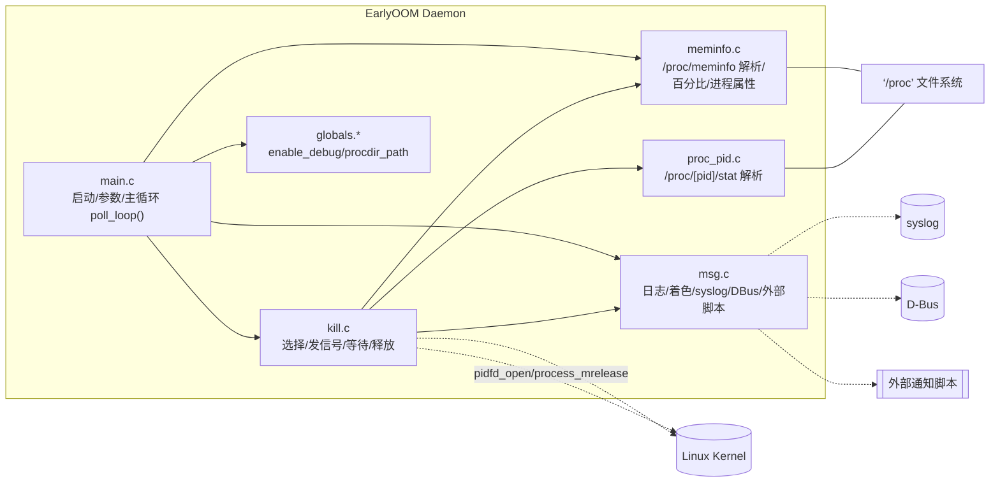

## 总体时序图

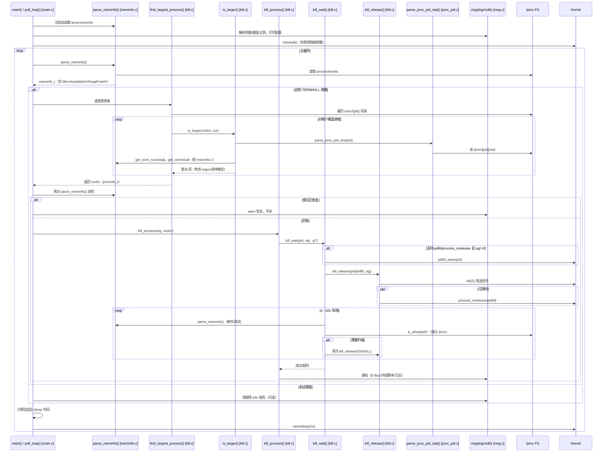

## 处理函数流程图

### main启动与参数解析

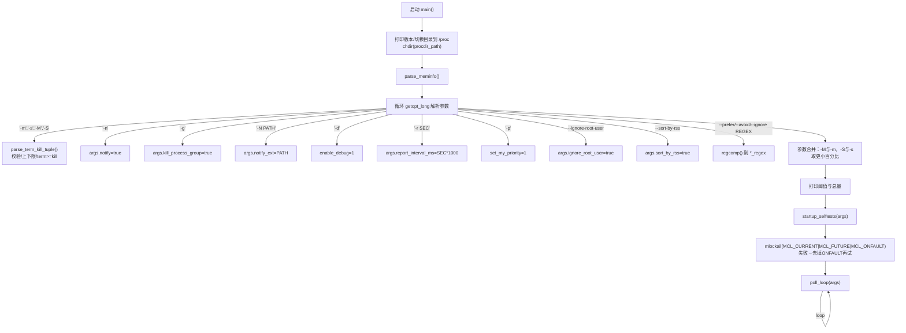

### poll_loop主循环

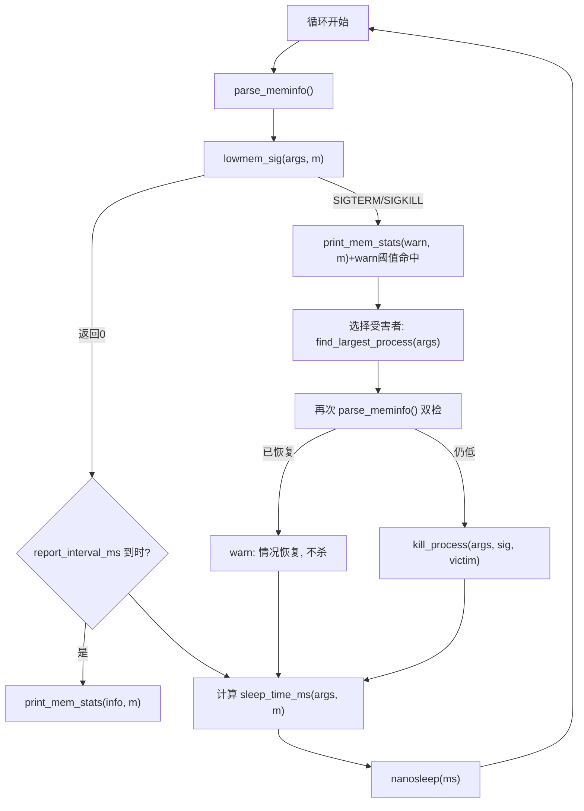

### 选择受害者进程

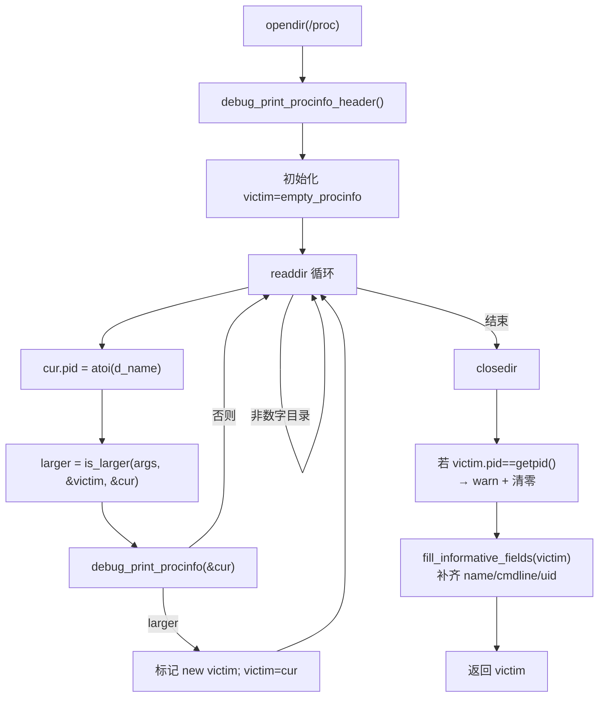

### 进程比较决策

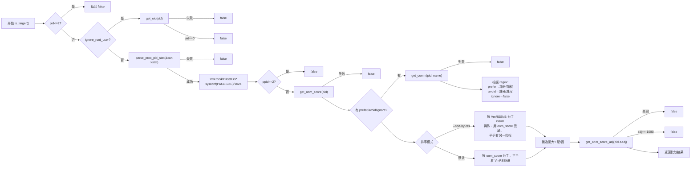

### 杀进程处理

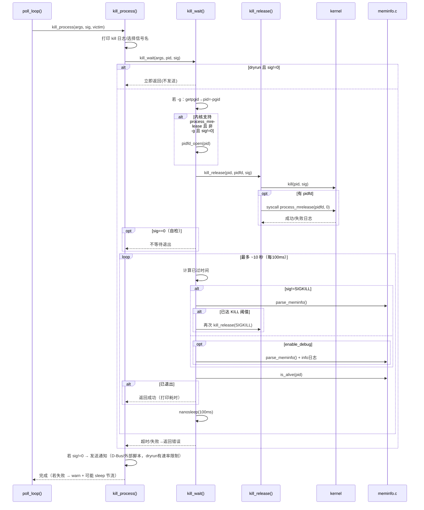

## 读取信息函数流程图

### 读取系统内存信息

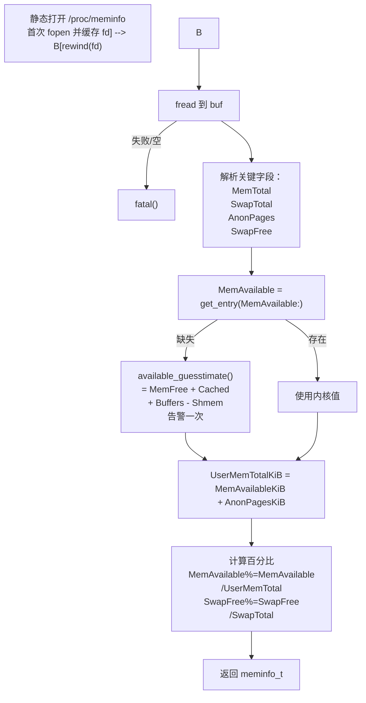

### 读取进程状态信息

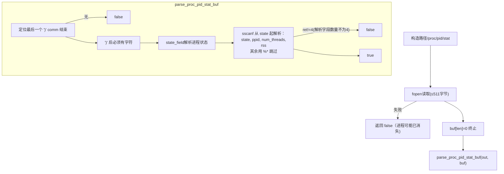

## 其他功能函数流程图

### 自适应睡眠

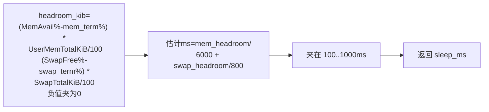

### 低内存信号判断

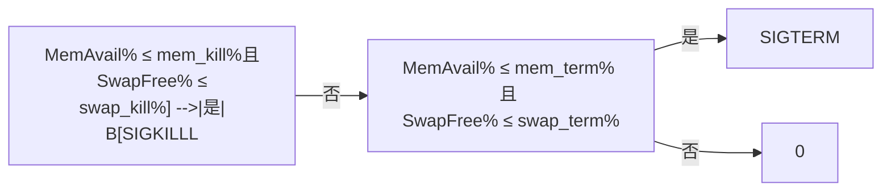

