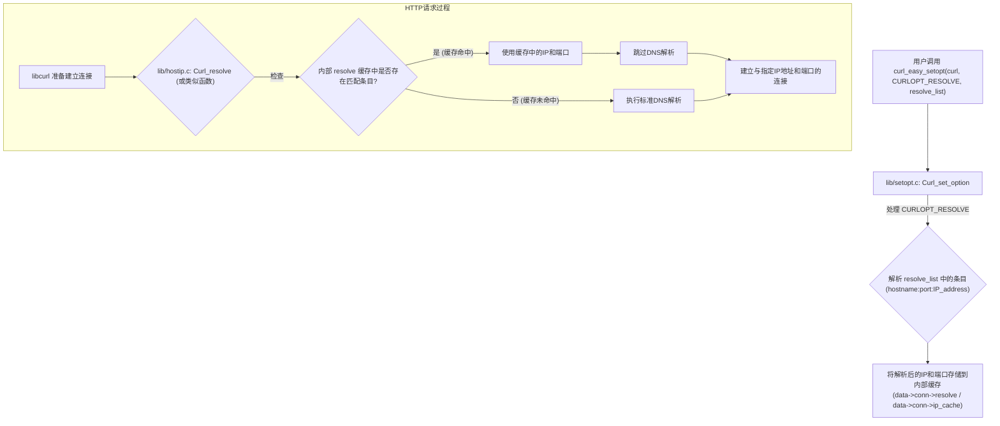
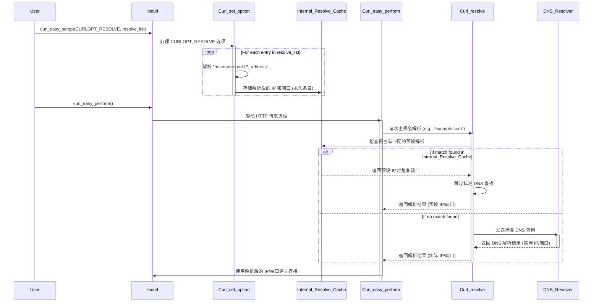

### Custom DNS Resolution in curl using CURLOPT_RESOLVE

本文档介绍了如何在 `libcurl` 中使用 `CURLOPT_RESOLVE` 为 HTTP 请求设置自定义的 DNS 解析 IP 地址和端口，并提供了代码示例和详细的底层调用流程分析。

## 示例代码

```c
#include <curl/curl.h>
#include <stdio.h>

int main(void) {
  CURL *curl;
  CURLcode res = CURLE_OK;

  curl_global_init(CURL_GLOBAL_DEFAULT);
  curl = curl_easy_init();

  if (curl) {
    /* Resolve "example.com" to a specific IP address and port.
       Format: "hostname:port:IP_address" */
    struct curl_slist *resolve_list = NULL;
    resolve_list = curl_slist_append(resolve_list, "example.com:80:192.0.2.1");
    resolve_list = curl_slist_append(resolve_list, "example.com:443:192.0.2.2");

    curl_easy_setopt(curl, CURLOPT_RESOLVE, resolve_list);

    /* Set the URL to fetch. Even though the hostname is "example.com",
       curl will use the provided IP address and port from CURLOPT_RESOLVE. */
    curl_easy_setopt(curl, CURLOPT_URL, "http://example.com/");

    /* Perform the request */
    res = curl_easy_perform(curl);

    /* Check for errors */
    if (res != CURLE_OK) {
      fprintf(stderr, "curl_easy_perform() failed: %s\n", curl_easy_strerror(res));
    }

    /* Clean up the resolve list */
    curl_slist_free_all(resolve_list);

    /* Always cleanup */
    curl_easy_cleanup(curl);
  }

  curl_global_cleanup();
  return (int)res;
}
```

## 解释

`CURLOPT_RESOLVE` 允许您为特定的主机名和端口提供自定义的 DNS 类似解析。这对于以下情况很有用：

*   **测试：** 强制连接到特定的服务器实例。
*   **安全：** 绕过 DNS 连接到已知的好 IP 地址，或测试应用程序在 DNS 被操纵时的行为。
*   **开发：** 在不修改 DNS 设置的情况下，测试针对本地或私有网络实例。

`curl_slist` 中每个条目的格式是 `"HOSTNAME:PORT:IP_ADDRESS"`。`libcurl` 将使用此映射，而不是执行该特定主机名和端口的 DNS 查找。

## `CURLOPT_RESOLVE` 用法的源代码分析

在 `curl` 中，处理 `CURLOPT_RESOLVE` 并使用指定 IP 和端口执行 HTTP 请求的核心逻辑主要在 `lib/setopt.c` 和 `lib/hostip.c` 中实现。

1.  **`lib/setopt.c`（设置选项）：**
    *   当您调用 `curl_easy_setopt(curl, CURLOPT_RESOLVE, resolve_list)` 时，`setopt.c` 中的 `Curl_set_option` 函数会处理 `CURLOPT_RESOLVE` 选项。
    *   它会遍历提供的 `curl_slist`（例如 `resolve_list`）中的每个条目。
    *   对于格式为 "HOSTNAME:PORT:IP_ADDRESS" 的每个字符串，它会解析组件并将其转换为内部地址信息结构（例如 `Curl_addrinfo`）。
    *   这些解析后的地址详细信息随后会存储在与 `CURL` 句柄关联的特殊内部缓存中（例如 `data->conn->resolve` 或 `data->conn->ip_cache`）。这些条目被标记为“永久”的，这意味着它们不会像标准 DNS 缓存条目那样过期。

2.  **`lib/hostip.c`（主机名解析）：**
    *   当 `curl` 准备建立连接（例如，在 `Curl_connect` 或 `Curl_resolve` 函数中）时，它首先会查询这个内部的“解析”缓存。
    *   如果目标主机名和端口（从 `CURLOPT_URL` 派生）在通过 `CURLOPT_RESOLVE` 提供的缓存中找到匹配的条目，`curl` 将**绕过**其正常的 DNS 查找过程。
    *   相反，它将直接使用 `CURLOPT_RESOLVE` 条目中指定的 IP 地址和端口来尝试建立连接。这意味着不会向外部 DNS 服务器发送 DNS 查询；而是直接尝试连接到预配置的 IP。

本质上，`CURLOPT_RESOLVE` 通过维护一个主机名到 IP 地址的内部自定义映射，使 `curl` 能够绕过操作系统的 DNS 解析机制。这种对解析的直接控制对于测试、安全评估以及需要特定网络配置的开发场景来说是无价的。

## 调用流程图（Mermaid 流程图）



## 调用流程图（Mermaid 时序图）

