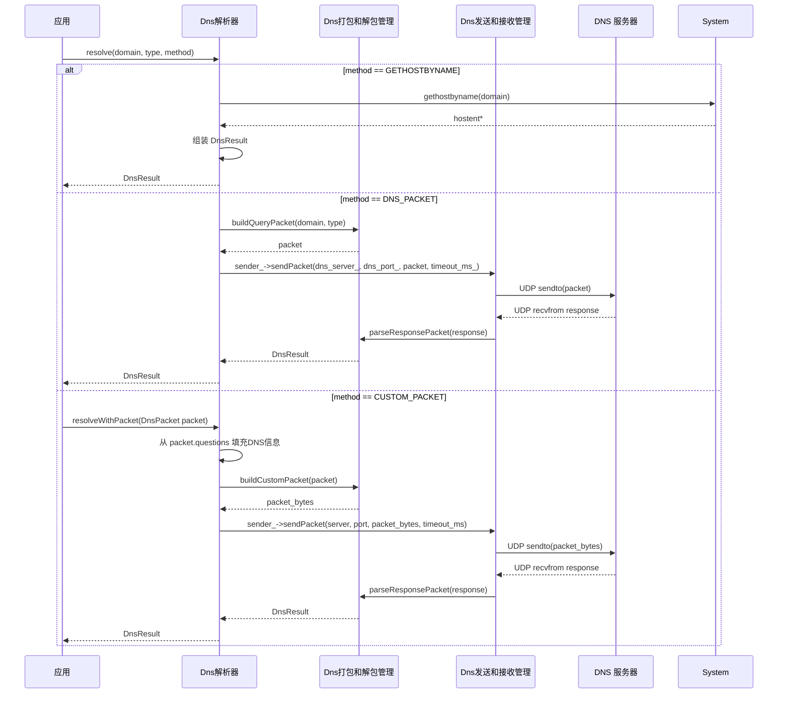
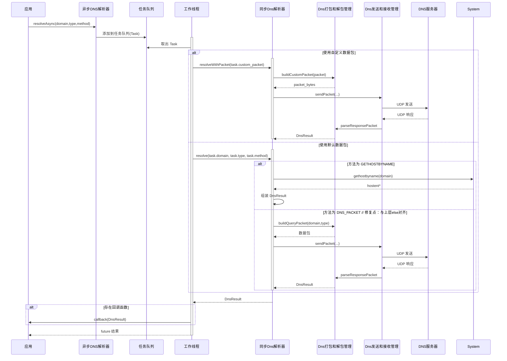

# 自写一个DNS解析库：初步框架

上一篇介绍了下我们写DNS解析库的目的以及需求，还有初步的暴露给用户使用的接口。接下来我们需要看下同步和异步这两套接口可以怎么实现。

## 软件需求

### 同步解析

先看下同步解析的流程。我们库的使用者在调用同步解析的接口之后，我们应该根据用户传入的信息和解析的方式做判断，并进行相应的处理。

* 如果是`gethostbyname`的方式，我们直接调用并等待解析返回，将返回的信息封装返回给用户即可。
* 如果是构建默认DNS数据包发送的方式，我们需要创建socket，设置为UDP发送方式，并根据DNS请求协议封装DNS数据包发送数据包；接收回复的数据，根据DNS响应协议解析数据包，填充响应的数据封装返回给用户。
* 如果是用户自定义DNS数据包发送的方式，则应该把DNS数据包的结构/对象信息暴露给用户，让用户去填充，之后调用我们提供的接口，我们再创建socket去发送。

### 异步解析

对于异步解析来说，流程和同步解析类似，只不过我们希望解析的过程不在用户的应用主进程中进行。

我们可以在用户调用解析的时候，开一个线程，把用户的解析任务放到里边去完成。如果用户设置的是`gethostbyname`那就在这个线程里边使用`gethostbyname`，如果是默认构建DNS数据包或用户传入一个自定义DNS数据包的方式，则在这个线程中创建socket去发送。

但是这里会有一个问题，就是如果每次用户一调用我们的接口就创建一个线程的话，对于有多DNS请求的需求来说线程资源开销过大，所以我们不如将所有解析任务放到一个队列里边，然后对于异步解析只开一个线程，这个线程只需要在队列里边有解析任务的时候去获取，然后执行对应的任务就可以了。

对于回调的方式，我们也把它作为任务的一项，当需要它的时候设置到解析任务里，并在解析完成后执行用户回调就可以了。注意，用户定义的回调如果设置用户数据的修改，我们的库是无法保证数据是线程安全的，只有用户自己或通过锁的机制才可以确保线程安全。

## 软件设计

### 总体设计

上面对同步解析和异步解析初步盘完了软件需求。接下来就可以进行软件设计了。

首先是软件所在层，肯定是用户的应用程序了，这个没什么好说的，我们作为一个库给用户提供头文件和库文件，用户的应用程序通过包含头文件，在对应的程序位置调用，在编译的时候链接我们的库即可。

对于库来说，我们的分层如下：

* DNS解析器：这一层分为DNS同步解析和DNS异步解析两大部分
* DNS打包和解包：这一层负责对DNS请求和响应进行定义，以及根据DNS请求和响应协议对DNS解析器的请求或响应数据包进行解析
* DNS发送和接收：这一层负责对DNS解析的网络处理，包括socket的创建、发送和接收数据包等

### 交互时序

#### 同步解析

一图胜千言

根据前面的分层设计，我们将我们的同步解析画出以上时序图：

* 应用：集成DNS解析库并调用resolve进行DNS解析，用户可以传入domain域名、ipv4或ipv6的类型、使用何种方式解析（`gethostbuname`、默认/自定义构建DNS数据包）
* DNS解析器：
  * 如果是`gethostbyname`方式，则直接调用，与系统交互，并将返回的ip地址等信息通过组装返回给应用程序
  * 如果是默认构建DNS数据包的方式，DNS解析器将调用DNS打包管理器封装数据包，其中一些DNS信息是默认指定的，只不过是需要填充用户指定的domain等，DNS打包管理器随后将数据包通过调用DNS发送器，创建UDP socket通过网络协议栈发送给DNS服务器，DNS解析完成后会返回数据包给DNS接收管理器，之后将响应解析之后封装数据原路返回给应用程序
  * 如果是用户自定义构建DNS数据包的方式，则用户需要填充DNS请求数据包的部分字段，然后调用DNS解析器将数据包传递并发送出去，后面的步骤和默认构建DNS数据包方式相同
* DNS打包和解包管理器：负责提供接口供DNS解析器将DNS数据包传递给DNS发送和接收器发送，或接收DNS发送和接收器传递过来的DNS响应
* DNS发送和接收管理器：负责与DNS打包和解包管理器将DNS请求/响应发送给DNS服务器（网络）/接收到本地

#### 异步解析

对于异步解析，我们需要引入工作线程和任务队列，负责解析异步的DNS请求；还有一个细节是我们的同步DNS解析器的操作是可以完全服用的，我们在进行DNS解析的时候直接使用上面的同步DNS解析器操作即可；至于支持用户传入的回调函数，我们只需要在处理解析任务时，判断这个任务打包的时候是否有用户传入的回调再进行调用即可：

相比于上面同步解析的操作，我们增加了异步DNS解析器、工作线程和任务队列：

* 异步DNS解析器：负责将用户的请求放入任务队列，包括`gethostbyname`、默认/自定义DNS数据包方式，以及设置回调的方式，我们都将它封装到`task`里边
* 任务队列：存放用户`task`，在工作线程需要的时候获取
* 工作线程：在任务队列有任务的时候会获取任务，调用同步DNS解析器的流程

### 框架图

根据以上的各个处理时序和分层设计，总体的框架图大致为下：

```mermaid
flowchart LR
    subgraph App["应用"]
      A2["resolve..."]
    end

    subgraph Sync["同步DNS解析器"]
      S1["resolve(domain, type, method)"]
      S2["resolveWithGethostbyname(domain)"]
      S3["resolveWithDnsPacket(domain, type)"]
      S4["resolveWithPacket(custom DnsPacket)"]
    end

    subgraph Async["异步解析器"]
      Q1["任务队列"]
      W1["工作线程<br/>从任务队列获取任务"]
      X1["执行DNS解析 -> 复用同步解析器"]
    end

    subgraph Packet["DNS数据包处理层"]
      P1["封装请求/响应数据包"]
      P2["sendPacket(server,port,bytes,timeout)"]
      P3["parseResponsePacket(bytes)"]
    end

    D["操作系统 gethostbyname()"]
    DNS["外部 DNS 服务器 (UDP/53)"]

    App --> A2 --> Sync

    Sync -->|method=GETHOSTBYNAME| D
    Sync -->|method=DNS_PACKET| Packet
    Sync -->|resolveWithPacket| Packet

    Async --> Q1 --> W1 --> X1 --> Sync

    Packet -->|UDP sendto| DNS
    DNS -->|UDP response| Packet
```

软件设计就绪，接下来就可以进行类的设计和职能处理了。下一篇介绍。