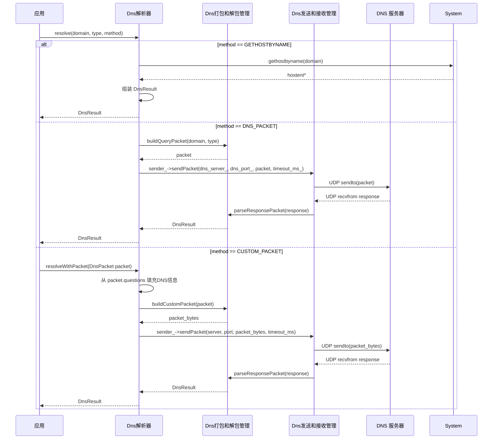
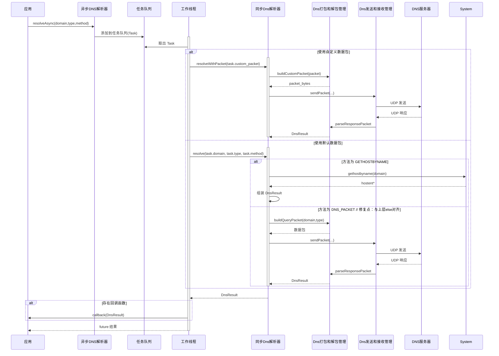

# 自写一个DNS解析库：实现和调用流程

上一篇我们介绍了DNS同步解析、异步解析及其相关类/结构的设计和职能划分，我们还画了类图来表示它们之间的关系，接下来我们需要根据之前在初步框架画的软件设计时序，来看看如何实现他们的接口：


*浏览器打开此此文链接，mermaid图可以放大看*

## 同步解析

前面我们说过，我这里使用DNS同步解析基类来定义基础方法，用DNS同步解析实现类来重写这些方法并扩展，当我们应用层继承这个DNS解析库后，在代码中调用`resolve`，实际上会调用我们重写的实现类方法，实现如下：
```cpp
DnsResult DnsResolverImpl::resolve(const std::string& domain, 
                                  DnsRecordType type,
                                  ResolveMethod method) {
    DnsResult result;
    result.domains.push_back(domain);
    
    // 验证域名格式
    if (!isValidDomain(domain)) {
        result.error_message = "无效的域名格式";
        return result;
    }
    
    switch (method) {
        case ResolveMethod::GETHOSTBYNAME:
            return resolveWithGethostbyname(domain);
        case ResolveMethod::DNS_PACKET:
            return resolveWithDnsPacket(domain, type);
        case ResolveMethod::CUSTOM_PACKET:
            result.error_message = "CUSTOM_PACKET方法需要调用resolveWithPacket接口";
            return result;
    }
    
    result.error_message = "未知的解析方法";
    return result;
}
```

* `isValidDomain`验证用户传入的域名是否合法

  ```cpp
  bool DnsResolverImpl::isValidDomain(const std::string& domain) {
      if (domain.empty() || domain.length() > 253) {
          return false;
      }
      
      // 检查是否包含有效字符
      for (char c : domain) {
          if (!((c >= 'a' && c <= 'z') || 
                (c >= 'A' && c <= 'Z') || 
                (c >= '0' && c <= '9') || 
                c == '-' || c == '.')) {
              return false;
          }
      }
      
      // 检查是否以点开头或结尾
      if (domain.front() == '.' || domain.back() == '.') {
          return false;
      }
      
      // 检查是否包含连续的点
      if (domain.find("..") != std::string::npos) {
          return false;
      }
      
      return true;
  }
  ```

* 判断`method`是哪种解析方式

  * `GETHOSTBYNAME`：`gethostbyname`解析
  * `DNS_PACKET`：默认DNS数据包解析
  * `CUSTOM_PACKET`：用户自定义DNS数据包解析

* 之后各自调转到对应的子方法。注意，对于用户自定义数据包解析，我们不希望用户使用这个接口，而是使用`resolveWithPacket`

对于`gethostbyname`的解析方式，我们实现如下：

```cpp
DnsResult DnsResolverImpl::resolveWithGethostbyname(const std::string& domain) {
    DnsResult result;
    result.domains.push_back(domain);
    
    struct hostent* he = gethostbyname(domain.c_str());
    if (!he) {
        result.error_message = "gethostbyname失败: " + std::string(hstrerror(h_errno));
        return result;
    }
    
    // 提取IP地址
    for (int i = 0; he->h_addr_list[i] != nullptr; ++i) {
        char ip[INET_ADDRSTRLEN];
        inet_ntop(AF_INET, he->h_addr_list[i], ip, INET_ADDRSTRLEN);
        result.addresses.push_back(ip);
        
        // 创建DNS记录
        DnsRecord record;
        record.name = domain;
        record.type = DnsRecordType::A;
        record.class_ = DnsRecordClass::IN;
        record.ttl = 300; // 默认TTL
        record.data = std::string(he->h_addr_list[i], he->h_length);
        result.records.push_back(record);
    }
    
    result.success = true;
    return result;
}
```

本质上是调用`gethostbyname`方法进行解析，将解析完成的ip地址进行提取，并封装到DNS响应包返回出去

对于默认DNS数据包解析方式，实现如下：

```cpp
DnsResult DnsResolverImpl::resolveWithDnsPacket(const std::string& domain, DnsRecordType type) {
    // 构建DNS查询数据包
    std::vector<uint8_t> packet = DnsPacketBuilder::buildQueryPacket(domain, type);
    
    // 发送数据包
    return sender_->sendPacket(dns_server_, dns_port_, packet, timeout_ms_);
}
```

* 调用DNS打包管理器的`buildQueryPacket`构建DNS请求包
* 将构建好的DNS请求包，通过DNS发送和接收数据管理器调用`sendPacket`发送出去

我们来看下`buildQueryPacket`：

```cpp
// DNS数据包构建器实现
std::vector<uint8_t> DnsPacketBuilder::buildQueryPacket(const std::string& domain,
                                                        DnsRecordType type,
                                                        DnsRecordClass class_,
                                                        uint16_t id) {
    std::vector<uint8_t> packet;
    
    // 生成事务ID
    if (id == 0) {
        id = generateTransactionId();
    }
    
    // DNS头部 (12字节)
    uint16_t network_id = ::htons(id);
    uint16_t flags = ::htons(buildFlags(true, true));
    uint16_t qdcount = ::htons(1);
    uint16_t ancount = ::htons(0);
    uint16_t nscount = ::htons(0);
    uint16_t arcount = ::htons(0);
    
    packet.insert(packet.end(), (uint8_t*)&network_id, (uint8_t*)&network_id + 2);
    packet.insert(packet.end(), (uint8_t*)&flags, (uint8_t*)&flags + 2);
    packet.insert(packet.end(), (uint8_t*)&qdcount, (uint8_t*)&qdcount + 2);
    packet.insert(packet.end(), (uint8_t*)&ancount, (uint8_t*)&ancount + 2);
    packet.insert(packet.end(), (uint8_t*)&nscount, (uint8_t*)&nscount + 2);
    packet.insert(packet.end(), (uint8_t*)&arcount, (uint8_t*)&arcount + 2);
    
    // 编码域名
    std::vector<uint8_t> encoded_domain = encodeDomain(domain);
    packet.insert(packet.end(), encoded_domain.begin(), encoded_domain.end());
    
    // 查询类型和类
    uint16_t network_type = ::htons(static_cast<uint16_t>(type));
    uint16_t network_class = ::htons(static_cast<uint16_t>(class_));
    
    packet.insert(packet.end(), (uint8_t*)&network_type, (uint8_t*)&network_type + 2);
    packet.insert(packet.end(), (uint8_t*)&network_class, (uint8_t*)&network_class + 2);
    
    return packet;
}
```

* 使用vector来构建数据包，一般需要确切到byte的数据包序列化等操作，在C++上我们可以使用vector，数据类型为uint8_t来填充各个字段的数据
* 通过vector的insert方法和传入它的end迭代器来实现各个字段的数据插入

相信上面的注释也比较清楚，这个接口的主要工作其实就是根据DNS请求协议来封装数据包。接下来看下`sender_->sendPacket`具体做了哪些操作：

```cpp
DnsResult DnsPacketSender::sendPacket(const std::string& server, uint16_t port,
                                     const std::vector<uint8_t>& packet, int timeout_ms) {
    DnsResult result;
    
    int sockfd = createSocket();
    if (sockfd < 0) {
        result.error_message = "Create socket failed";
        return result;
    }
    
    // 发送数据
    if (!sendData(sockfd, packet, server, port)) {
        result.error_message = "Send DNS packet failed";
        close(sockfd);
        return result;
    }
    
    // 接收响应
    std::vector<uint8_t> response = receiveData(sockfd, timeout_ms);
    close(sockfd);
    
    if (response.empty()) {
        result.error_message = "Receive DNS response timeout";
        return result;
    }
    
    // 解析响应
    return DnsPacketBuilder::parseResponsePacket(response);
}
```

* `createSocket`创建socket

  ```cpp
  int DnsPacketSender::createSocket() {
      int sockfd = socket(AF_INET, SOCK_DGRAM, 0);
      if (sockfd < 0) return -1;
      
      // 设置非阻塞模式
      int flags = fcntl(sockfd, F_GETFL, 0);
      fcntl(sockfd, F_SETFL, flags | O_NONBLOCK);
      
      return sockfd;
  }
  ```

  * 创建udp socket
  * 将socket设置为非阻塞的

* `sendData`发送数据

  ```cpp
  bool DnsPacketSender::sendData(int sockfd, const std::vector<uint8_t>& data,
                                const std::string& server, uint16_t port) {
      struct sockaddr_in server_addr;
      memset(&server_addr, 0, sizeof(server_addr));
      server_addr.sin_family = AF_INET;
      server_addr.sin_port = htons(port);
      
      if (inet_pton(AF_INET, server.c_str(), &server_addr.sin_addr) <= 0) {
          return false;
      }
      
      ssize_t sent = sendto(sockfd, data.data(), data.size(), 0,
                            (struct sockaddr*)&server_addr, sizeof(server_addr));
      
      return sent == static_cast<ssize_t>(data.size());
  }
  ```

  核心操作是填充地址和端口（DNS服务器地址和端口），调用`sendto`发送

* 调用`receiveData`接收数据

  ```cpp
  std::vector<uint8_t> DnsPacketSender::receiveData(int sockfd, int timeout_ms = DNS_TIMEOUT) {
      std::vector<uint8_t> buffer(4096);
      
      struct pollfd pfd;
      pfd.fd = sockfd;
      pfd.events = POLLIN;
      
      int poll_result = poll(&pfd, 1, timeout_ms);
      if (poll_result <= 0) {
          return std::vector<uint8_t>();
      }
      
      ssize_t received = recv(sockfd, buffer.data(), buffer.size(), 0);
      if (received <= 0) {
          return std::vector<uint8_t>();
      }
      
      buffer.resize(received);
      return buffer;
  }
  ```

  * 这里使用poll来管理数据连接，设置了poll的时间类型为`POLLIN`，并设置了超时时间，表示当这个连接上，超时时间内有数据可读时唤醒所在进程
  * 后面调用`recv`将这个连接上的数据读取出来并调整大小

  这里你当然可以使用其他IO多路复用方式

* 最后调用`DnsPacketBuilder::parseResponsePacket`解析DNS响应数据包

  ```cpp
  DnsResult DnsPacketBuilder::parseResponsePacket(const std::vector<uint8_t>& data) {
      DnsResult result;
      
      if (data.size() < 12) {
          result.error_message = "DNS响应数据包太小";
          return result;
      }
      
      size_t offset = 0;
      
      // 解析头部
      uint16_t id = ::ntohs(*reinterpret_cast<const uint16_t*>(&data[offset]));
      offset += 2;
      uint16_t flags = ::ntohs(*reinterpret_cast<const uint16_t*>(&data[offset]));
      offset += 2;
      uint16_t qdcount = ::ntohs(*reinterpret_cast<const uint16_t*>(&data[offset]));
      offset += 2;
      uint16_t ancount = ::ntohs(*reinterpret_cast<const uint16_t*>(&data[offset]));
      offset += 2;
      uint16_t nscount = ::ntohs(*reinterpret_cast<const uint16_t*>(&data[offset]));
      offset += 2;
      uint16_t arcount = ::ntohs(*reinterpret_cast<const uint16_t*>(&data[offset]));
      offset += 2;
      
      // 检查响应标志
      bool isResponse = (flags & 0x8000) != 0;
      bool isAuthoritative = (flags & 0x0400) != 0;
      bool isTruncated = (flags & 0x0200) != 0;
      bool isRecursionDesired = (flags & 0x0100) != 0;
      bool isRecursionAvailable = (flags & 0x0080) != 0;
      uint8_t responseCode = flags & 0x000F;
      
      if (!isResponse) {
          result.error_message = "不是DNS响应数据包";
          return result;
      }
      
      if (responseCode != 0) {
          result.error_message = "DNS响应错误，错误码: " + std::to_string(responseCode);
          return result;
      }
      
      // 解析问题部分，提取查询的域名
      for (uint16_t i = 0; i < qdcount; ++i) {
          if (offset >= data.size()) break;
          std::string domain = decodeDomain(data, offset);
          result.domains.push_back(domain);
          offset += 4; // 跳过类型和类
      }
      
      // 解析回答部分
      for (uint16_t i = 0; i < ancount; ++i) {
          if (offset >= data.size()) break;
          DnsRecord record = decodeRecord(data, offset);
          result.records.push_back(record);
          
          // 提取IP地址
          if (record.type == DnsRecordType::A && record.data.length() == 4) {
              char ip[INET_ADDRSTRLEN];
              inet_ntop(AF_INET, record.data.c_str(), ip, INET_ADDRSTRLEN);
              result.addresses.push_back(ip);
          } else if (record.type == DnsRecordType::AAAA && record.data.length() == 16) {
              char ip[INET6_ADDRSTRLEN];
              inet_ntop(AF_INET6, record.data.c_str(), ip, INET6_ADDRSTRLEN);
              result.addresses.push_back(ip);
          }
      }
      
      result.success = true;
      return result;
  }
  ```

  解析数据部分就不再赘述了，看着注释也比较好理解。注意在发送数据和接收数据的封装部分，对于网络字节序的转换是必须的

  我们前面说了，对于用户自定义DNS数据包解析的方式，我们期望用户使用的是这个接口`resolveWithPacket`，接下来我们可以看看它的实现：

  ```cpp
  DnsResult DnsResolverImpl::resolveWithPacket(const DnsPacket& packet) {
      DnsResult result;
      
      // 从数据包中提取查询的域名
      for (const auto& question : packet.questions) {
          result.domains.push_back(question);
      }
      
      // 构建自定义数据包
      std::vector<uint8_t> packet_data = DnsPacketBuilder::buildCustomPacket(packet);
      
      // 发送数据包
      return sender_->sendPacket(dns_server_, dns_port_, packet_data, timeout_ms_);
  }
  
  ```

  主要是调用构建自定义数据包的方法`DnsPacketBuilder::buildCustomPacket`，之后和上面的构建默认DNS数据包解析的方式一样，调用`sender_->sendPacket`发送出去

  ```cpp
  std::vector<uint8_t> DnsPacketBuilder::buildCustomPacket(const DnsPacket& packet) {
      std::vector<uint8_t> data;
      
      // DNS头部
      uint16_t network_id = ::htons(packet.id);
      uint16_t network_flags = ::htons(packet.flags);
      uint16_t network_qdcount = ::htons(packet.qdcount);
      uint16_t network_ancount = ::htons(packet.ancount);
      uint16_t network_nscount = ::htons(packet.nscount);
      uint16_t network_arcount = ::htons(packet.arcount);
      
      data.insert(data.end(), (uint8_t*)&network_id, (uint8_t*)&network_id + 2);
      data.insert(data.end(), (uint8_t*)&network_flags, (uint8_t*)&network_flags + 2);
      data.insert(data.end(), (uint8_t*)&network_qdcount, (uint8_t*)&network_qdcount + 2);
      data.insert(data.end(), (uint8_t*)&network_ancount, (uint8_t*)&network_ancount + 2);
      data.insert(data.end(), (uint8_t*)&network_nscount, (uint8_t*)&network_nscount + 2);
      data.insert(data.end(), (uint8_t*)&network_arcount, (uint8_t*)&network_arcount + 2);
      
      // 问题部分
      for (const auto& question : packet.questions) {
          std::vector<uint8_t> encoded_domain = encodeDomain(question);
          data.insert(data.end(), encoded_domain.begin(), encoded_domain.end());
          
          // 添加查询类型和类（默认为A记录和IN类）
          uint16_t network_type = ::htons(static_cast<uint16_t>(DnsRecordType::A));
          uint16_t network_class = ::htons(static_cast<uint16_t>(DnsRecordClass::IN));
          data.insert(data.end(), (uint8_t*)&network_type, (uint8_t*)&network_type + 2);
          data.insert(data.end(), (uint8_t*)&network_class, (uint8_t*)&network_class + 2);
      }
      
      // 记录部分
      for (const auto& record : packet.answers) {
          std::vector<uint8_t> encoded_record = encodeRecord(record);
          data.insert(data.end(), encoded_record.begin(), encoded_record.end());
      }
      
      for (const auto& record : packet.authorities) {
          std::vector<uint8_t> encoded_record = encodeRecord(record);
          data.insert(data.end(), encoded_record.begin(), encoded_record.end());
      }
      
      for (const auto& record : packet.additionals) {
          std::vector<uint8_t> encoded_record = encodeRecord(record);
          data.insert(data.end(), encoded_record.begin(), encoded_record.end());
      }
      
      return data;
  }
  ```

  我们可以看到这里比默认构建的过程还要多，是因为我们要用户自定义的数据包，那就说明我们支持更灵活地设置头部字段和各类记录内容

  而默认构建的话，只包含一个问题、没有答案、权威和附加记录，且头部字段固定。这样的用户自定义数据包构建过程，更满足其他复杂的场景


## 异步解析


同样回看一下之前在初步框架中，对于异步解析的软件设计时序图：


  可以看到，涉及到解析的具体流程我们是可以直接复用同步解析的处理的。我们这边主要看下异步解析器和其他模块的交互流程，以及对任务的存取、执行时如何实现的。首先看下构造函数：

```cpp
AsyncDnsResolverImpl::AsyncDnsResolverImpl() : running_(false) {
    resolver_ = std::make_unique<DnsResolverImpl>();
}
```

由于我们复用了同步解析器的操作，所以我们直接在内部初始化一个同步解析器，方便后面使用

我们调用的异步解析接口`resolveAsync`实现如下：

```cpp
std::future<DnsResult> AsyncDnsResolverImpl::resolveAsync(const std::string& domain,
                                                         DnsRecordType type,
                                                         ResolveMethod method) {
    std::promise<DnsResult> promise;
    std::future<DnsResult> future = promise.get_future();
    
    Task task;
    task.domain = domain;
    task.type = type;
    task.method = method;
    task.use_custom_packet = false;
    task.promise = std::move(promise);
    
    addTask(std::move(task));
    return future;
}
```

* 声明一个`promise`并获取`future`，在最后将这个`future`返回给用户

* 这个`promise`是要在异步解析的任务执行完成后设置结果给到`future`

* 封装`task`并入队

  ```cpp
  void AsyncDnsResolverImpl::addTask(Task task) {
      {
          std::lock_guard<std::mutex> lock(queue_mutex_);
          task_queue_.push(std::move(task));
      }
      queue_cv_.notify_one();
  }
  
  ```

  加锁，将任务入队之后发出条件通知工作线程，期望工作线程取出任务执行

为了方便后面对工作线程操作的说明，我在这边先把解析接口都介绍完成吧：

```cpp
// 用户自定义DNS数据包解析方式
std::future<DnsResult> AsyncDnsResolverImpl::resolveWithPacketAsync(const DnsPacket& packet) {
    std::promise<DnsResult> promise;
    std::future<DnsResult> future = promise.get_future();
    
    Task task;
    task.use_custom_packet = true;
    task.custom_packet = packet;
    task.promise = std::move(promise);
    
    addTask(std::move(task));
    return future;
}

// 异步解析--有用户回调
void AsyncDnsResolverImpl::resolveWithCallback(const std::string& domain,
                                             std::function<void(const DnsResult&)> callback,
                                             DnsRecordType type,
                                             ResolveMethod method) {
    Task task;
    task.domain = domain;
    task.type = type;
    task.method = method;
    task.use_custom_packet = false;
    task.callback = callback;
    
    addTask(std::move(task));
}

// 用户自定义DNS数据包解析 -- 有用户回调
void AsyncDnsResolverImpl::resolveWithPacketCallback(const DnsPacket& packet,
                                                   std::function<void(const DnsResult&)> callback) {
    Task task;
    task.use_custom_packet = true;
    task.custom_packet = packet;
    task.callback = callback;
    
    addTask(std::move(task));
}
```

在处理流程上，对于没有用户回调的接口，我们声明`promise`并最后将`future`返回给用户，用户可以通过这个`future`来获取解析结果

对于设置了用户回调的接口，我们不需要设置`promise`和`future`机制，而是将回调封装到`Task`中，后面会用到

还有，对于`Task`的设置：

* 对于是否是用户自定义DNS数据包解析，我们使用了`task.use_custom_packet`标志位来表示
* 对于非构建DNS数据包的方式，我们需要对`task.method`进行设置

接下来我们看下，在任务入队且条件变量发出信号通知唤醒之后，工作线程的操作。在这之前，我们需要知道，工作线程肯定是在我们具体执行某个解析任务之前开启的，这个在前面的文章也解释过了，所以我们的用户程序需要在适当的代码位置调用start来决定工作线程何时开启：

```cpp
void AsyncDnsResolverImpl::start() {
    if (!running_) {
        running_ = true;
        worker_thread_ = std::thread(&AsyncDnsResolverImpl::workerThread, this);
    }
}
```

我们的用户程序需要调用`start`来让工作线程开始运行。这里的`workerThread`就是我们工作线程的具体逻辑

```cpp
void AsyncDnsResolverImpl::workerThread() {
    while (running_) {
        Task task;
        
        {
            std::unique_lock<std::mutex> lock(queue_mutex_);
            queue_cv_.wait(lock, [this] { return !task_queue_.empty() || !running_; });
            
            if (!running_ && task_queue_.empty()) {
                break;
            }
            
            if (!task_queue_.empty()) {
                task = std::move(task_queue_.front());
                task_queue_.pop();
            }
        }
        
        executeTask(task);
    }
}
```

我们的工作线程是在一个大的while循环下进行的，其主要逻辑是：

* 在工作线程运行时，如果工作队列为空，则等待任务添加到任务队列中，这里和前面添加任务队列之后，条件变量发出通知时呼应的，这里会接收到条件变量的通知并继续判断队列是不是空的，或者此时工作线程被期望在运行吗（running标志位）；如果工作线程在这里被唤醒后，判断任务队列不为空且还在运行，则我们取出任务队列的任务并执行任务

```cpp
void AsyncDnsResolverImpl::executeTask(Task& task) {
    DnsResult result;
    
    if (task.use_custom_packet) {
        result = resolver_->resolveWithPacket(task.custom_packet);
    } else {
        result = resolver_->resolve(task.domain, task.type, task.method);
    }
    
    // 处理回调
    if (task.callback) {
        task.callback(result);
    }
    
    // 处理promise
    task.promise.set_value(result);
}
```

* 如果是用户自定义数据包，我们调用同步解析器的`resolveWithPacket`；否则调用同步解析器的`resolve`
* 如果有用户传入的回调，我们调用这个回调
* 前面设置的`promise`机制这里需要用上：在得到解析结果之后，需要及时将`future`的结果设置上

在我们使用异步解析的时候，我们需要关注工作线程的运行周期，既然我们使用`start`开启工作线程，那也需要使用`stop`来关闭：

```cpp
void AsyncDnsResolverImpl::stop() {
    if (running_) {
        running_ = false;
        queue_cv_.notify_all();
        
        if (worker_thread_.joinable()) {
            worker_thread_.join();
        }
    }
}
```

我们需要将running标志位置为false，并使用条件变量通知工作线程；工作线程被唤醒后会判断running标志位，这样就退出工作线程的逻辑工作了，且线程也应该就运行结束了；我们还在最后加上对`join`的判断和操作，保证用户线程在库的工作线程结束之后再往后运行，确保资源的清理。


## 总结

以上就是我们自写DNS解析库各个类和接口的全部内容了，我们使用以下时序图来做总结吧：

```mermaid
sequenceDiagram
    participant User as 用户程序
    participant Factory as 工厂函数
    participant SyncResolver as DnsResolverImpl
    participant AsyncResolver as AsyncDnsResolverImpl
    participant PacketBuilder as DnsPacketBuilder
    participant PacketSender as DnsPacketSender
    participant WorkerThread as 工作线程
    participant System as 系统调用

    Note over User, System: 同步DNS解析流程

    User->>Factory: createDnsResolver()
    Factory->>SyncResolver: new DnsResolverImpl()
    SyncResolver->>PacketSender: make_unique<DnsPacketSender>()
    Factory-->>User: unique_ptr<DnsResolver>

    User->>SyncResolver: setDnsServer("8.8.8.8", 53)
    User->>SyncResolver: setTimeout(5000)

    alt gethostbyname方式
        User->>SyncResolver: resolve(domain, A, GETHOSTBYNAME)
        SyncResolver->>SyncResolver: isValidDomain(domain)
        SyncResolver->>SyncResolver: resolveWithGethostbyname(domain)
        SyncResolver->>System: gethostbyname(domain.c_str())
        System-->>SyncResolver: hostent*
        SyncResolver->>System: inet_ntop(AF_INET, addr, ip, INET_ADDRSTRLEN)
        SyncResolver-->>User: DnsResult
    else DNS数据包方式
        User->>SyncResolver: resolve(domain, A, DNS_PACKET)
        SyncResolver->>SyncResolver: isValidDomain(domain)
        SyncResolver->>SyncResolver: resolveWithDnsPacket(domain, type)
        SyncResolver->>PacketBuilder: buildQueryPacket(domain, type)
        PacketBuilder->>PacketBuilder: generateTransactionId()
        PacketBuilder->>PacketBuilder: buildFlags(true, true)
        PacketBuilder->>PacketBuilder: encodeDomain(domain)
        PacketBuilder-->>SyncResolver: vector<uint8_t>
        SyncResolver->>PacketSender: sendPacket(server, port, packet, timeout)
        PacketSender->>PacketSender: createSocket()
        PacketSender->>System: socket(AF_INET, SOCK_DGRAM, 0)
        PacketSender->>System: fcntl(sockfd, F_SETFL, O_NONBLOCK)
        PacketSender->>PacketSender: sendData(sockfd, packet, server, port)
        PacketSender->>System: inet_pton(AF_INET, server, &addr)
        PacketSender->>System: sendto(sockfd, data, size, 0, addr, addrlen)
        PacketSender->>PacketSender: receiveData(sockfd, timeout)
        PacketSender->>System: poll(&pfd, 1, timeout)
        PacketSender->>System: recv(sockfd, buffer, size, 0)
        PacketSender->>System: close(sockfd)
        PacketSender->>PacketBuilder: parseResponsePacket(response)
        PacketBuilder->>PacketBuilder: decodeDomain(data, offset)
        PacketBuilder->>PacketBuilder: decodeRecord(data, offset)
        PacketBuilder->>System: inet_ntop(AF_INET, record.data, ip, INET_ADDRSTRLEN)
        PacketBuilder-->>PacketSender: DnsResult
        PacketSender-->>SyncResolver: DnsResult
        SyncResolver-->>User: DnsResult
    else 自定义数据包方式
        User->>SyncResolver: resolveWithPacket(custom_packet)
        SyncResolver->>PacketBuilder: buildCustomPacket(packet)
        PacketBuilder->>PacketBuilder: encodeDomain(question)
        PacketBuilder->>PacketBuilder: encodeRecord(record)
        PacketBuilder-->>SyncResolver: vector<uint8_t>
        SyncResolver->>PacketSender: sendPacket(server, port, packet_data, timeout)
        Note right of PacketSender: 同上述DNS数据包发送流程
        PacketSender-->>SyncResolver: DnsResult
        SyncResolver-->>User: DnsResult
    end

    Note over User, System: 异步DNS解析流程

    User->>Factory: createAsyncDnsResolver()
    Factory->>AsyncResolver: new AsyncDnsResolverImpl()
    AsyncResolver->>SyncResolver: make_unique<DnsResolverImpl>()
    Factory->>AsyncResolver: start()
    AsyncResolver->>WorkerThread: thread(&AsyncDnsResolverImpl::workerThread, this)
    Factory-->>User: unique_ptr<AsyncDnsResolver>

    par 异步Future方式
        User->>AsyncResolver: resolveAsync(domain, type, method)
        AsyncResolver->>AsyncResolver: addTask(task)
        AsyncResolver->>WorkerThread: queue_cv_.notify_one()
        WorkerThread->>WorkerThread: queue_cv_.wait(lock, condition)
        WorkerThread->>WorkerThread: executeTask(task)
        WorkerThread->>SyncResolver: resolve(domain, type, method)
        Note right of SyncResolver: 执行同步解析流程
        SyncResolver-->>WorkerThread: DnsResult
        WorkerThread->>WorkerThread: promise.set_value(result)
        AsyncResolver-->>User: future<DnsResult>
        User->>User: future.get()
    and 异步回调方式
        User->>AsyncResolver: resolveWithCallback(domain, callback, type, method)
        AsyncResolver->>AsyncResolver: addTask(task)
        AsyncResolver->>WorkerThread: queue_cv_.notify_one()
        WorkerThread->>WorkerThread: queue_cv_.wait(lock, condition)
        WorkerThread->>WorkerThread: executeTask(task)
        WorkerThread->>SyncResolver: resolve(domain, type, method)
        Note right of SyncResolver: 执行同步解析流程
        SyncResolver-->>WorkerThread: DnsResult
        WorkerThread->>User: callback(result)
    and 自定义数据包异步方式
        User->>AsyncResolver: resolveWithPacketAsync(packet)
        AsyncResolver->>AsyncResolver: addTask(task)
        AsyncResolver->>WorkerThread: queue_cv_.notify_one()
        WorkerThread->>WorkerThread: executeTask(task)
        WorkerThread->>SyncResolver: resolveWithPacket(packet)
        Note right of SyncResolver: 执行自定义数据包解析流程
        SyncResolver-->>WorkerThread: DnsResult
        WorkerThread->>WorkerThread: promise.set_value(result)
        AsyncResolver-->>User: future<DnsResult>
    end

    Note over User, System: 程序结束清理

    User->>AsyncResolver: ~AsyncDnsResolverImpl()
    AsyncResolver->>AsyncResolver: stop()
    AsyncResolver->>WorkerThread: running_ = false
    AsyncResolver->>WorkerThread: queue_cv_.notify_all()
    AsyncResolver->>WorkerThread: worker_thread_.join()
```



