# 自写一个DNS解析库：类和职能设计

上篇文章介绍了DNS解析库的总体框架，还有我们对DNS解析库的分层设计，以及应用层调用DNS解析进行同步解析和异步解析分别会进行怎样的交互。接下来就可以综合之前的考虑进行类和职能的设计了。

## 类设计

首先是我们需要哪些类，以及这些类的职能划分。

* 对于DNS同步解析来说，我希望有一个DNS同步解析类用于对`gethostbyname`、构建默认/自定义DNS数据包方式的同步调用，这个在上一篇也介绍了。
* 对于DNS异步解析类，我希望有一个DNS异步解析类，用于调用DNS同步解析类，因为DNS异步解析无非就是在DNS同步解析的基础上，增加把解析流程封装为`task`，并增加任务队列用于存放任务，工作线程在任务队列有任务的时候进行获取和执行`task`，所以异步解析类中还得有一个`task`类/结构
* 对于DNS打包和解包管理来说，我们需要有一个包管理器器类，打包DNS请求、解包DNS响应并返回响应包等操作。除此之外，我们还需要定义给用户使用的DNS请求包类/结构和DNS响应包类/结构，供用户程序使用和获取结果，这两个类/结构体的定义需要满足DNS请求/响应的协议格式，可能还会涉及一些子结构，用于表示其他DNS协议字段信息
* 对于DNS发送和接收数据管理，我们肯定希望一个类专门做这个事情，即将默认/用户自定义DNS数据包进行发送和接收，负责创建socket、设置socket属性、发送和接收UDP数据等操作

这里我希望对于库的实现支持较强的拓展性，我认为我可以分别对DNS同步解析类和DNS异步解析类，抽象出一个基类，即DNS同步解析基类和异步解析基类，如果其他开发者有更好的实现，或者在某些情况下想单独使用同步或异步的接口且接口语义明确的话，我们可以给他们基础并实现。当然，如果觉得没有必要的话，或觉得我们的设计对于项目和其他开发者的需求足够好的话，也可以不使用，或者将DNS同步解析类作为基类等等等等，都是可以的。

### 协议和数据包相关的类

先定义DNS请求和DNS响应的类，这个需要我们参照一下DNS协议进行：

```cpp
// DNS记录类型
enum class DnsRecordType : uint16_t {
    A = 1,           // IPv4地址
    AAAA = 28,       // IPv6地址
    CNAME = 5,       // 规范名称
    MX = 15,         // 邮件交换
    TXT = 16,        // 文本记录
    NS = 2,          // 名称服务器
    PTR = 12,        // 指针记录
    SOA = 6,         // 起始授权
    SRV = 33,        // 服务记录
    CAA = 257        // 证书颁发机构授权
};

// DNS记录类
enum class DnsRecordClass : uint16_t {
    IN = 1,          // Internet
    CS = 2,          // CSNET
    CH = 3,          // CHAOS
    HS = 4           // Hesiod
};

// DNS解析方式
enum class ResolveMethod {
    GETHOSTBYNAME,   // 使用gethostbyname
    DNS_PACKET,      // 使用DNS数据包
    CUSTOM_PACKET    // 使用自定义DNS数据包
};

// DNS记录结构
struct DnsRecord {
    std::string name;
    DnsRecordType type;
    DnsRecordClass class_;
    uint32_t ttl;
    std::string data;
    
    DnsRecord() : type(DnsRecordType::A), class_(DnsRecordClass::IN), ttl(0) {}
};

// DNS解析结果
struct DnsResult {
    std::vector<std::string> domains;
    std::vector<std::string> addresses;  // IP地址列表
    std::vector<DnsRecord> records;      // 完整DNS记录
    bool success;
    std::string error_message;
    
    DnsResult() : success(false) {}
};

// DNS数据包结构
struct DnsPacket {
    uint16_t id;                    // 事务ID
    uint16_t flags;                 // 标志位
    uint16_t qdcount;               // 问题数量
    uint16_t ancount;               // 回答数量
    uint16_t nscount;               // 权威数量
    uint16_t arcount;               // 附加数量
    std::vector<std::string> questions;  // 问题列表
    std::vector<DnsRecord> answers;      // 回答列表
    std::vector<DnsRecord> authorities;  // 权威列表
    std::vector<DnsRecord> additionals;  // 附加列表
    
    DnsPacket() : id(0), flags(0), qdcount(0), ancount(0), nscount(0), arcount(0) {}
};

```

上述结构都定义的比较清晰且有对应注释，可以参照DNS协议看看，后面有空再写一篇DNS协议相关的文章吧。

### DNS同步解析和异步解析类

按前面说的，我需要同步和异步解析的基类，继承于基类进行接口实现的，我管它叫做实现类：

```cpp
// DNS解析器接口
class DnsResolver {
public:
    virtual ~DnsResolver() = default;
    
    // 同步解析接口
    virtual DnsResult resolve(const std::string& domain, 
                             DnsRecordType type = DnsRecordType::A,
                             ResolveMethod method = ResolveMethod::GETHOSTBYNAME) = 0;
    
    // 使用自定义DNS数据包解析
    virtual DnsResult resolveWithPacket(const DnsPacket& packet) = 0;
    
    // 设置DNS服务器
    virtual void setDnsServer(const std::string& server, uint16_t port = 53) = 0;
    
    // 设置超时时间
    virtual void setTimeout(int timeout_ms) = 0;
};

// 异步DNS解析器接口
class AsyncDnsResolver {
public:
    virtual ~AsyncDnsResolver() = default;
    
    // 异步解析接口
    virtual std::future<DnsResult> resolveAsync(const std::string& domain,
                                               DnsRecordType type = DnsRecordType::A,
                                               ResolveMethod method = ResolveMethod::GETHOSTBYNAME) = 0;
    
    // 使用自定义DNS数据包异步解析
    virtual std::future<DnsResult> resolveWithPacketAsync(const DnsPacket& packet) = 0;
    
    // 使用自定义DNS数据包异步解析（回调方式）
    virtual void resolveWithPacketCallback(const DnsPacket& packet,
                                         std::function<void(const DnsResult&)> callback) = 0;
    
    // 回调式异步解析
    virtual void resolveWithCallback(const std::string& domain,
                                   std::function<void(const DnsResult&)> callback,
                                   DnsRecordType type = DnsRecordType::A,
                                   ResolveMethod method = ResolveMethod::GETHOSTBYNAME) = 0;
    
    // 设置DNS服务器
    virtual void setDnsServer(const std::string& server, uint16_t port = 53) = 0;
    
    // 设置超时时间
    virtual void setTimeout(int timeout_ms) = 0;
};
```

* `DnsResolver`DNS同步解析基类
  * `resolve`：解析方式method默认使用的是`gethostbyname`的方式，这里我们可以传入的是`GETHOSTBYNAME`和`DNS_PACKET`，对于用户自定义DNS数据来说，由`resolveWithPacket`处理
  * `setDnsServer`和`setTimeout`用于设置本地DNS服务器地址，以及同步解析的超时时间，我们总不希望阻塞很长时间一直解析下去的
* `AsyncDnsResolver`DNS异步解析类
  * `std::future<DnsResult>`对于异步解析，我们期望返回的是C++的一个future，我们可以通过`future.get()`来获取`DnsResult`结果
  * `resolveWithPacketCallback`和`resolveWithCallback`还定义了使用回调的方式来回传解析结果，以及执行用户自己的操作

接下来看下实现类，首先是DNS同步解析类：

```cpp
// DNS解析器实现类
class DnsResolverImpl : public DnsResolver {
public:
    DnsResolverImpl();
    ~DnsResolverImpl() override;
    
    // 同步解析接口
    DnsResult resolve(const std::string& domain, 
                     DnsRecordType type = DnsRecordType::A,
                     ResolveMethod method = ResolveMethod::GETHOSTBYNAME) override;
    
    // 使用自定义DNS数据包解析
    DnsResult resolveWithPacket(const DnsPacket& packet) override;
    
    // 设置DNS服务器
    void setDnsServer(const std::string& server, uint16_t port = 53) override;
    
    // 设置超时时间
    void setTimeout(int timeout_ms) override;

private:
    std::string dns_server_;
    uint16_t dns_port_;
    int timeout_ms_;
    
    // 使用gethostbyname解析
    DnsResult resolveWithGethostbyname(const std::string& domain);
    
    // 使用DNS数据包解析
    DnsResult resolveWithDnsPacket(const std::string& domain, DnsRecordType type);
    
    // 验证域名格式
    bool isValidDomain(const std::string& domain);
    
    // 获取默认DNS服务器
    std::string getDefaultDnsServer();
};
```

其实就是对基类的重写，我增加了成员如下：

* `dns_server_`：用于存储设置的DNS本地服务器地址，而且我们应该还得有一个默认的，例如`8.8.8.8`等，这个在`getDefaultDnsServer`方法做了逻辑，这样在用户不进行设置的时候我们也可以使用，当然，设置的地址能不能用还取决于本地设备的路由设置
* `dns_port_`：DNS解析的端口，当然也得设置默认值
* `timeout_ms_`：DNS解析的超时时间
* `resolveWithGethostbyname`：当我们使用的是`gethostbyname`的时候跳转的子方法
* `resolveWithDnsPacket`：当我们使用的是默认/自定义DNS数据包解析的子方法
* `isValidDomain`：判断我们待解析的域名是否合法

接下来看下DNS异步解析类：

```cpp
// 异步DNS解析器实现类
class AsyncDnsResolverImpl : public AsyncDnsResolver {
public:
    AsyncDnsResolverImpl();
    ~AsyncDnsResolverImpl() override;
    
    // 异步解析接口
    std::future<DnsResult> resolveAsync(const std::string& domain,
                                       DnsRecordType type = DnsRecordType::A,
                                       ResolveMethod method = ResolveMethod::GETHOSTBYNAME) override;
    
    // 使用自定义DNS数据包异步解析
    std::future<DnsResult> resolveWithPacketAsync(const DnsPacket& packet) override;
    
    // 使用自定义DNS数据包异步解析（回调方式）
    void resolveWithPacketCallback(const DnsPacket& packet,
                                  std::function<void(const DnsResult&)> callback) override;
    
    // 回调式异步解析
    void resolveWithCallback(const std::string& domain,
                           std::function<void(const DnsResult&)> callback,
                           DnsRecordType type = DnsRecordType::A,
                           ResolveMethod method = ResolveMethod::GETHOSTBYNAME) override;
    
    // 设置DNS服务器
    void setDnsServer(const std::string& server, uint16_t port = 53) override;
    
    // 设置超时时间
    void setTimeout(int timeout_ms) override;
    
    // 启动工作线程
    void start();
    
    // 停止工作线程
    void stop();

private:
    struct Task {
        std::string domain;
        DnsRecordType type;
        ResolveMethod method;
        DnsPacket custom_packet;
        bool use_custom_packet;
        std::function<void(const DnsResult&)> callback;
        std::promise<DnsResult> promise;
        
        Task() : type(DnsRecordType::A), method(ResolveMethod::GETHOSTBYNAME), 
                 use_custom_packet(false) {}
    };
    
    std::unique_ptr<DnsResolver> resolver_;
    std::thread worker_thread_;
    std::queue<Task> task_queue_;
    std::mutex queue_mutex_;
    std::condition_variable queue_cv_;
    std::atomic<bool> running_;
    
    // 工作线程函数
    void workerThread();
    
    // 执行解析任务
    void executeTask(Task& task);
    
    // 添加任务到队列
    void addTask(Task task);
};
```

对于DNS解析接口的解释和上面DNS同步解析的一致，这里就不多说了。DNS异步解析类主要增加的是对于任务、任务队列和工作线程的管理：

* `start`：当我们添加好解析任务之后，我们希望开启工作并由我们的工作线程做任务处理
* `stop`：停止工作线程解析
* `struct Task`：异步解析任务的封装，这里包含了用户设置和获取的一些信息，如`domain`、`method`等，我们在进行异步解析的时候还需要看下用户传给我们的任务有没有设置用户回调，有的话是需要执行的，所以有了`callback`，并且我们将先给到用户一个C++的`promise`，用户可以通过`promise`得到解析结果
* 其他和工作线程以及任务队列相关的，如`queue_mutex_`和`queue_cv_`，是用来对任务入队、出队的互斥操作，以及当队列有任务时，唤醒工作线程获取任务的

### DNS打包和解包管理类

```cpp
// DNS数据包处理类
class DnsPacketBuilder {
public:
    // 构建DNS查询数据包
    static std::vector<uint8_t> buildQueryPacket(const std::string& domain,
                                                 DnsRecordType type = DnsRecordType::A,
                                                 DnsRecordClass class_ = DnsRecordClass::IN,
                                                 uint16_t id = 0);
    
    // 构建自定义DNS数据包
    static std::vector<uint8_t> buildCustomPacket(const DnsPacket& packet);
    
    // 解析DNS响应数据包
    static DnsResult parseResponsePacket(const std::vector<uint8_t>& data);
    
    // 生成随机事务ID
    static uint16_t generateTransactionId();
    
    // 设置DNS标志位
    static uint16_t buildFlags(bool isQuery = true, bool isRecursionDesired = true);

private:
    // 编码DNS记录
    static std::vector<uint8_t> encodeRecord(const DnsRecord& record);
    
    // 解码DNS记录
    static DnsRecord decodeRecord(const std::vector<uint8_t>& data, size_t& offset);
};
```

以上注释对接口的功能都进行了解释，这里值得注意的是，我们不太希望对DNS包管理器类的使用是通过生成对象来调用的，因为没有必要，我们更多的是使用它给我们提供的打包和解包的方法，待处理的原始数据都是上下游提供的，也就是DNS同步解析器类（其实异步解析器类也是提供者，只不过最后都会交给同步解析器处理）

### DNS发送和接收管理类

对这个类我们也使用的是它方法，但是区别在于它要记录我们的发送重试次数和超时时间等：

```cpp
// DNS数据包发送器
class DnsPacketSender {
public:
    DnsPacketSender();
    ~DnsPacketSender();
    
    // 发送DNS数据包
    DnsResult sendPacket(const std::string& server, uint16_t port,
                        const std::vector<uint8_t>& packet, int timeout_ms = DNS_TIMEOUT);
    
    // 设置重试次数
    void setRetryCount(int count);

private:
    int timeout_ms_;
    int retry_count_;
    
    // 创建UDP socket
    int createSocket();
    
    // 发送数据
    bool sendData(int sockfd, const std::vector<uint8_t>& data, 
                  const std::string& server, uint16_t port);
    
    // 接收数据
    std::vector<uint8_t> receiveData(int sockfd, int timeout_ms);
};
```

这里我将发送DNS数据和接收DNS数据放到一个接口`sendPacket`里边了，最终会调用我们的私有方法`sendData`和`receiveData`

### 补充

这里我们从上到下的顺序梳理了类的设计，需要回到DNS同步解析类那里，补充DNS发送和接收管理的句柄

```cpp
// DNS解析器实现类
class DnsResolverImpl : public DnsResolver {
public:
    // 和上面一致

private:
    std::string dns_server_;
    uint16_t dns_port_;
    int timeout_ms_;
    // 补充DNS发送和接收管理类的句柄
    std::unique_ptr<DnsPacketSender> sender_;
    
    // 和上面一致
};
```


## 类图预览

```mermaid
classDiagram
    namespace zjpdns {
        %% 枚举类型
        class DnsRecordType {
            <<enumeration>>
            A : uint16_t
            AAAA : uint16_t
            CNAME : uint16_t
            MX : uint16_t
            TXT : uint16_t
            NS : uint16_t
            PTR : uint16_t
            SOA : uint16_t
            SRV : uint16_t
            CAA : uint16_t
        }
        
        class DnsRecordClass {
            <<enumeration>>
            IN : uint16_t
            CS : uint16_t
            CH : uint16_t
            HS : uint16_t
        }
        
        class ResolveMethod {
            <<enumeration>>
            GETHOSTBYNAME
            DNS_PACKET
            CUSTOM_PACKET
        }
        
        %% 数据结构
        class DnsRecord {
            +string name
            +DnsRecordType type
            +DnsRecordClass class_
            +uint32_t ttl
            +string data
            +DnsRecord()
        }
        
        class DnsResult {
            +vector~string~ domains
            +vector~string~ addresses
            +vector~DnsRecord~ records
            +bool success
            +string error_message
            +DnsResult()
        }
        
        class DnsPacket {
            +uint16_t id
            +uint16_t flags
            +uint16_t qdcount
            +uint16_t ancount
            +uint16_t nscount
            +uint16_t arcount
            +vector~string~ questions
            +vector~DnsRecord~ answers
            +vector~DnsRecord~ authorities
            +vector~DnsRecord~ additionals
            +DnsPacket()
        }
        
        %% 接口类
        class DnsResolver {
            <<interface>>
            +virtual ~DnsResolver()
            +virtual DnsResult resolve(string, DnsRecordType, ResolveMethod)
            +virtual DnsResult resolveWithPacket(DnsPacket)
            +virtual void setDnsServer(string, uint16_t)
            +virtual void setTimeout(int)
        }
        
        class AsyncDnsResolver {
            <<interface>>
            +virtual ~AsyncDnsResolver()
            +virtual future~DnsResult~ resolveAsync(string, DnsRecordType, ResolveMethod)
            +virtual future~DnsResult~ resolveWithPacketAsync(DnsPacket)
            +virtual void resolveWithPacketCallback(DnsPacket, function)
            +virtual void resolveWithCallback(string, function, DnsRecordType, ResolveMethod)
            +virtual void setDnsServer(string, uint16_t)
            +virtual void setTimeout(int)
        }
        
        %% 实现类
        class DnsResolverImpl {
            -string dns_server_
            -uint16_t dns_port_
            -int timeout_ms_
            -unique_ptr~DnsPacketSender~ sender_
            +DnsResolverImpl()
            +~DnsResolverImpl()
            +DnsResult resolve(string, DnsRecordType, ResolveMethod)
            +DnsResult resolveWithPacket(DnsPacket)
            +void setDnsServer(string, uint16_t)
            +void setTimeout(int)
            -DnsResult resolveWithGethostbyname(string)
            -DnsResult resolveWithDnsPacket(string, DnsRecordType)
            -bool isValidDomain(string)
            -string getDefaultDnsServer()
        }
        
        class AsyncDnsResolverImpl {
            -unique_ptr~DnsResolver~ resolver_
            -thread worker_thread_
            -queue~Task~ task_queue_
            -mutex queue_mutex_
            -condition_variable queue_cv_
            -atomic~bool~ running_
            +AsyncDnsResolverImpl()
            +~AsyncDnsResolverImpl()
            +future~DnsResult~ resolveAsync(string, DnsRecordType, ResolveMethod)
            +future~DnsResult~ resolveWithPacketAsync(DnsPacket)
            +void resolveWithPacketCallback(DnsPacket, function)
            +void resolveWithCallback(string, function, DnsRecordType, ResolveMethod)
            +void setDnsServer(string, uint16_t)
            +void setTimeout(int)
            +void start()
            +void stop()
            -void workerThread()
            -void executeTask(Task&)
            -void addTask(Task)
        }
        
        %% 工具类
        class DnsPacketBuilder {
            <<static>>
            +static vector~uint8_t~ buildQueryPacket(string, DnsRecordType, DnsRecordClass, uint16_t)
            +static vector~uint8_t~ buildCustomPacket(DnsPacket)
            +static DnsResult parseResponsePacket(vector~uint8_t~)
            +static DnsPacket parsePacket(vector~uint8_t~)
            +static uint16_t generateTransactionId()
            +static uint16_t buildFlags(bool, bool)
            +static vector~uint8_t~ encodeDomain(string)
            +static string decodeDomain(vector~uint8_t~, size_t&)
            -static vector~uint8_t~ encodeRecord(DnsRecord)
            -static DnsRecord decodeRecord(vector~uint8_t~, size_t&)
        }
        
        class DnsPacketSender {
            -int timeout_ms_
            -int retry_count_
            +DnsPacketSender()
            +~DnsPacketSender()
            +DnsResult sendPacket(string, uint16_t, vector~uint8_t~, int)
            +void setRetryCount(int)
            -int createSocket()
            -bool sendData(int, vector~uint8_t~, string, uint16_t)
            -vector~uint8_t~ receiveData(int, int)
        }
        
        %% 内部结构
        class Task {
            +string domain
            +DnsRecordType type
            +ResolveMethod method
            +DnsPacket custom_packet
            +bool use_custom_packet
            +function callback
            +promise~DnsResult~ promise
            +Task()
        }
        
        %% 工厂函数
        class Factory {
            <<namespace>>
            +createDnsResolver() unique_ptr~DnsResolver~
            +createAsyncDnsResolver() unique_ptr~AsyncDnsResolver~
        }
    }
    
    %% 关系
    DnsResolverImpl ..|> DnsResolver : implements
    AsyncDnsResolverImpl ..|> AsyncDnsResolver : implements
    AsyncDnsResolverImpl --> DnsResolver : uses
    DnsResolverImpl --> DnsPacketSender : uses
    DnsPacketBuilder --> DnsRecord : creates
    DnsPacketBuilder --> DnsPacket : creates
    DnsPacketSender --> DnsPacketBuilder : uses
    AsyncDnsResolverImpl --> Task : contains
    DnsResult --> DnsRecord : contains
    DnsPacket --> DnsRecord : contains
    DnsPacket --> DnsRecordType : uses
    DnsPacket --> DnsRecordClass : uses
```



对于前面我们说的类设计这里使用类图做了个总说明。

*当然，因为我这边是先写的代码后补充的设计文档，所以会有一些接口是后来在实现的过程中加上去的，比如对记录的编解码等，如果我们是在前期做软件设计的话，其实不会这么详细具体，在后面实现的过程中再详尽补充即可。*


## 职能设计

将类设计做好后其实就明确了类的职能划分：

* DNS同步解析基类：用于声明DNS解析用到的一些基础方法，期望可以进行拓展或更丰富的实现，所以做成基类，如果后续有其他的对基础内容的修改需要先更新这里
* DNS同步解析实现类：继承于DNS同步解析基类，用于重写解析方法，并拓展开发者自行实现的DNS解析类，可以增加其他工具方法等
* DNS异步解析基类：用于声明DNS异步解析用到的一些基础方法，同DNS同步解析基类
* DNS异步解析实现类：继承于DNS异步解析基类，我的实现主要是复用DNS同步解析的方法
* DNS发送和接收管理：主要是提供发送数据和接收数据的方法，和网络处理相关的方法都可以在这里实现
* DNS打包和解包管理：主要是对DNS请求和响应数据包的封装、解包，和数据内容、格式相关的处理都可以在这里实现


下一篇介绍下各个类和接口的具体实现以及处理流程。